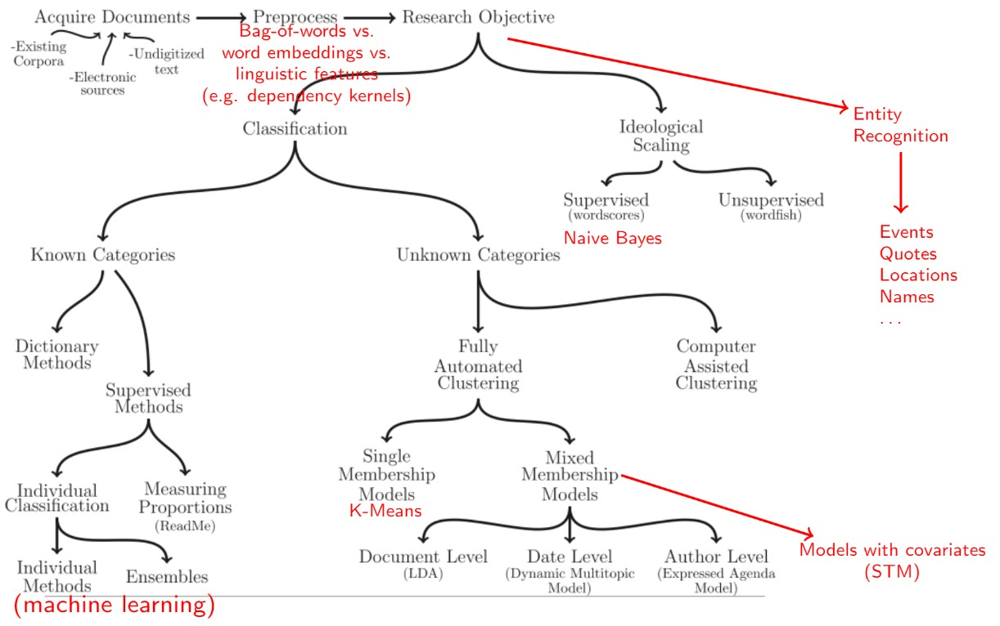
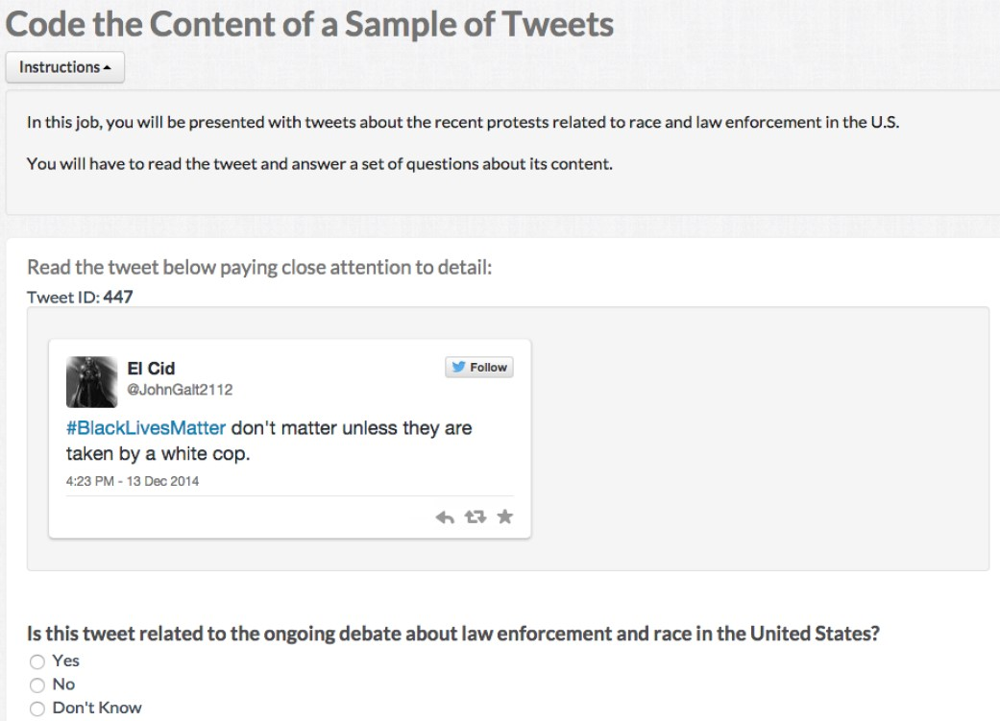
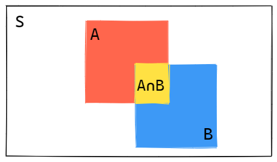
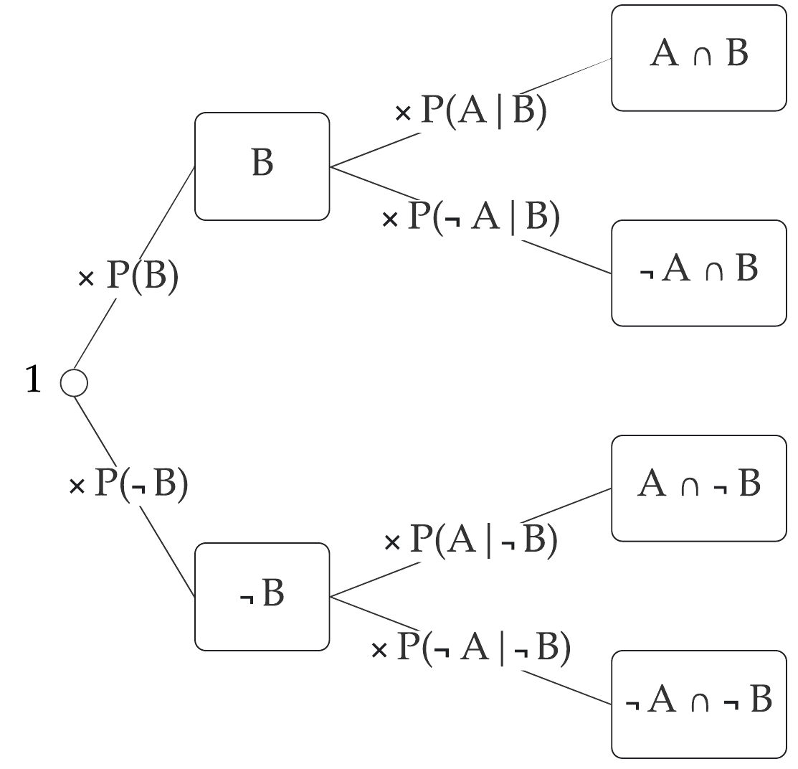
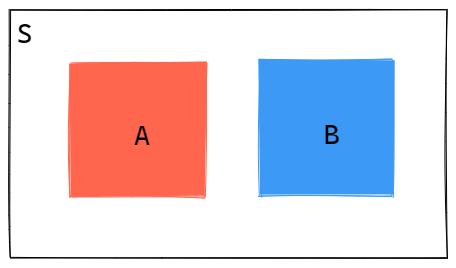
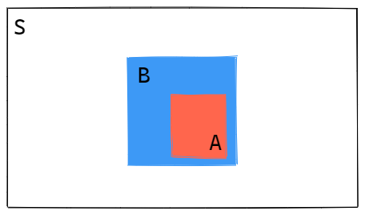
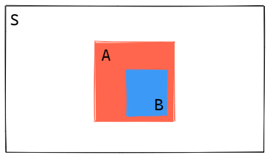
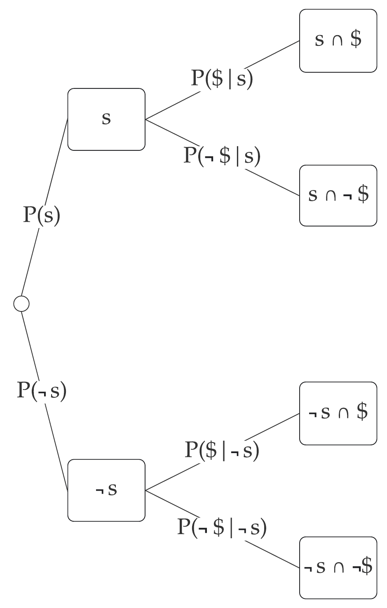
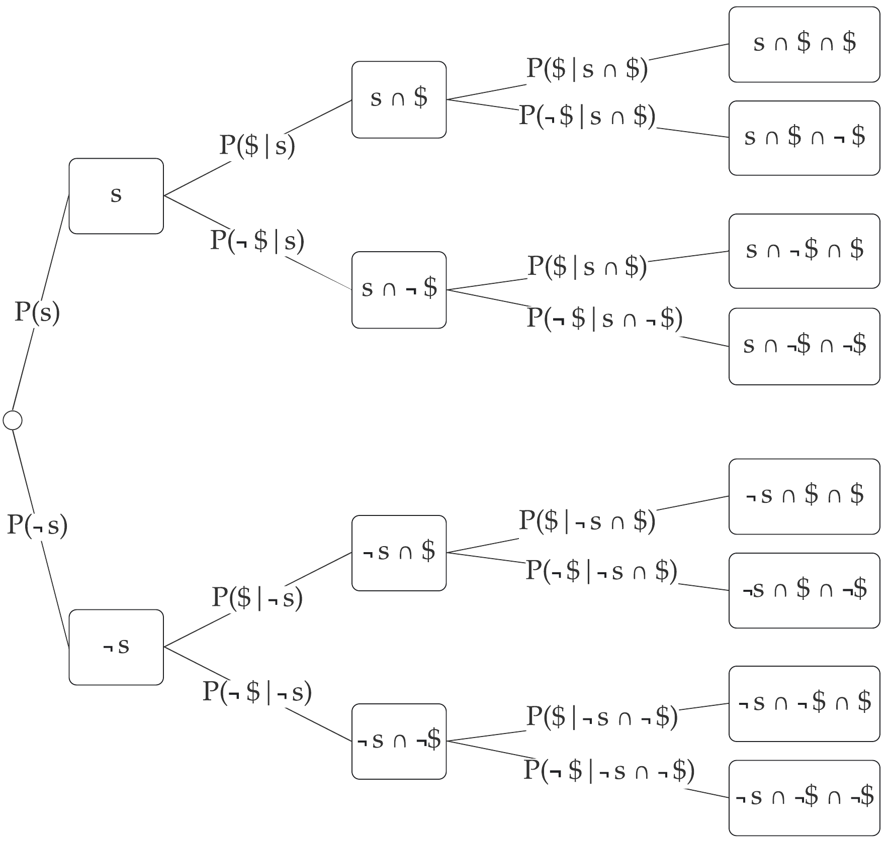

# Outline for today

1. **Supervised machine learning**
    - Why do we need a labeled set? 

2. **Probability fundamentals review**
    - Conditional probability
    - Rule of product

3. **Bayes theorem**
    - From conditional probabilities to Bayes theorem
    - Example: How good is our spam classifier?

4. **Naive Bayes**
    - Dissecting the Naive Bayes
    - Implementation in quanteda
    
5. **Prior probabilities**

6. **Coding Exercise**

---
# Course schedule

| Session |  Date  | Topic                                                |   Assignment  |     Due date    |
|:-------:|:------:|:-----------------------------------------------------|:-------------:|:---------------:|
|    1    | Feb 02 | Overview and key concepts                            |     \-        |     \-          |
|    2    | Feb 09 | Preprocessing and descriptive statistics             | Formative     | Feb 22 23:59:59 |
|    3    | Feb 16 | Dictionary methods                                   |     \-        |     \-          |
|    4    | Feb 23 | *Machine learning for texts: Classification I*       | Summative 1   | Mar 08 23:59:59 |
|    5    | Mar 02 | Machine learning for texts: Classification II        |     \-        |     \-          |
|    6    | Mar 09 | Supervised and unsupervised scaling                  | Summative 2   | Mar 22 23:59:59 |
|    7    | Mar 16 | Similarity and clustering                            |     \-        |     \-          |
|    8    | Mar 23 | Topic models                                         | Summative 3   | Apr 12 23:59:59 |
|   \-    |   \-   | *Break*                                              |     \-        |     \-          |
|    9    | Apr 13 | Retrieving data from the web                         |     \-        |     \-          |
|   10    | Apr 20 | Published applications                               |     \-        |     \-          |
|   11    | Apr 27 | Project Presentations                                |     \-        |     \-          |

---
class: inverse, center, middle

# Supervised machine learning

<html><div style='float:left'></div><hr color='#EB811B' size=1px width=800px></html> 

---
# Supervised machine learning 


&nbsp; Fig. 1 in Grimmer and Stuart (2013)


---
# Supervised machine learning

### The goal is classify documents into pre existing categories.

For example, authors of documents, sentiment of tweets, ideological position of parties based on manifestos, tone of movie reviews...

### What we need

- Hand-coded dataset (labeled), to be split into:
    
    - *Training set*: used to train the classifier
    - *Validation/Test set*: used to validate the classifier
  
- Method to *extrapolate* from hand coding to unlabeled documents (classifier):
    
    - Naive Bayes, regularized regression, SVM, CNN, ensemble
methods, etc.

- *Performance metric* to choose best classifier and avoid overfitting:
    
    - Confusion matrix, accuracy, precision, recall...

- Approach to *validate* classifier: cross-validation

---
# Creating a labeled set


### How do we obtain a labeled set?

- External sources of annotation
    - Disputed authorship of Federalist papers estimated based on known authors of other documents

- Expert annotation
  - "Canonical" dataset in Comparative Manifesto Project
  - In most projects, undergraduate students (expertise comes from training)

- Crowd-sourced coding
  - Wisdom of crowds: aggregated judgments of non-experts
converge to judgments of experts at much lower cost (Benoit
et al 2016)
  - Easy to implement with CrowdFlower or MTurk

---
# Labeling example



---
# Principles of supervised learning

.pull-left[
### Generalization

A classifier or a regression algorithm learns to correctly predict output from given inputs

Crucially, it predicts correctly not only in previously seen samples but also in previously unseen samples.
]

.pull-right[

### Overfitting

A classifier or a regression algorithm learns to correctly predict output from given inputs in previously seen samples. 

However, it fails to do so in previously unseen samples. This causes poor prediction/generalization.
]

<br>
####The goal is to maximize the frontier of precise identification of true condition with accurate recall

---
class: inverse, center, middle

# Probability fundamentals review

<html><div style='float:left'></div><hr color='#EB811B' size=1px width=800px></html>

---
# Motivation

#### Why should we look more closely into conditional probabilities and Bayes theorem?
<br>
After all, we could just learn the broad idea of the Naive Bayes classifier and run `textmodel_nb()` in R without knowing the details ...

<br>

- We introduce classification by the example of the Naive Bayes which requires a better understanding of the model's internal mechanisms

--

- Although universities mostly teach probability theory for independent events, the most interesting social phenomena are conditional (and not independent of) other factors

--

- We lay the foundation for interesting and widely used data science applications of Bayesian thinking

  ... such as the Wordscores model covered next week!
 

---
# Conditional probability


#### Definition

$$P(A|B)=\frac{P( A \cap B)}{P(B)} \text{, when } P(B)>0$$
where $A$ and $B$ are events in a sample space $S$. 



Intuitively, what this formula does is _restricting the sample space_ to events where $B$ occurs, and counting those where both $A$ and $B$ occur.


---
# Example

####What is the probability of event $A$ given $B$?

.pull-left[
Let $A$ be the event that a the roll of a dice results in an *odd* number: $A=\{1,3,5\}$

Let $B$ be the event that the outcome is *smaller or equal to three*: $B=\{1,2,3\}$
]

.pull-right[


]
<br>

--

$$P(A|B)=\frac{| A \cap B|}{|B|}=\frac{|\{1,3\}|}{|\{1,2,3\}|}=\frac{2}{3}$$

--

More generally, we can rewrite this in terms of probabilities 

$$P(A|B)=\frac{P(A \cap B)}{P(B)}=\frac{ \frac{|A \cap B|}{|S|} }{ \frac{|B|}{|S|} }=\frac{ \frac{2}{6} }{ \frac{3}{6}}=\frac{2}{3}$$
where $S=\{1,2,3,4,5,6\}$ is the sample space.

---
# Rule of product

The rule of product allows finding the probability of two (or more) events occurring together


#### Rule of product for dependent events


$$
\begin{align}
P(A|B)= \frac{P( A \cap B)}{P(B)}  \text{ }
\Leftrightarrow  \text{ }  P(A|B)P(B)=&P(A\cap B)
\end{align}
$$

Rewriting the conditional probability allows finding $P(A \cap B)$ using a tree diagram:

 

---
# Rule of product

The rule of product allows finding the probability of two (or more) events occurring together

#### Rule of product for independent events 

Two events $A$ and $B$ are independent only if $$P(A \cap B)=P(A)  P(B)$$

<br>

Independence means that conditional probability of one event given another is the same as the original (prior) probability:

$$
\begin{align}
P(A|B)=& \frac{P(A \cap B)}{P(B)}= \frac{P(A)P(B)}{P(B)} = P(A)
\end{align}
$$


---
# Rule of product

#### Rule of product for independent events (continued)

Sometimes the independence of two events is clear because they do not have a  physical interaction with each other 

&nbsp; &nbsp; &nbsp; &nbsp; For example, the roll of a dice today and the weather tomorrow


At other times, independence is not obvious so we need to check if they satisfy the independence condition

.pull-left[

In the die roll example, we had $P(A)=\frac{|\{1,3,5\}|}{|S|}=\frac{3}{6}=\frac{1}{2}$ and $P(B)=\frac{ |\{1,2,3\} | }{|S|}=\frac{3}{6}=\frac{1}{2}$ and
$P(A \cap B) = \frac{1}{3}$

]

.pull-right[


]

$A$ and $B$ are not independent since

$$P(A)P(B)=  \left( \frac{1}{2} \right)^2 =\frac{1}{4} \quad \quad  \boldsymbol{\neq} \quad \quad P(A \cap B)=\frac{1}{3}$$
???

In previous slide on the die roll example, we used set theory to determine P(A *and* B). Ask for a different way to come up with the probability of the intersection. 

Answer: Going back to the tree-diagram (or rule of product) interpretation of conditional probabilities, we can compute P(A *and* B) with P(A|B)P(B)=(2/3)*(1/2).


---
# Special cases (I)

If $A$ and $B$ are disjoint they cannot occur together, so $A \cap B = \varnothing$. 

$$P(A|B)=\frac{P(A \cap B)}{P(B)}=\frac{P(\varnothing)}{P(B)}=0$$



---
# Special cases (II)


If $A$ is a subset of $B$, then whenever $A$ happens $B$ happens as well. 

In this case, $A \cap B = A$.

$$P(A|B)=\frac{P(A \cap B)}{P(B)}=\frac{P(A)}{P(B)}$$




???

For example: What is the probability of sampling a PhD among holders of a master's degree? Let $A$ be the number of people in a population who hold a doctoral degree and $B$ the number of people who hold a master's degree. The probability of randomly sampling a PhD who also has a master's degree simplifies from $P(A \cap B)$ to $P(A)$ because PhDs also hold master's degrees.

---
# Special cases (III)

If $B$ is a subset of $A$, then whenever $B$ happens $A$ also happens. 

In this case, $A \cap B=B$.

$P(A|B)=\frac{P(A \cap B)}{P(B)}=\frac{P(B)}{P(B)}=1$




---
class: inverse, center, middle

# Bayes theorem

<html><div style='float:left'></div><hr color='#EB811B' size=1px width=800px></html> 


---
# Bayes theorem

Rearranging the definition of conditional probability gives the probability of the intersection:

$$
P(A|B)= \frac{P(A \cap B)}{P(B)} \Leftrightarrow P(B)P(A|B)=P(A\cap B)
$$

An alternative way of expressing the probability of the intersection is based on $P(B|A)$.

$$
P(B|A) = \frac{P(A \cap B)}{P(A)} \Leftrightarrow P(A)P(B|  A )=P(A \cap B)
$$
<br>

Setting both equations equal to another and rearranging gives the **Bayes theorem**:

$$
\begin{aligned}
P(A)P(B|  A )=&P(B)P(A|B) \\ 
\text{ } \\
\Leftrightarrow P(B|  A )=&\frac{P(B)P(A|B)}{P(A)}
\end{aligned}
$$


---
# Applying Bayes theorem

<br> 
###The rate of spam mails for a certain email address is 2%. A spam filter identifies a spam mail with a probability of 95%. At the same time, 10% of non-spam messages are classified as spam.

<br>

####(a) What is the probability that a mail that was marked as spam is truly a spam mail?

####(b) What is the probability that a mail that was not identified as spam is spam?

---
class: inverse, center, middle

# Naive Bayes

<html><div style='float:left'></div><hr color='#EB811B' size=1px width=800px></html>


---
# Spam classification

```{r, include=F}
library(quanteda)
library(quanteda.textmodels)
```


```{r}
# 4 texts with known and 3 texts with unknown category
txt <- c(k1 = "$ Win $", 
         k2 = "$ Prize $", 
         k3 = "Earn $ Easily", 
         k4 = "Paypal 100 $",
         u1 = "$",
         u2 = "$ $",
         u3 = "Paypal 100 $ $")
x <- dfm(txt) 
y <- factor(c("Spam","Spam","Spam","No Spam", NA, NA, NA), ordered = T)
```


.pull-left[

training dfm with known categories

```{r, echo=F}
kab <- knitr::kable(quanteda::convert(x[1:4,], "data.frame"), align = "c", 
                    col.names = c("",colnames(x))) 

kableExtra::column_spec(kab, 2:ncol(x[1:4,]), width = "0.5in")
```

]

.pull-right[

training vector with known categories

```{r, echo=F}
knitr::kable(y[1:4], align = "c", col.names = "y")
```

]

---
# P( word | category )

```{r, eval = F}
dfm(txt, groups = y)                # compute word frequency given category
```

```{r, echo=F}
as.matrix(dfm(txt, groups = y))     # compute word frequency given category
```


```{r, eval=F}
dfm(txt, groups = y) + 1             # but we need to apply Laplacian smoothing 
```

```{r, echo=F}
as.matrix(dfm(txt, groups = y) + 1)  # but we need to apply Laplacian smoothing 
```

```{r, eval=F}
# get probability of word given category 
# divide feature frequency by category frequency (10 and 16 respectively)
(dfm(txt, groups = y) + 1) / rowSums(dfm(txt, groups = y) + 1)
```

```{r, echo=F}
# get probability of word given category 
# divide word frequency by category frequency (10 and 16 respectively)
as.matrix( (dfm(txt, groups = y) + 1) / rowSums(dfm(txt, groups = y) + 1) )
```

---
# nb <- textmodel_nb(x,y,prior="docfreq")

```{r, include=F, warning=F}
nb <- textmodel_nb(x,y,prior="docfreq")
```


```{r, warning=F, R.options=list(digits=3)}
( Pc <- nb$priors )                                 # extract prior for class
( PwGc <- nb$param )                                # get p of word given category
```
.pull-left[
```{r, eval=F}
# get p of class given word(s)
( PcGw <- predict(nb, type="prob") )            
```
```{r, echo=F}
# get p of class given word(s)
( PcGw <- round( predict(nb, type="prob") ,2) )            
```
]
.pull-right[

```{r, eval=F}
# categorize based on highest p
( cats <- predict(nb, type="class") )               
```
```{r, include=F}
# categorize based on highest p
( cats <- predict(nb, type="class") )               
```
```{r, echo=F}
cat( paste( cats, collapse='\n' ) )
```
]


---
# Manually computing P( spam | words )

Recall that we have the prior P(spam)=0.75 and estimated these conditional probabilities:


```{r echo=F}
freq_given_cat_df <- convert( (dfm(txt, groups = y) + 1) / rowSums(dfm(txt, groups = y) + 1), "data.frame")
col_labels <- c(" ", colnames(freq_given_cat_df)[2:ncol(freq_given_cat_df)])

knitr::kable(freq_given_cat_df, align="c", col.names = col_labels)
```

####Notice how our belief of the message being spam changes as we consider various features  

.pull-left[
#### P(spam | &#36;)
```{r, R.options=list(digits=2)}
(.75*.375) / (.75*.375 + .25*.2) 
```

#### P(no spam | &#36;)
```{r, R.options=list(digits=2)}
(.25*.2) / (.25*.2 + .75*.375)
```
]


.pull-right[
#### P(spam | &#36; &#8745; &#36;)
```{r, R.options=list(digits=2)}
(.75 * .375^2) / 
 (.75 * .375^2 + .25 * .2^2)
```

#### P(spam | &#36; &#8745;  &#36; 100  &#8745; Paypal) 
```{r, R.options=list(digits=2)}
(.75 * .375^2 * .0625^2) / 
 (.75 * .375^2 *.0625^2 + .25 * .2^4)
```
]


---
# P( spam | $ )

.pull-left[
What is the probability of spam given a dollar sign in the message?



]

--


.pull-right[


$$
\begin{align}
P(\text{s}|\$)=&\frac{P(\text{s})P(\$|\text{s})}{P(\text{s})P(\$|\text{s})+P(\neg \text{ s})P(\$|\neg \text{ s})}
\\=&\frac{0.75 \times0.375}{0.75\times 0.375 + 0.25\times 0.2} \\
=& `r round( (.75*.375) / (.75*.375 + .25*.2) ,2)`
\end{align}
$$

#### Numerator

Look at the branches where the evidence (&#36;) occurs *and* the hypothesis (spam) is true; compute the joint probability P(s &#8745; &#36;)

#### Denominator

Consider all possibilities where the evidence occurs: 
numerator *added* to the joint probability of the evidence occurring given the hypothesis is not true

]

---
# Considering multiple features

#### The Naive Bayes model (wrongly) assumes **conditional independence of word counts given the class**.

- This is why the model is called "naive": it assumes that seeing a word does not change the probability of observing other words in a document. 

- However, the word "weather" is more likely to be followed by related words like "forecast" and "report" rather than unrelated words such as "guitar".

--

#### This assumption has practical advantages as we can *multiply* the conditional probabilities of a *w*ord given a *c*lass $P(w_j|c_k)$ to get the *joint* probability of the words occurring in a *d*ocument.

Then, the probability that a document belongs to a class can be calculated with


$$P(c_k|d)=P(c_k|w_1 \cap w_2 \cap \dots w_J)=P(c_k) \prod_{j}^{J} \frac{P(w_j|c_k)}{P(w_j)}$$

where $\prod_j^J$ means to multiply the $J$ word probabilities.

---
# P( spam | $ &#8745; $ )


.pull-left[

What is the probability of spam given **two** dollar signs in the message?



]

--

.pull-right[

Assuming conditional independence of features given the class allows us to easily calculate the probability of spam given **multiple** features.

Independence simplifies the calculation, for example P(&#36; | s &#8745;  &#36;) = P( &#36;| s)

Substantively, we assume that observing a &#36; does not affect the probability of observing further &#36; (or any other feature) 


$$
\begin{align}
&P(\text{s}| \$ \cap \$)\\
=&\frac{P(\text{s})P(\$|\text{s})^2}{P(\text{s})P(\$|\text{s})^2 +P(\neg \text{ s})P(\$|\neg \text{ s})^2 }
\\=&\frac{0.75 \times0.375^2}{0.75\times 0.375^2 + 0.25\times 0.2^2} \\=& `r round((.75 * .375^2) / (.75 * .375^2 + .25 * .2^2),2)`
\end{align}
$$

]


---
# P( spam | $ &#8745; $ &#8745; Paypal &#8745; 100 )

What is the probability of spam given the message includes &#36;, &#36;, Paypal, and 100? 

Recall that we have the prior of P(spam)=0.75 and estimated the following conditional probabilities:


```{r echo=F}
knitr::kable(freq_given_cat_df, align="c", col.names = col_labels)
```
<br>

--

$$
\begin{align}
&P(\text{s}|\$ \cap \$ \cap \text{Paypal} \cap 100)\\
=&\frac{P(\text{s})P(\$|\text{s})^2 P(\text{Paypal}|s)P(100|s)}{P(\text{s})P(\$|\text{s})^2 P(\text{Paypal}|s)P(100|s) +P(\neg \text{ s})P(\$|\neg \text{ s})^2 P(\text{Paypal}| \neg s)P(100| \neg s)}
\\=&\frac{0.75 \times0.375^2 \times 0.0625^2}{0.75\times 0.375^2 \times 0.0625^2+ 0.25\times 0.2^4} \\ =& `r round((.75 * .375^2 * .0625^2) /  (.75 * .375^2 *.0625^2 + .25 * .2^4),2)`
\end{align}
$$


???

Note how the conditional probabilities are only conditional on the message being spam but not on the features occurring in that message (assumption: conditional independence of word counts given the class)

---
class: inverse, center, middle

# Prior probabilities

<html><div style='float:left'></div><hr color='#EB811B' size=1px width=800px></html> 


---
# Document frequency

#### A prior probability is the baseline expectation of observing a category without considering any evidence. 

`textmodel_nb()` allows specifying different priors for training a classifier

#### Relative document frequency

Throughout this lecture we assumed that the relative frequency of a category occurring in the corpus is a reasonable baseline expectation of receiving a spam message

.pull-left[
```{r, echo=F}
knitr::kable(y[1:4], align = "c", col.names = "y")
```
]

.pull-right[

$$P(\text{ s }) = \frac{3}{4}$$
<br>
$$P(\neg s) = \frac{1}{4}$$
]
<br>

#### However, there may be nothing informative in the relative numbers of documents.


---
# Term frequency

#### Using term frequency makes the priors equal to the fraction of total feature counts found in the grouped documents in each training class

Therefore, classes with the largest number of features are assigned the largest priors

--

Coincidentally, in our example the fraction of total features is the same as the relative document frequency

.pull-left[
```{r, eval=F}
dfm(txt, groups = y)
```

```{r, echo=F}
as.matrix( dfm(txt, groups = y) )

```
]

.right-code[
```{r}
rs <-rowSums(dfm(txt,groups=y))
```
```{r,echo=F}
cat( paste( c(" "," ",rs), collapse='\n' ) )
```
]


.pull-left[
```{r}
rs / sum(rs)
```
]

---
# Uniform priors

#### Using uniform priors means to set the unconditional probability of observing one class to be the same as observing any other class

--

To illustrate, let's recalculate the probability of P(spam | $ ) with uniform priors

$$
\begin{align}
P(\text{s}|\$)=&\frac{P(\text{s})P(\$|\text{s})}{P(\text{s})P(\$|\text{s})+P(\neg \text{ s})P(\$|\neg \text{ s})}
\end{align}
$$

Equal prior probabilities simplify the calculation since $P(s)=P(\neg s)$

$$
\begin{align}
P(\text{s}|\$)=&\frac{ P(\text{s})  P(\$|\text{s})}{P(\text{s})P(\$|\text{s})+P( \text{s})P(\$|\neg \text{ s})}
\\=&\frac{P(\$|\text{s})}{P(\$|\text{s})+P(\$|\neg \text{ s})}
\\=&\frac{0.375}{0.375 + 0.2} = `r round( (.375) / (.375 + .2) ,2)`
\end{align}
$$

--

#### Therefore, assuming uniform priors implies calculating the probability of the category given the evidence with **no priors**!

---
# Uniform priors


#### Assuming that categories have the same probability of occurring can be an explicit *decision* of the analyst

This is appropriate if there is no reason to expect the occurrence of one category to be more likely than others
<br>
<br>


#### Uniform priors can also result from the available data in the following scenarios

1. Setting `prior="docfreq"` and having the *same number of documents* in each training class
  
  For example, there are 500 spam messages and 500 non-spam messages in the dataset
<br>

2. Setting `prior="termfreq"` and having the *same the total count of features* in each training class

  For example, all spam messages taken together contain 100,000 words and all non-spam messages also contain 100,000 words


---
class: inverse, center, middle
# Coding exercise

<html><div style='float:left'></div><hr color='#EB811B' size=1px width=800px></html>
