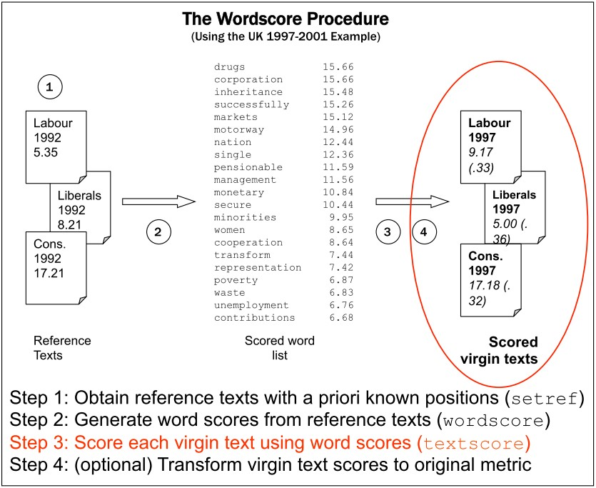
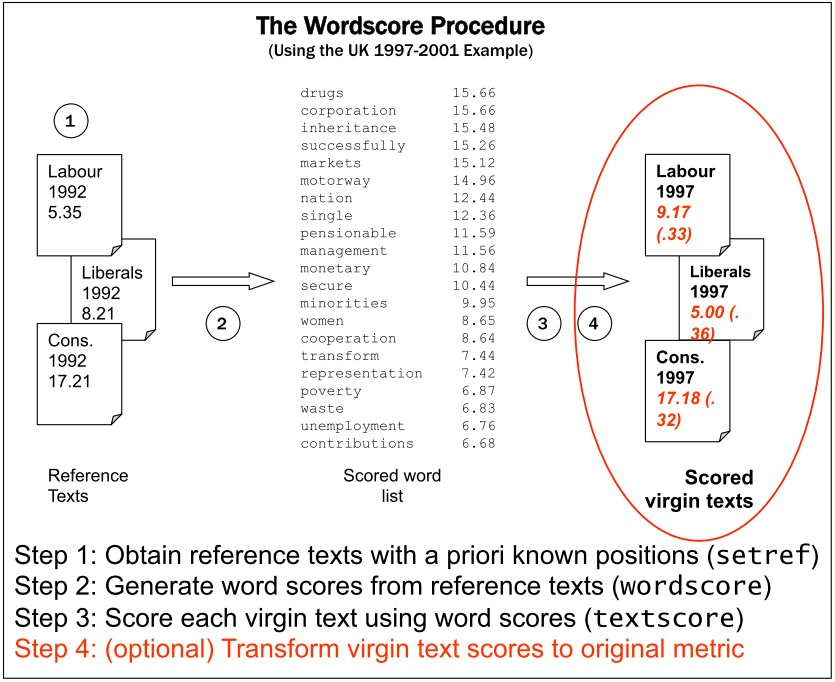
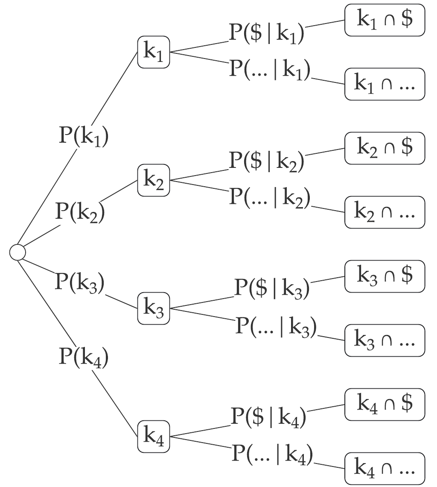
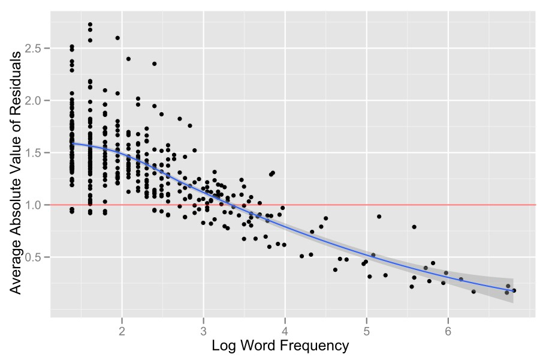
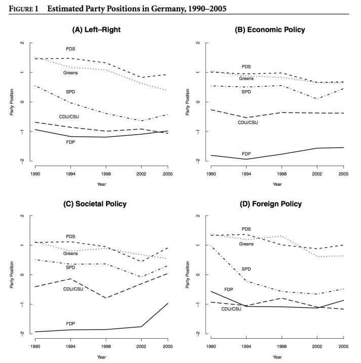
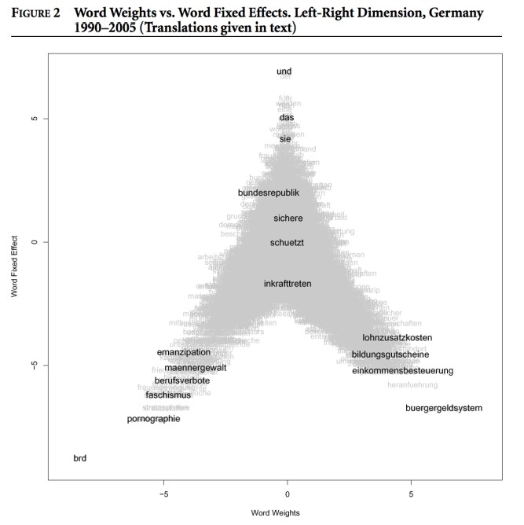
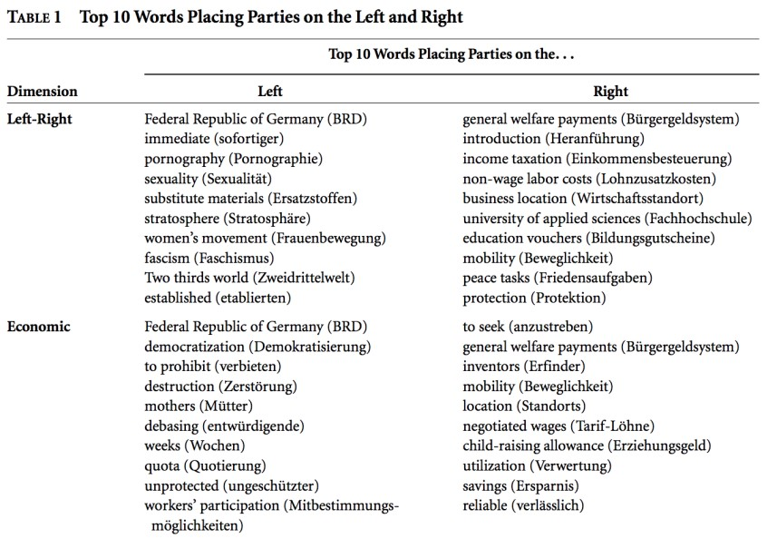

# Outline for today

1. **Supervised scaling**
  - Wordscores model
  - How it relates to Naive Bayes
  - Wordscore example
  
2. **Unsupervised Learning**
  - Basics of unsupervised scaling methods
  - Parametric scaling models: Wordfish 
  
3. **Coding examples**
  - Scaling UK manifestos with Wordscores
  - Scaling Irish budget debate 2010 using Wordfish


---
# Course schedule

| Session |  Date  | Topic                                                |   Assignment  |     Due date    |
|:-------:|:------:|:-----------------------------------------------------|:-------------:|:---------------:|
|    1    | Feb 02 | Overview and key concepts                            |     \-        |     \-          |
|    2    | Feb 09 | Preprocessing and descriptive statistics             | Formative     | Feb 22 23:59:59 |
|    3    | Feb 16 | Dictionary methods                                   |     \-        |     \-          |
|    4    | Feb 23 | Machine learning for texts: Classification I         | Summative 1   | Mar 08 23:59:59 |
|    5    | Mar 02 | Machine learning for texts: Classification II        |     \-        |     \-          |
|    6    | Mar 09 | *Supervised and unsupervised scaling*                | Summative 2   | Mar 22 23:59:59 |
|    7    | Mar 16 | Similarity and clustering                            |     \-        |     \-          |
|    8    | Mar 23 | Topic models                                         | Summative 3   | Apr 12 23:59:59 |
|   \-    |   \-   | *Break*                                              |     \-        |     \-          |
|    9    | Apr 13 | Retrieving data from the web                         |     \-        |     \-          |
|   10    | Apr 20 | Published applications                               |     \-        |     \-          |
|   11    | Apr 27 | Project Presentations                                |     \-        |     \-          |


---
class: inverse, center, middle

# Wordscores
------------

---
# Supervised and unsupervised learning 


&nbsp; Fig. 1 in Grimmer and Stuart (2013)


---
# From classification to scaling

Machine learning focuses on identifying classes (*classification*), while social science is typically interested in locating things on latent traits (*scaling*), for example:

- Policy positions on economic vs social dimension
- Inter- and intra-party differences
- Soft news vs hard news
- ...and any other continuous scale


But the two methods overlap and can be adapted - will demonstrate later using the Naive Bayes classifier

In fact, the class predictions for a collection of words from Naive Bayes can be adapted to scaling


---
# Wordscores 

Analogous to a "training set" and a "test set" in classification, the Wordscores method by Laver, Benoit, and Garry (2003) uses two sets of texts:

#### Reference texts

- texts about which we know something (a scalar dimensional score)

#### Virgin texts

- texts about which we know nothing (but whose dimensional score we'd like to know)

<br>
#### Basic procedure

1. Analyze reference texts to obtain a single "score" for every word 
2. Use word scores to score virgin texts


---
# Wordscores procedure (I)


---
# Wordscores procedure (II)


---
# Wordscores procedure (III)


---
# Wordscores procedure (IV)




---
# Wordscore implementation

```{r, include=F}
library(quanteda)
library(quanteda.textmodels)
```


```{r}
# 4 texts with known and 3 texts with unknown category
txt <- c(k1 = "$ Win $", 
         k2 = "$ Prize $", 
         k3 = "Earn $ Easily", 
         k4 = "Paypal 100 $",
         u1 = "$",
         u2 = "$ $",
         u3 = "Paypal 100 $ $")
x <- dfm(txt) 
y <- c(1, 1, 1, -1, NA, NA, NA)
```


.pull-left[

training dfm from references texts

```{r, echo=F}
kab_x <- knitr::kable(quanteda::convert(x[1:4,], "data.frame"), align = "c", 
                    col.names = c("",colnames(x))) 

kableExtra::column_spec(kab_x, 2:ncol(x[1:4,]), width = "0.5in")
```

]

.pull-right[

training vector with known positions

```{r, echo=F}
kab_y <- knitr::kable(y[1:4], align = "c", col.names = "y")

kableExtra::column_spec(kab_y, 1, width = "0.5in")
```

]

---
# Wordscores

#### Compute probability of a reading document given a word

Start with a set of $D$ reference texts, represented by an $D \times W$ document-feature matrix $C_{dw}$ , where $d$ indexes the document and $w$ indexes the $W$ total word types.

We normalize the document-feature matrix within each
document by converting $C_{ij}$ into a relative document-feature
matrix (within document), by dividing $C_{ij}$ by its word total
marginals

####Probability of word given the document

```{r,eval=F}
( PwGd <- dfm_weight(x[1:4,],scheme="prop") )
```

```{r,echo=F}
PwGd <- as.matrix( dfm_weight(x[1:4,],scheme="prop"))
round( PwGd, 2)
```

---
# P( k<sub>1</sub> | &#36; )

.pull-left[




Uniform priors: P(k<sub>1</sub>)=...=P(k<sub>4</sub>)= &frac14;

####If we only read "&#36;" the probability of reading the document k<sub>1</sub> is  &frac13;.


]

.pull-right[

Probability of word given the document:

```{r, echo=F}

kab_PwGd <- knitr::kable(round(as.matrix(PwGd),2), align = c("l", rep("c", ncol(PwGd)-1)), 
                    col.names = colnames(PwGd))

kab_PwGd_c  <- kableExtra::column_spec(kab_PwGd, 1,width_max = "0.15in")
kab_PwGd_cr <- kableExtra::row_spec(kab_PwGd_c, 0:nrow(PwGd), font_size = 17.5)
kab_PwGd_cr 

```
<br>

$$
\begin{align}
&P(k_1|$)\\
&=\frac{P(k_1)P($|k_1)}{P(k_1)P($|k_1)+\text{...}+P(k_2)P($|k_4)}\\
&=\frac{P($|k_1)}{P($|k_1)+\text{...}+P($|k_4)}\\
&=\frac{ \frac{2}{3} }{\frac{2}{3} + \frac{2}{3} + \frac{1}{3} + \frac{1}{3}}=\frac{1}{3}
\end{align}
$$

]

---
# P( document | word )

####Now let's compute all probabilities of reading a document given a word

```{r, eval=F}
PwGd # recall our matrix containing all P(word | document)
```

```{r, echo=F}
round(PwGd,2) # recall our matrix containing all P(word | document)
```

.pull-left[
```{r,eval=F}
# transpose PwGd matrix
( tPwGd <- t(PwGd) ) 
```

```{r, echo=F}
tPwGd <- t(PwGd)
round( tPwGd ,2)
```
]

.pull-right[
```{r,eval=F}
# P(document | word)
( PdGw <- tPwGd / rowSums(tPwGd) )
```
```{r,echo=F}
PdGw <-tPwGd/rowSums(tPwGd) #P(document|word)
round( tPwGd / rowSums( tPwGd ) ,2)
```
]


---
# Scoring words

Compute a $J$-length "score" vector $S$ for each word $j$ as the average of each document $i$’s scores $a_i$, weighted by each word's $P_{ij}$ so that 
$S_j=\sum_i^I a_i P_{ij}$
```{r}
y[1:4] # the "a" vector with the positions of the document
```


```{r,eval=F}
t(PdGw) * y[1:4] # transpose matrix so we can multiply PdGw with the doc positions
```
```{r, echo = F}
# transpose matrix so we can multiply words of the document with the document score
round( t(PdGw) * y[1:4] ,2)
```

```{r, eval=F}
( ws <- colSums( t(PdGw) * y[1:4] )) # then, sum up the result column-wise
```
```{r,echo=F}
# then, sum up the result column-wise
ws <- colSums( t(PdGw) * y[1:4] )
round( ws, 2)
```

---
# Scoring words

We obtain the scored words *also* by using matrix multiplication. In matrix algebra, $$\underset{1 \times J}{S} = \underset{1 \times I}{a} \cdot \underset{I \times J}{P}$$

.pull-left[


```{r,eval=F}
PdGw # P(document | word)
```

```{r,echo=F}
round( tPwGd ,2) # P(document | word)
```
]

.pull-right[

```{r}
y[1:4] # documents scale
```

]


```{r, eval = F}
 # matrix multiplication with P(document|words) and scores
( ws <- PdGw %*% y[1:4] )
```
```{r, echo = F}
# matrix multiplication with P(document | words) and scores 
ws <- PdGw %*% y[1:4]
round( ws , 2)[,1]
```


---
# Scoring texts

####The goal is to obtain a single score for any new text, relative to the reference texts

We do this by taking the mean of the scores of its words, weighted by their term frequency

.pull-left[
```{r, eval = F}
PwGd <- dfm_weight(x, scheme="prop")
t(PwGd) # transpose matrix 
```
```{r, echo = F}
PwGd <- as.matrix(dfm_weight(x, scheme="prop") )
round(t(PwGd),2) # transpose matrix
```


]


.pull-right[

```{r,eval=F}
# row-wise PwGd * score
t(PwGd) * ws[,1]
```
```{r,echo=F}
# row-wise PwGd * score
round((t(PwGd) * ws[,1])[,1:6],2)
```

]

```{r, eval = F}
colSums( t(PwGd) * ws[,1] )
```
```{r, echo=F}
round(colSums( t(PwGd) * ws[,1] ), 2)
```
---
# Scoring texts

We obtain the scored words *also* by using matrix multiplication.

```{r, eval=F}
# matrix multiplication with P(word | document) and obtained wordscores 
PwGd %*% ws
```
```{r,echo=F}
as.matrix(round( dfm_weight(x ,scheme="prop") %*% ws,2))[,1]
```


#### Does this result make sense in the context of the spam example? 
<br>

```{r, echo=F}
df <- t(data.frame(txt))
rownames(df) <- NULL
colnames(df) <- c("k1 (s)", "k2 (s)","k3 (s)", "k4 (¬s)", "u1","u2","u3")
df_kab <- knitr::kable(df, align = "c")
kableExtra::column_spec(df_kab, 1:7, width_min = "0.8in") 
```

--

#### Final remarks
- Note that new words outside of the set $J$ may appear in the $K$ virgin documents — these are simply ignored (because we have no information on their scores)
- Note also that nothing prohibits reference documents from also being scored as virgin documents


---
# Using textmodel_wordscores()

#### For convenience we can use the quanteda function to obtain the above results

```{r}
ws_mod <- textmodel_wordscores(x,y) 
```


#### Wordscores

```{r, eval=F}
summary(ws_mod)
```
```{r,echo=F}
summary(ws_mod)[[1]]
round( summary(ws_mod)[[3]], 2)     # print wordscores
```

#### Scaled documents

```{r, eval=F}
predict(ws_mod)
```
```{r,echo=F}
round(predict(ws_mod),2)
```


---
class: inverse, center, middle
# Unsupervised scaling

<html><div style='float:left'></div><hr color='#EB811B' size=1px width=800px></html>

---
# Unsupervised scaling methods

Text gets converted into a quantitative matrix of features

- words, typically
- could be dictionary entries, or parts of speech

Documents are scaled based on similarity or distance in feature use but the fundamental problem is distance on which scale?

- Ideally, something we care about, e.g. policy positions, ideology, preferences, sentiment
- But often other dimensions (language, rhetoric style, authorship) are more predictive

First dimension in unsupervised scaling will capture main source of variation, whatever it is

Unlike supervised models, validation comes after estimating
the model

---
# Unsupervised scaling methods

#### Two main approaches

**Parametric methods** model feature occurrence according to some stochastic distribution, typically in the form of a measurement model

- for instance, model words as a multi-level Bernoulli distribution, or a Poisson distribution
- word effects and “positional” effects are unobserved parameters to be estimated
- e.g. Wordfish (Slapin and Proksch 2008) and Wordshoal (Lauderdale and Herzog 2016)

**Non-parametric methods** typically based on the Singular Value Decomposition of a matrix
- correspondence analysis
- factor analysis
- other (multi)dimensional scaling methods

---
class: inverse, middle, center
# Parametric scaling models
---------------------------------------------------


---
# Wordfish (Slapin and Proksch 2008)

####The goal is unsupervised scaling of ideological positions

The frequency with which politician $i$ uses word $k$ is drawn from a Poisson distribution:

$$w_{ik} \sim \text{Poisson}(\lambda_{ik} )$$
$$\lambda_{ik} = \exp(\alpha_i +  \psi_k +  \beta_k \times \theta_i )$$
with latent parameters:


$\alpha_i$ is “loquaciousness” of politician $i$ (document fixed effect, hence it’s associated with the party or politician)

$\psi_k$ is frequency of word $k$ (word fixed effect)

$\beta_k$ is discrimination parameter of word $k$

$\theta_i$ is the politician's ideological position


**Key intuition**: controlling for document length and word frequency, words with negative $k$ will tend to be used more often by politicians with negative $\theta_i$ (and vice versa)


---
# Wordfish (Slapin and Proksch 2008)


#### Why Poisson?
<br>

- Poisson distributed variables are bounded between (0, &infin;) and take on only discrete values 0, 1, 2, ..., &infin;

- Exponential transformation: word counts are function of log document length and word frequency

<br>

$$
\begin{align}
w_{ik} &\sim \text{Poisson}(\lambda_{ik}) \\
\lambda_{ik} &= \exp(\alpha_i + \psi_k + \beta_k \times \theta_i) \\
\log(\lambda_{ik}) &= \alpha_i + \psi_k \times \theta_i
\end{align}
$$

---
# How to estimate this model 

#### Conditional maximum likelihood estimation:

- If we knew $\psi$ and $\beta$ (the word parameters) then we have a Poisson regression model

- If we knew $\alpha$ and $\beta$ (the party/politician/document parameters) then we have a Poisson regression model too!

- So we alternate them and hope to converge to reasonable estimates for both

- Implemented in the quanteda package `textmodel_wordfish()`


An alternative is MCMC with a Bayesian formulation or variational inference using an Expectation-Maximization algorithm (Imai et al 2016)


---
# Conditional max. likelihood for wordfish

Start by guessing the parameters (some guesses are better than other, e.g. SVD)

Algorithm: 

1. Assume the current *legislator parameters* are correct and fit as a Poisson regression model

2. Assume the current *word parameters* are correct and fit as a Poisson regression model 

3. Normalize $\theta$s to mean 0 and variance 1

Iterate until convergence (change in value below a certain threshold)

---
# Identification 

The *scale* and *direction* of $\theta$ is undetermined - like most models with latent variables 

To identify the model in Wordfish

- Fix one $\alpha$ to zero to specify the left-right direction (Wordfish option 1)

- Fix one $\hat \theta$s to mean zero and variance 1 to specify the scale (Wordfish option 2)

- Fix two $\hat \theta$s to specify the direction and scale (Wordfish option 3 and Wordscores)

Note: Fixing two reference scores does not specify the policy domain, it just identifies the model

---
# "Features" of parametric scaling

- Standard (statistical) inference about parameters

- Uncertainty accounting for parameters 

- Distributional assumptions are made explicit (as part of the data generating process motivating the choice of stochastic distribution)

  - conditional independence
  - stochastic process (e.g. $\text{E}(Y_{ij}=\text{Var}(Y_{ij})=\lambda_{ij}$)

- Permits hierarchical reparameterization (to add covariates)

- Generative model: given the estimated parameters, we could
generate a document for any specified length

---
# Some reasons why this model is wrong

- Violations of conditional independence:

  - Words occur in sequence (serial correlation)

  - Words occur in combinations (e.g. as collocations) “carbon tax” / “income tax” / “inheritance tax” / “capital gains tax” /”bank tax”

  - Legislative speech uses rhetoric that contains frequent
synonyms and repetition for emphasis (e.g. “Yes we can!”)

- Heteroskedastic errors (variance not constant and equal to
mean):

  - overdispersion when “informative” words tend to cluster
together

  - underdispersion could (possibly) occur when words of high frequency are uninformative and have relatively low between-text variation (once length is considered)


---
# Overdispersion 


#### Overdispersion in German manifesto data (data taken from Slapin and Proksch 2008)




---
# One solution to model overdispersion

Negative binomial model (Lo, Proksch, and Slapin 2014):

$$
\begin{align}
w_{ik} &\sim \text{NB}(r, \frac{\lambda_{ik}}{\lambda_{ik} + r_i}) \\
\lambda_{ik} &= \exp(\alpha_i + \psi_k + \beta_k \times \theta_i)
\end{align}
$$

where ri is a variance inflation parameter that varies across
documents.

It can have a substantive interpretation (ideological ambiguity),
e.g. when a party emphasizes an issue but fails to mention key
words associated with it that a party with similar ideology
mentions.

---
# Example from Slapin and Proksch 2008



---
# Example from Slapin and Proksch 2008



---
# Example from Slapin and Proksch 2008




---
class: inverse, center, middle
# Coding exercise

<html><div style='float:left'></div><hr color='#EB811B' size=1px width=800px></html>


