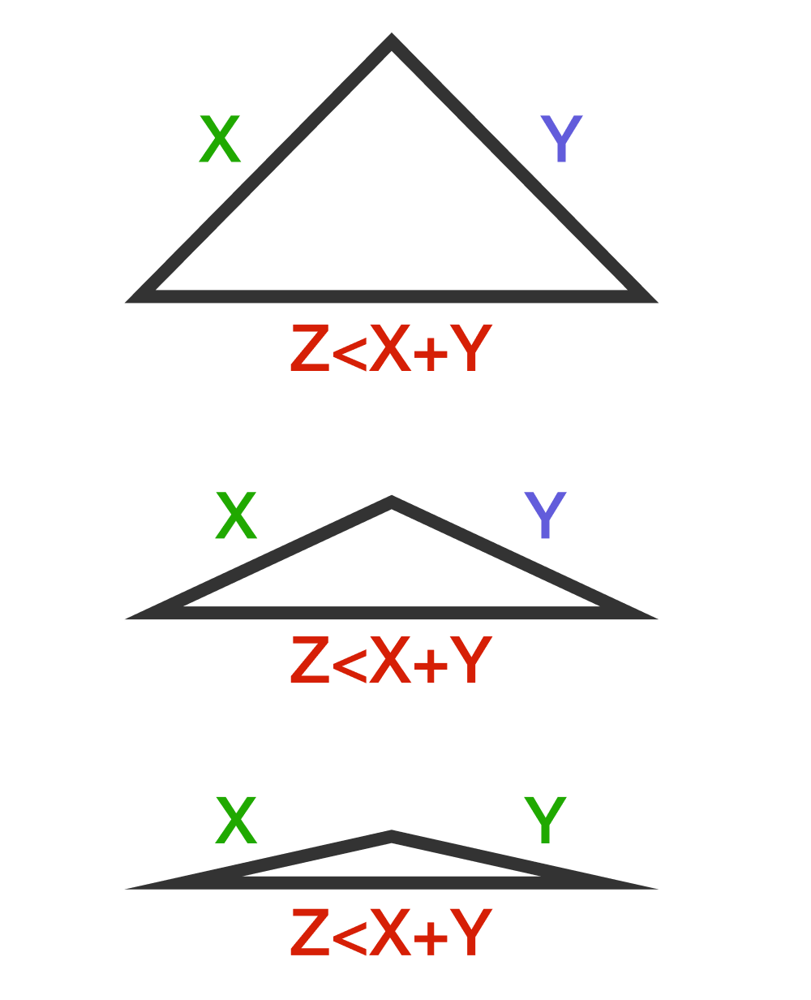
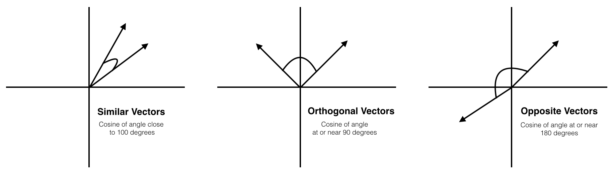
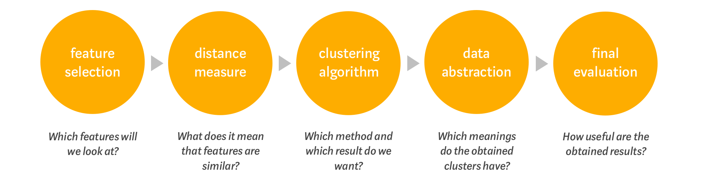
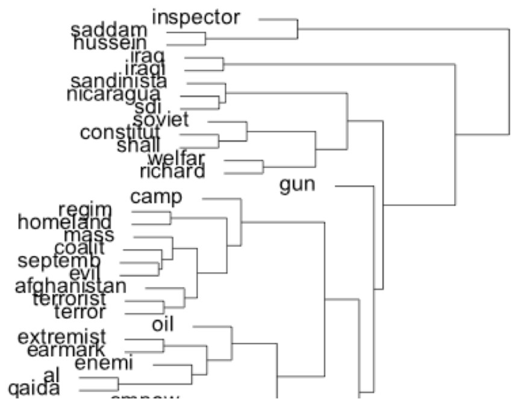
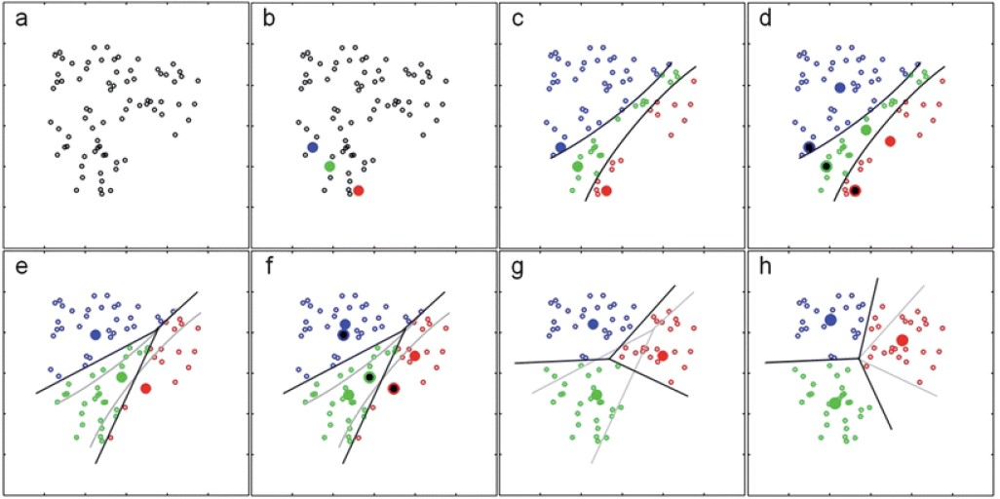
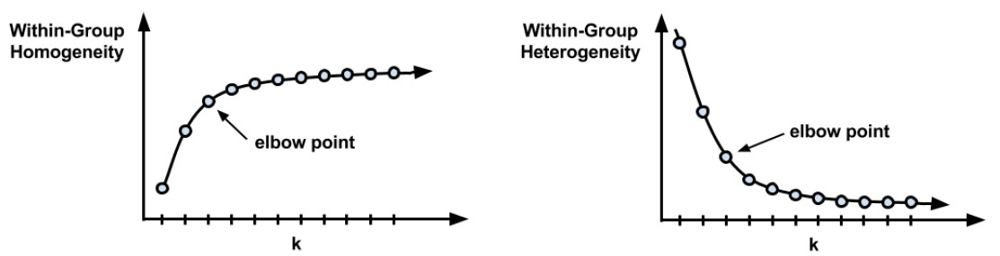

# Outline for today

1. **Similarity metrics**
  - Cosine
  - Euclidean
  - Jaccard
  - Edit distance
  
2. **Clustering methods**
  - k-means clustering
  - Hierarchical clustering
  
3. **Computer exercises**
  - Building a movie recommendation engine
  - Clustering UK party manifestos


---
# Course schedule

| Session |  Date  | Topic                                                |   Assignment  |     Due date    |
|:-------:|:------:|:-----------------------------------------------------|:-------------:|:---------------:|
|    1    | Feb 02 | Overview and key concepts                            |     \-        |     \-          |
|    2    | Feb 09 | Preprocessing and descriptive statistics             | Formative     | Feb 22 23:59:59 |
|    3    | Feb 16 | Dictionary methods                                   |     \-        |     \-          |
|    4    | Feb 23 | Machine learning for texts: Classification I         | Summative 1   | Mar 08 23:59:59 |
|    5    | Mar 02 | Machine learning for texts: Classification II        |     \-        |     \-          |
|    6    | Mar 09 | Supervised and unsupervised scaling                  | Summative 2   | Mar 22 23:59:59 |
|    7    | Mar 16 | *Similarity and clustering*                          |     \-        |     \-          |
|    8    | Mar 23 | Topic models                                         | Summative 3   | Apr 12 23:59:59 |
|   \-    |   \-   | *Break*                                              |     \-        |     \-          |
|    9    | Apr 13 | Retrieving data from the web                         |     \-        |     \-          |
|   10    | Apr 20 | Published applications                               |     \-        |     \-          |
|   11    | Apr 27 | Project Presentations                                |     \-        |     \-          |


---
class: inverse, center, middle

# Comparing documents
---------------------


---
# Comparing documents

###Idea 

The (weighted) features form a vector for each document and these vectors can be judged using metrics of similarity

A document's vector for us is simply (for us) the row of the document-feature matrix containing the (relative) frequency of features

### Problem

How do we measure distance or similarity between the vector representation of two (or more) different documents?

---
# Characteristics of similarity measures

Let $A$ and $B$ be any two documents in a set and $d(A,B)$ be the distance between $A$ and $B$

- $d(A,B) \geq 0$ (the distance between any two points must be non-negative) 
--

- $d(A,B) = 0 \text{ iff } A = B$ (the distance between two documents must be zero if and only if the objects are identical)

--

- $d(A,B) = d(B,A)$ (the distance must be symmetric: A to $B$ is the same distance as from $B$ to $A$)

--

- $d(A,C) = \leq d(A,B) + d(B,C)$ (the measure must satisfy the triangle inequality)

---
# A note on the triangle inequality

#### The triangle inequality states that the sum of the lengths of any two sides of a triangle is greater than the length of the remaining side.

--

It follows from the fact that a straight line is the shortest path between two points. The inequality is strict if the triangle is non-degenerate (meaning it has a non-zero area).

.pull-left[

]
.pull-right[
#### Example
Two legs of a triangle have lengths of 7.4 and 17.3 respectively. 

What is the *largest possible* length for the third side $z$?
]
--
.pull-right[
7.4 + 17.3 = 24.7 so that $z$ < 24 
]


<small>
See [Brilliant.org](https://brilliant.org/wiki/triangle-inequality/)
</small>

---
# Euclidian distance

Between document $A$ and $B$ where $j$ indexes their features and $y_{ij}$ is the value for feature $j$ of document $i$ 

Euclidean distance is based on the *Pythagorean theorem*


#### Formula
$$d(A,B) = \sqrt{ \sum_{j=1}^j (y_{Aj} - y_{Bj})^2 }$$
#### In vector notation 

$$|| \mathbf{y}_A - \mathbf{y}_B || $$

Can be performed for any number of features $J$ where $J$ is the number of columns of the dfm

$y_{Aj}$ and $y_{Bj}$ can be any representation of features (count, relative frequency, indicator)


---
# Euclidean distance

```{r, include=F}
library(quanteda)
library(ggplot2)
```
.pull-left[

Let's create a dfm from these two texts

```{r}
# corpus
txt <- c("Win Prize", 
         "Win Win")

# document-feature-matrix
x <- dfm(txt) 
```

```{r, echo=F}
kab_x <- knitr::kable(quanteda::convert(x, "data.frame"), align = "c", 
                    col.names = c("",colnames(x))) 

kableExtra::column_spec(kab_x, 2:ncol(x), width = "0.5in")
```

```{r,eval=F}
textstat_dist(x, method="euclidean")
```
```{r,echo=F}
round(as.matrix(textstat_dist(x, method="euclidean")),2)
```
]

.pull-right[

```{r, echo = F, fig.align='center'}
ggplot( convert(x[1:2,], "data.frame"), aes(win,prize)) + 
  geom_point(size = 3.5) +
  theme_bw(base_size = 25) +
  geom_line(linetype = "longdash") +
  geom_line(data = data.frame(prize = c(1,2), win = c(0,0)), aes(prize,win), linetype="dashed") +
  geom_line(data = data.frame(prize = c(1,1), win = c(0,1)), aes(prize,win), linetype="dashed") +
  geom_text(data = data.frame(prize = 0.58, win = 1.58), aes(label="d"), size = 10) +
  scale_y_continuous(limits = c(0,2), breaks = c(0:2)) +
  scale_x_continuous(limits = c(0,2), breaks = c(0:2)) 
```

$$
\begin{align}
\text{d}(A,B)= &\sqrt{(y_{A1} - y_{B1})^2 +  (y_{A2} - y_{B2})^2 }\\
=&\sqrt{ (2-1)^2 + (1-0)^2 } \\
=& `r round(sqrt( (2-1)^2 + (1-0)^2 ),2) `
\end{align}
$$ 
]

---
# Comparing more than two observations

.pull-left[
We can look at $\frac{n-1}{2}$ pairwise comparisons between different documents

```{r}
txt2 <- c(A = "Win Prize", 
          B = "Win Prize Prize Prize",
          C = "Win Win", 
          D = "Win Win Win")
x2 <- dfm(txt2)
```

```{r, echo=F}
kab_x2 <- knitr::kable(quanteda::convert(x2, "data.frame"), align = "c", 
                    col.names = c("",colnames(x2))) 

kableExtra::column_spec(kab_x2, 2:ncol(x2), width = "0.5in")
```
]

.pull-right[
```{r,echo=F, out.width="91%", fig.align='center'}
ggplot(convert(x2,"data.frame"), aes(win,prize)) + 
    geom_point(size = 4) + 
    scale_y_continuous(limits = c(0,3.1), breaks = c(0:3)) +
    scale_x_continuous(limits = c(0,3.1), breaks = c(0:3)) +
    theme_bw(base_size = 25)
```
```{r,eval=F}
textstat_dist(x2, method="euclidean")
```
```{r,echo=F}
round(as.matrix(textstat_dist(x2, method="euclidean")),2)
```
]

---
# Cosine similarity

Cosine similarity is based on the size of the angle between vectors. Perfect similarity yields a score of 1, no relation will yield 0, and -1 means the vectors are opposites.



--

####Properties


- cosine similarity between frequency vectors of (relative) frequencies cannot be negative as word-counts cannot be negative
- the measure is independent of document length because it deals only with the angle of the vectors 

--

<small>
Figure from [O'Reilly](https://www.oreilly.com/library/view/mastering-machine-learning/9781785283451/ba8bef27-953e-42a4-8180-cea152af8118.xhtml)
</small>


---
# Cosine similarity

####Formula
<br>

$$\frac{\mathbf{y}_A \cdot \mathbf{y}_B}{\|\mathbf{y}_A\| \|  \mathbf{y}_B\|}=\frac{\sum_j y_{Aj} y_{Bj}}{\sqrt{\sum_j y_{Aj}^2} \sqrt{\sum_j y_{Bj}^2}}$$
<br>

The $\cdot$ operator is the dot product, or $\sum_j y_{Aj}y_{Bj}$ 

$\| \mathbf{y}_A \|$ is the norm of the feature vector $\mathbf{y}$ for document $A$, such that $\| \mathbf{y}_A \| = \sqrt{ \sum_j y_{Aj}^2 }$


####Euclidean distance measures how *different* documents are, whereas cosine similarity measures how *similar* documents are. Of course, it's easy to reverse them; generally, we can say (1 - distance) = similarity.


---
# Norm of a vector 

####If $\vec{u} \in \mathbb{R}^n$, then the Norm or Magnitude of $\vec u$  denoted $\| \vec{u} \|$ is defined as the length or magnitude of the vector and can be calculated using the formula:

$$\| \vec{u} \| = \sqrt{u_1^2 + u_2^2 + ... + u_J^2}=\sqrt{\sum_{j=1}^J u_j^2}$$


.pull-left[
```{r, echo = F, out.width="95%"}
ggplot( convert(x[1,], "data.frame"), aes(win,prize)) + 
  theme_bw(base_size = 25) +
  annotate("segment", x=0, xend=1, y=0, yend=1, size=1.5, arrow=arrow()) +
  geom_line(data = data.frame(prize = c(1,0), win = c(0,0)), aes(prize,win), linetype="dashed") +
  geom_line(data = data.frame(prize = c(1,1), win = c(0,1)), aes(prize,win), linetype="dashed") +
  scale_y_continuous(limits = c(0,2), breaks = c(0:2)) +
  scale_x_continuous(limits = c(0,2), breaks = c(0:2)) 
```


]
.pull-right[

#### Example

The feature vector of document $A$ "*Win Prize*" is $\left( \begin{matrix} 1 & 1\end{matrix} \right)$

$$
\begin{align}
\| \mathbf{y}_A\| =&\sqrt{1^2 + 1^2} \\ =&1.41
\end{align}
$$

<br>
This formula should make sense geometrically as it analogous to the Pythagorean theorem!

]

---
# Jaccard coefficient

The Jaccard coefficient is similar to the Cosine similarity measure and ranges from 0 to 1

$$\frac{\text{doc}_A \cap \text{doc}_B}{\text{doc}_A \cup \text{doc}_B}=\frac{\mathbf{y}_A \cdot \mathbf{y}_B}{\|\mathbf{y}_A\| + \| \mathbf{y}_B \| - \mathbf{y}_A \cdot \mathbf{y}_B}$$
.pull-left[

]

--

.pull-right[
Using set notation, the coefficient is
$$
\begin{align}
&\frac{\{\text{win, prize}\} \cap \{\text{win, win}\}}{\{\text{win, prize}\} \cup \{\text{win, win}\}} \\
=&\frac{\{\text{win}\}}{\{\text{win, prize\}}} =\frac{1}{2}
\end{align}
$$
In *R*  we calculate the measure on the dfm
```{r, eval = F}
textstat_simil(x, method="jaccard")
```
```{r, echo = F}
as.matrix(textstat_simil(dfm(txt), method = "jaccard"))
```
]


---
# Edit distances

#### Edit distance refers to the number of operations required to transform one string into another for strings of equal length

#### Levenshtein distance

Example: the Levenshtein distance between "kitten" and "sitting" is 3
  1. kitten ! sitten (substitution of "s" for "k")
  2. sitten ! sittin (substitution of "i" for "e")
  3. sittin ! sitting (insertion of "g" at the end).

--

#### Hamming distance

- For two strings of equal length, the Hamming distance is the number of positions at which the corresponding characters are different
- Not common, as at a textual level this is hard to implement and possibly meaningless

---
# Other uses and extensions

Used extensively in information retrieval (search engines, library searches, ...)

- Summary measures of how far apart two texts are – but be careful exactly how you define "features" 

- Some but not many applications in social sciences to measure substantive similarity — scaling models are generally preferred 

- Can be used to generalize or represent features in machine learning, by computing similarities between textual (sub)sequences without extracting the features explicitly

---
class: inverse, middle, center
# Clustering 
------------

---
# Clustering


&nbsp; Fig. 1 in Grimmer and Stuart (2013)


---
# The idea of "clusters"

####Groups of items such that inside a cluster they are very similar to each other, but very different from those outside the cluster

- Unsupervised classification: cluster is not to relate features to classes or latent traits, but rather to estimate membership of distinct groups

- Groups are given labels through post-estimation interpretation of their elements

- Typically used when we do not and never will know the "true" class labels 

- Issues:
  - How many clusters?
  - How to compute distance is arbitrary
  - Which features to include? Cluster might be sensitive to pre-processing (feature selection)

---
# Clustering

<br>



Note that this process may require reiteration until you arrive at meaningful groupings of your data!

--

.footnote[
Figure by [Koch (2020)](https://towardsdatascience.com/a-friendly-introduction-to-text-clustering-fa996bcefd04)
]


---
# Hierarchical clustering

1. Start by considering each item as its own cluster, for n clusters
2. Calculate the $\frac{n(n-1)}{2}$ pairwise distances between each of
the n clusters, store in a matrix $D$
3. Find smallest (off-diagonal) distance in $D$, and merge the items corresponding to the $i, j$ indexes in $D$ into a new "cluster"
4. Recalculate distance matrix $D_1$ with new cluster(s). Options for determining the location of a cluster include:
  - The furthest point in each cluster (complete-linkage)
  - The closest point in each cluster (single-linkage)
  - The average of each cluster (centroid)
5. Repeat 3-4 until a stopping condition is reached
  - i.e. all items have been merged into a single cluster
6. To plot the dendrograms, need decisions on ordering, since there are $2^{(n-1)}$ possible orderings

---
# Hierarchical clustering I


.pull-left[
Recall the previous example corpus
```{r,eval=F}
txt2 <- c(A = "Win Prize", 
          B = "Win Prize Prize Prize",
          C = "Win Win", 
          D = "Win Win Win")
```

... and its document-feature-matrix

```{r, echo=F}
kab_x2 <- knitr::kable(quanteda::convert(x2, "data.frame"), align = "c", 
                    col.names = c("",colnames(x2))) 

kableExtra::column_spec(kab_x2, 2:ncol(x2), width = "0.5in")
```


]

--
.pull-right[


```{r,echo=F, fig.align='center'}
ggplot(convert(x2,"data.frame"), aes(win,prize)) + 
  geom_point(aes(color = doc_id), size = 4) + 
  scale_y_continuous(limits = c(0,3.1), breaks = c(0:3)) +
  scale_x_continuous(limits = c(0,3.1), breaks = c(0:3)) +
  theme_bw(base_size = 25) +
  labs(color = "") +
  theme(legend.position = "bottom") +
  geom_text(aes(label=doc_id), nudge_y = 0.1, nudge_x = 0.09, size = 6.5)
```

We start by considering each item as its own cluster, for n=4 clusters

]

---
# Hierarchical clustering II

.pull-left[
Using euclidean distance, we calculate the $\frac{n(n -1)}{2}$ pairwise distances between each of the n clusters and store them in matrix $D$

```{r,echo=F}
deuc <- round(as.matrix(textstat_dist(x2,method = "euclidean")),2)
deuc[lower.tri(deuc)] <- NA

options(knitr.kable.NA = '')
kab_deuc <- knitr::kable(as.data.frame(deuc), align = "c", 
                    col.names = c(colnames(deuc))) 


kableExtra::column_spec(kab_deuc, 2:ncol(deuc), width = "0.5in")
```


<br>
Note we could use any other metric for distance/similarity

]

.pull-right[

```{r,echo=F, fig.align='center'}
df <- convert(x2,"data.frame")
ggplot(df, aes(win,prize)) + 
  geom_point(size = 4, aes(color=doc_id)) + 
  scale_y_continuous(limits = c(0,3.1), breaks = c(0:3)) +
  scale_x_continuous(limits = c(0,3.1), breaks = c(0:3)) +
  theme_bw(base_size = 25) +
  labs(color = "") +
  # A to B
  #geom_text(data=data.frame(doc_id ="",win=1,prize=2), aes(label="2"), size=8) +
  #geom_line(data = data.frame(doc_id="",win=c(1,1),prize=c(1,3)),linetype="dashed")+
  # A to C
  #geom_text(data=data.frame(doc_id="",win=1.5,prize=0.5),aes(label="1.41"),size=8) +
  #geom_line(data = data.frame(doc_id="",win=c(1,2),prize=c(1,0)),linetype="dotted")+
  # A to D
  #geom_text(data = data.frame(doc_id = "", win = 0.5, prize = 0.5), aes(label="2.24"), size = 8) +
  # C to D
  #geom_text(data = data.frame(doc_id = "", win = 2.5, prize = 0.02),            aes(label="1"), size = 8)
  theme(legend.position = "bottom") +
    geom_text(aes(label=doc_id), nudge_y = 0.1, nudge_x = 0.09, size = 6.5)
```

]


---
# Hierarchical clustering III

.pull-left[
Find smallest (off-diagonal) distance in $D$, and merge the items into a new "cluster"

<br>

```{r,echo=F}
kableExtra::column_spec(kab_deuc, 2:ncol(deuc), width = "0.5in")
```

Based on euclidean distance, C and D are closest to each other so we merge them into a new set!
]

.pull-right[

```{r,echo=F, fig.align='center'}
df$h1<- c(df[1:2,1], "h1","h1")
ggplot(df, aes(win,prize)) + 
  scale_y_continuous(limits = c(0,3.1), breaks = c(0:3)) +
  scale_x_continuous(limits = c(0,3.1), breaks = c(0:3)) +
  theme_bw(base_size = 25) +
  labs(color = "") +
  theme(legend.position = "bottom") +
  # C to D
  geom_text(data = data.frame(doc_id = "", win = 2.5, prize = 0.12), aes(label="1"), size = 8) +
  geom_line(data = data.frame(doc_id="",win=c(2,3),prize=c(0,0)),linetype="dashed") +
  geom_point(size = 4, aes(color=h1)) + 
  geom_text(aes(label=doc_id), nudge_y = 0.1, nudge_x = 0.09, size = 6.5)
```


We are now left with 3 options to connect the sets: A &harr; B, A	&harr; h1, and B	&harr; h1
]


---
# Hierarchical clustering IV


.pull-left[


The distance between A and B remains the same $\text{d}(\text{A,B}) = 2$ but we need to recalculate distances involving the new h1


*Complete-linkage*: What is the *maximum* distance from A to h1? And from B to h1?

$$
\begin{align}
\text{d(A, h1)}=&\max( \text{ d}(\text{A},\text{C}) , \text{ d}(\text{A},\text{D})\text{ )} \\
=&\max( \text{ 1.41, 2.24 )} =2.24 
\end{align}
$$

$$
\begin{align}
\text{d(B, h1)}=&\max( \text{ d}(\text{B},\text{C}) , \text{ d}(\text{B},\text{D})\text{ )} \\
=&\max( \text{ 3.16, 3.61 )} =3.61 \\
\end{align}
$$

]

.pull-right[

```{r,echo=F, fig.align='center'}

df$h2 <- c("h2","h2", df$h1[3:4])
ggplot(df, aes(win,prize)) + 
  scale_y_continuous(limits = c(0,3.1), breaks = c(0:3)) +
  scale_x_continuous(limits = c(0,3.1), breaks = c(0:3)) +
  theme_bw(base_size = 25) +
  labs(color = "") +
  theme(legend.position = "bottom") +
  # C to D
  geom_text(data = data.frame(doc_id = "", win = 2.5, prize = 0.12), aes(label="1"), size = 8) +
  geom_line(data = data.frame(doc_id="",win=c(2,3),prize=c(0,0)),linetype="dashed")+ 
  # A to B
  geom_text(data=data.frame(doc_id ="",win=0.9,prize=2), aes(label="2"), size=8) +
  geom_line(data = data.frame(doc_id="",win=c(1,1),prize=c(1,3)),linetype="dashed")+
  geom_point(size = 4, aes(color=h2)) +
  geom_text(aes(label=doc_id), nudge_y = 0.1, nudge_x = 0.09, size = 6.5)
```


With a distance of 2, A and B are closest!


]

---
# Hierarchical clustering VI

.pull-left[

```{r,echo=F, fig.align='center'}
df$h3 <- "h3"
ggplot(df, aes(win,prize)) + 
  scale_y_continuous(limits = c(0,3.1), breaks = c(0:3)) +
  scale_x_continuous(limits = c(0,3.1), breaks = c(0:3)) +
  theme_bw(base_size = 25) +
  labs(color = "") +
  theme(legend.position = "bottom") +
  # C to D
  geom_text(data = data.frame(doc_id = "", win = 2.5, prize = 0.12), aes(label="1"), size = 8) +
  geom_line(data = data.frame(doc_id="",win=c(2,3),prize=c(0,0)),linetype="dashed")+ 
  # A to B
  geom_text(data=data.frame(doc_id ="",win=0.9,prize=2), aes(label="2"), size=8) +
  geom_line(data = data.frame(doc_id="",win=c(1,1),prize=c(1,3)),linetype="dashed") +
  geom_point(size = 4, aes(color=h3)) +
  scale_color_manual(values=c("darkgreen")) +
  geom_text(aes(label=doc_id), nudge_y = 0.1, nudge_x = 0.09, size = 6.5)
```


]

.pull-right[

We continue the clustering procedure until all items were merged into a single cluster.

Employing the complete linkage criterion again, we find that the maximum distance between the sets, i.e. the distance between B and D, is 3.61. 

Note that this calculation is only necessary to find the distance *at which* the sets were joined. The sets are joined anyway since there are only two left!
]

---
# Dendrogram (complete-linkage)

#### Dendrograms indicate both the similarity and the order that the clusters were formed
.pull-left[
```{r,eval=F}
# compute distance matrix with quanteda
d<-textstat_dist(x2,method="euclidean")

# make it compatible 
( dis <- as.dist(d) )
```
```{r,echo=F}
d<-textstat_dist(x2,method="euclidean")
round(as.matrix( dis <- as.dist(d) ),2)
```

```{r}
# run hierarchical clustering
( hcc <- hclust(dis,method="complete"))
```

]
.pull-right[
```{r}
# plot complete linkage dendrogram
plot(hcc)
```

]

---
# Dendrogram (single-linkage)


#### Single-linkage: compute the distance between a point and the closest point in each cluster


.pull-left[
```{r,eval=F}
# compute distance matrix with quanteda
d<-textstat_dist(x2,method="euclidean")

# make it compatible 
( dis <- as.dist(d) )
```
```{r,echo=F}
d<-textstat_dist(x2,method="euclidean")
round(as.matrix( dis <- as.dist(d) ),2)
```

```{r}
# run hierarchical clustering
( hcs <- hclust(dis,method = "single"))
```

]
.pull-right[
```{r}
# plot single linkage dendrogram
plot(hcs)
```

]
---
# Dendrogram (centroid)

#### Centroid: compute the distance between a point and the average distance to a cluster

.pull-left[
```{r,eval=F}
# compute distance matrix with quanteda
d<-textstat_dist(x2,method="euclidean")

# make it compatible 
( dis <- as.dist(d) )
```
```{r,echo=F}
d<-textstat_dist(x2,method="euclidean")
round(as.matrix( dis <- as.dist(d) ),2)
```

```{r}
# run hierarchical clustering
( hca <- hclust(dis,method="centroid"))
```

]
.pull-right[
```{r}
# plot dendrogram centroid linkage
plot(hca)
```

]

---
# Dendrogram

#### Dendrograms indicate both the similarity and the order that the clusters were formed

 

Data: Presidential State of the Union addresses

---
# Pros and Cons of hierarchical clustering

#### Advantages

- deterministic, unlike k-means

- no need to decide on k in advance (although can specify as a stopping condition)

- allows hierarchical relations to be examined (usually through dendrograms)

--

#### Disadvantages

- more complex to compute: quadratic in complexity: $O(n^2)$ - whereas k-means has complexity that is $O(n)$

- the decision about where to create branches and in what order can be somewhat arbitrary, determined by method of declaring the "distance" to already formed clusters

- for words, tends to identify collocations as base-level clusters (e.g. "saddam" and "hussein")

---
# Dendrogram at word level

#### Hierarchical clustering tends to create word collocations as base-level clusters



Data: Presidential State of the Union addresses


---
# k-means clustering

#### Assign each item to one of k clusters, where the goal is to minimised within-cluster difference and maximize between-cluster differences

- Uses random starting positions and iterates until stable. Hence, results can be different when running the algorithm again!

- k-means clustering treats feature values as coordinates in a multi-dimensional space

- Advantages
  - simplicity
  - highly flexible
  - efficient

- Disadvantages
  - no fixed rules for determining k
  - uses an element of randomness for starting values
  
  
---
# Algorithm details

1. Choose starting values
  - assign random positions to k starting values that will serve as the "cluster centres", known as "centroids" ; or,
  - assign each feature randomly to one of k classes
2. assign each item to the class of the centroid that is "closest"
  - Euclidean distance is most common
  - any others may also be used (Manhattan, Minkowski, Mahalanobis, etc.)
  - (assumes feature vectors are normalized within document)
3. update: recompute the cluster centroids as the mean value of the points assigned to that cluster
4. repeat reassignment of points and updating centroids
5. repeat 2-4 until some stopping condition is satisfied
  - e.g. when no items are reclassified following update of centroids
  
  
---
# k-means clustering 
<br>
<br>


---
# Appropriate number of clusters

- very often based on prior information about the number of categories sought
- for example, you need to cluster people in a class into a fixed number of (like-minded) tutorial groups
- a (rough!) guideline: set k equal to $\sqrt{ \frac{N}{2}}$ where $N$ is the number of items to be classified
- usually too big: setting k to large values will improve within-cluster similarity, but risks overfitting
- "elbow plots": fit multiple clusters with different k values, and choose k beyond which are diminishing gains



---
class: inverse, middle, center
# Computer exercises
--------------------


