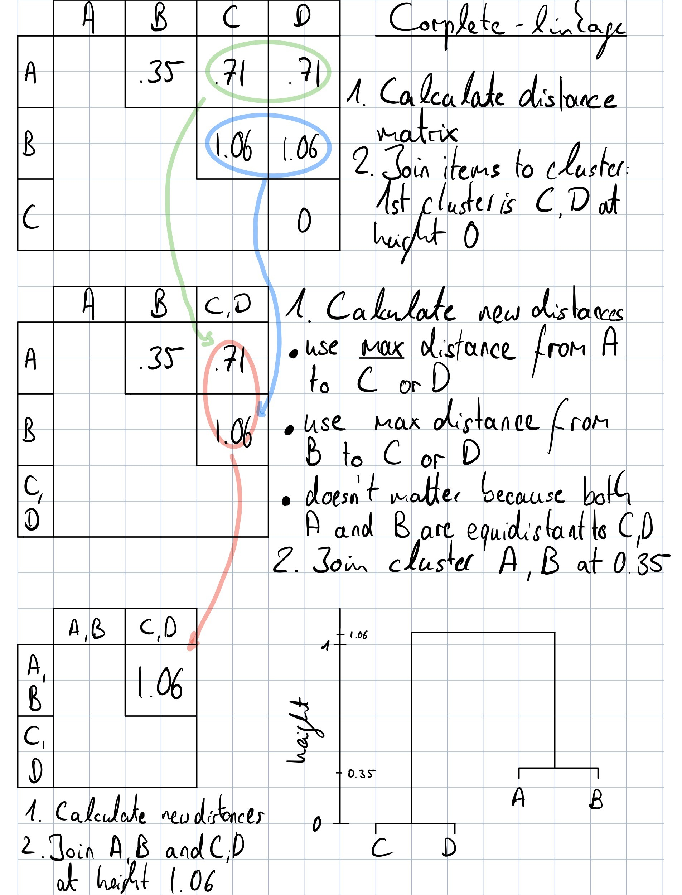

```{r setup, include = F}
knitr::opts_chunk$set(
  collapse = TRUE,
  comment = "##"
)
library(quanteda)
library(ggplot2)
```

In the first part of the assignment, we will strengthen our intuition for distance metrics and clustering methods. In particular, we will look at Euclidean distance and hierarchical clustering. These methods are widely used in data science, even beyond natural language processing. It is therefore worthwhile to get a solid working knowledge of these techniques.

Recall the following corpus from the lecture slides of session 8.

```{r}
txt <- c(A = "Win Prize", 
         B = "Win Prize Prize Prize",
         C = "Win Win", 
         D = "Win Win Win")
```

**Question 1 (1 point)**

Start by converting the corpus to a document-feature-matrix called `x`. Throughout the following tasks, we will use euclidean distance to quantify how different documents are. Therefore, it is recommendable to use the relative frequencies of the features given the document. Create a weighted document-feature-matrix called `xw` using `dfm_weight()` with the appropriate function argument.

```{r}

```

### Question 2 (6 points)

The documents only have two distinct features and can therefore be represented in a two-dimensional coordinate system. Drawing on the figure below, calculate the euclidean distances between the documents manually. Please show the numbers that lead to your results. You should obtain six pair-wise distances between documents. For better readability, create a named vector that stores all six distances and print it to the console, for example: `c(A_to_B = NA, A_to_C = NA)`

Hint: Recall the Pythagorean theorem which allows you to calculate the hypotenuse of a right triangle.

```{r, out.width="90%", fig.align="center"}

ggplot(data = convert(xw,"data.frame"), aes(win, prize)) + 
  # use jitter because two points overlap
  geom_jitter(aes(color = doc_id),width = .005, height = 0) + 
  # specify axis ticks and breaks
  scale_x_continuous(limits = c(-.05,1.1), breaks = c(0, .5, 1)) +
  scale_y_continuous(limits = c(-.05,1.1), breaks = c(0, .5, 1)) +
  # use simple layout with increased font size
  theme_bw(base_size = 15)

```

```{r}

```

### Question 3 (2 points)

Verify your calculations by comparing your manual calculations to the output of the `textstat_dist()` function from the quanteda package. Assign the output to an object called `qdist`.

We will use this distance matrix for creating a dendrogram using the stats package which is already installed and loaded in your current R session. For compatibility reasons, we need to convert the `qdist` object to a stats object using `as.dist()`. Please call it `sdist`. 

```{r}

```

### Question 4 (4 points)

On the basis of this dissimilarity matrix and the figure above, sketch the dendrogram that results from hierarchically clustering these four observations. Indicate the height at which the clusters were merged in your dendrogram. To do this, employ the same set of steps outlined in the lecture slides but use the *single-linkage* criterion.

Please include a graphic of the calculations that lead to your results. It is fine to snap a photo of the drawing using your phone or draw any other way. You can embed the photo in RMarkdown file with the example code below.

```{r complete-linkage-example, out.width="90%", fig.align="center"}

```

```{r single-linkage-example, out.width="90%", fig.align="center"}

```

### Question 5 (3 points)

Now run the hierarchical clustering algorithm for "single" and "complete" linkage and plot the dendrogram using R's built-in functions. How are the two plots similar? How are they different?

**Your answer here**

> 

```{r}

```
