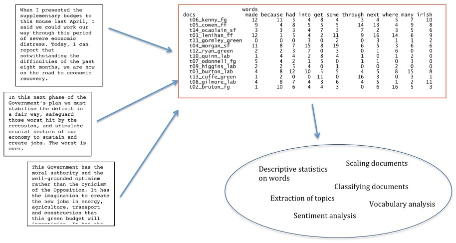
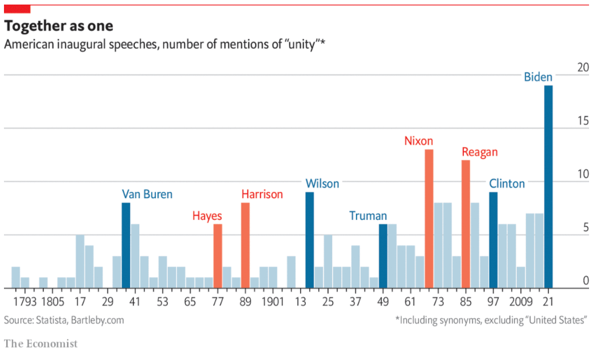
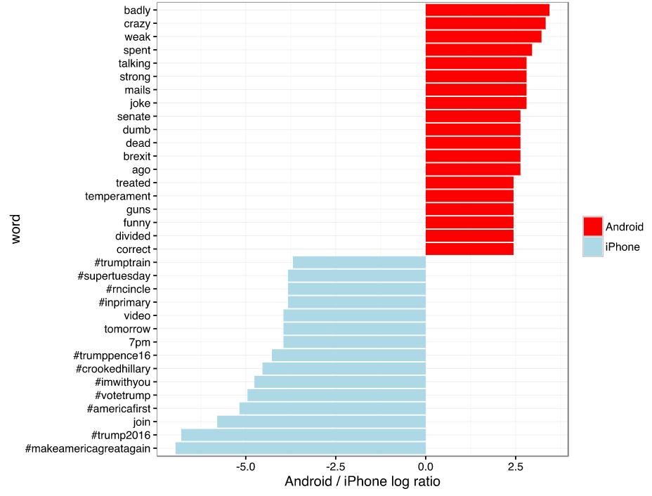
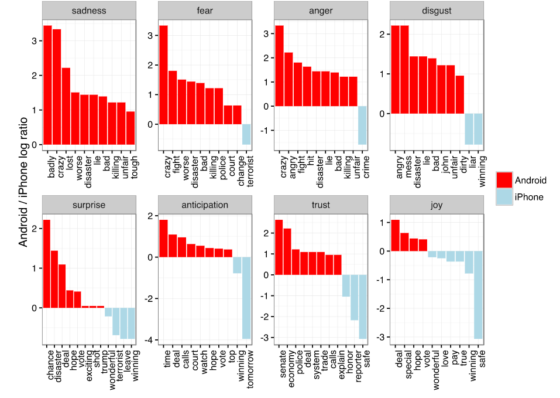
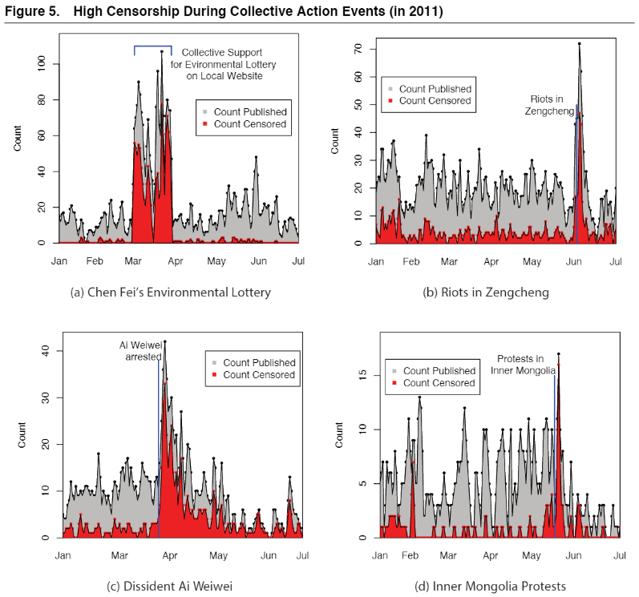
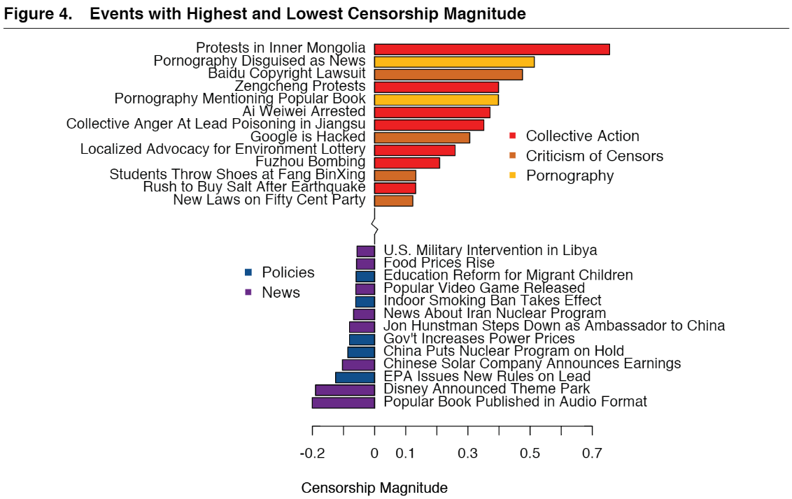

<!-- # see live presentation with xaringan::inf_mr('Session 1/session_1_slides.Rmd') -->

# Outline for today


1. **Intro**
    - What is this course?
    - What am I going to learn in this course?
    
2. **Quantitative Text Analysis principles**
    - What is QTA?
    - Motivation and assumptions
    - Example analyses

3. **Review of the R language**
    - Anatomy of code
    - Data types and structures
    - Operators
    - Functions and libraries
    
---
class: inverse, center, middle

# Intro

<html><div style='float:left'></div><hr color='#EB811B' size=1px width=800px></html> 

---
#Text as data

.pull-left[


]
.pull-right[

<br>

]

???

**Technological change** created many new **research opportunities** because a increasing number of events become documented and readily **available in electronic format**. 

Very old documents such this publication by the catholic church and not so old documents such as these party manifestos are digitized.

Other events happen in the digital sphere

Political scientist use these data sources to answer old and new questions of the discipline

These data, particularly textual data but it could also voice recordings, require new methods for analysis - which is what this course will be about: **equip you with a new tool set for empirical projects**

Two use cases for the content of this course: 

1. maybe you're interested in data mining, machine learning, sentiment analysis and want to see **how these methods play out when comes to answering scientific question** of the field you're working in. you'll get a better understanding of this line of research

2. you might want to conduct a **pilot study** for your masters thesis -> help 

---
# Course schedule

| Session |  Date  | Topic                                                |   Assignment  |     Due date    |
|:-------:|:------:|:-----------------------------------------------------|:-------------:|:---------------:|
|    1    | Feb 02 | *Overview and key concepts*                          |     \-        |     \-          |
|    2    | Feb 09 | Preprocessing and descriptive statistics             | Formative     | Feb 22 23:59:59 |
|    3    | Feb 16 | Dictionary methods                                   |     \-        |     \-          |
|    4    | Feb 23 | Machine learning for texts: Classification I         | Summative 1   | Mar 08 23:59:59 |
|    5    | Mar 02 | Machine learning for texts: Classification II        |     \-        |     \-          |
|    6    | Mar 09 | Supervised and unsupervised scaling                  | Summative 2   | Mar 15 23:59:59 |
|    7    | Mar 16 | Similarity and clustering                            |     \-        |     \-          |
|    8    | Mar 23 | Topic models                                         | Summative 3   | Apr 12 23:59:59 |
|   \-    |   \-   | *Break*                                              |     \-        |     \-          |
|    9    | Apr 13 | Retrieving data from the web                         |     \-        |     \-          |
|   10    | Apr 20 | Published applications                               |     \-        |     \-          |
|   11    | Apr 27 | Project Presentations                                |     \-        |     \-          |


???

we will apply these techniques to text data but there are **broader principles underlying the methods that your can transfer** to other data settings (classifier, evaluating the quality of the results of a machine learning algorithm) 

---
# Course objectives

<br>

- learning the fundamentals of computational methods, particularly for text analysis

- ability to apply statistical and machine learning methods for text in R 

- evaluating the strengths and weaknesses of these techniques for answering political science questions

- enhanced understanding of published applications

- conduct independent empirical research using quantitative text analysis 

???


Administrative:
- save computer memory during sessions: Most problems arise due to internet connection or working memory. BigBlueButton is browser based and therefore require more working memory than app-based software like Zoom or Microsoft Teams. It is therefore crucial to close unnecessary applications and to clean the cache of your browser, for example by restarting your computer regularly.

---
# Tell us about yourself

.left-column[
<br>


]
.right-column[
- What do you study?

- What do you expect from this course?

- What is your experience with R and/or quantitative text analysis?

- Do you have a topic in mind that you want to explore?
]

???

getting to know each other: 
- creates a more enjoyable atmosphere
- helps me to adapt the course material to your experience and expectations

---
class: inverse, center, middle

# Fundamentals of<br>quantitative text analysis

<html><div style='float:left'></div><hr color='#EB811B' size=1px width=800px></html> 

---
# Text to document-feature matrix
<br>
<br>


???

this is what QTA is about on a **technical level**

- **matrix shows** the count of words (columns) in a document (row)
- **descriptive statistics** on words 
    - has the frequency of a word changed 
    - which words occur in which contexts
- **sentiment analysis**
    - has a text a more negative or positve tone
- **scaling documents **
    - estimating left right ideology of parliament speeches

---
# Roadmap for QTA projects

1. Selecting texts: Defining the **corpus**

2. **Conversion** of texts into a common electronic format

3. **Defining documents**: deciding what will be the documentary
unit of analysis

4. **Defining features**. These can take a variety of forms, including
tokens, equivalence classes of tokens (dictionaries), selected
phrases, human-coded segments (of possibly variable length),
linguistic features, and more.

5. Conversion of textual features into a **quantitative matrix**

6. A **quantitative or statistical procedure** to extract information
from the quantitative matrix

7. **Summary** and interpretation of the quantitative results

???

1. Where does the **data come from**? What are the **conclusions** that the texts allow me me draw? (What is the data generating process? Random or convenience sample...)
2. For example, before analyzing inauguration speeches by US presidents they had to be converted. Most of the texts we will analyze come in electronic format
3. Defining documents (or rows in the dfm) depends on your research question. Analyze tweets of a single member of parliament (each tweet = 1 row). Compare members of parliamemt (combine all tweets of one person = 1 row)
4. 
---
# Why quantitative text analysis?

#### Justin Grimmer's haystack metaphor

Analyzing a straw of hay: understanding the meaning of a
sentence

$\rightarrow$ Humans are great! But computer struggle.

Organizing the haystack: *describing, classifying, scaling texts*

$\rightarrow$ Humans struggle. But computers are great! (What this course is about)

<br>

--

#### Principles of quantitative text analysis (Grimmer and Stewart 2013)

1. All quantitative models are wrong - but some are useful
2. Quantitative methods for text *amplify* resources and *augment*
humans
3. There is no globally best method for automated text analysis
4. Validate, validate, validate

???

- QTA augments human ability rather replace
- interpretation of quantitative results is hard (or impossible) without knowing the texts
- choice of method depends on your question, therefore we will cover a broad range so that participants not confined to particular research questions in the final project


---
# Quantitative text analysis requires assumptions

1. Texts represent an observable implication of some **underlying
characteristic** of interest
  - An attribute of the author
  - A sentiment or emotion
  - Salience of a political issue

2. Texts can be represented through **extracting their features**
  - most common is the bag of words assumption
  - many other possible definitions of “features” (e.g. word
embeddings)

3. A document-feature matrix can be analyzed using quantitative
methods to produce **meaningful and valid estimates** of the
underlying characteristic of interest

---
# Overview of text as data methods
<br>

&nbsp; Fig. 1 in Grimmer and Stuart (2013) 

???

- Classification: Which documents are about a certain topic? (or spam email)
    - Known categories: sorting newspaper articles into categories (sports, politics, business)
        - Dictionary methods: which words are associated with certain concepts (positive or negative tone)
        - Supervised methods: let individuals categorize a collection of documents and apply machine learning algorithm to predict the categories of other documents
    - Unknown categories: sometimes we don't know the categories included in a corpus. We can use a computer to identify topics
        - Single membership models: the computer will assign a single category to the document
        - Mixed membership model: the computer assigns a numerical value corresponding to the degree to which the documents contains a certain topic: this document is 20% about business, 30% about politics etc.
- Scaling documents: Place documents within a spectrum, for example left and right ideology
    - We will talk about unsupervised and unsupervised methods
- Entity recognition: let the computer recognize which words represent names, events, locations, etc.

---
class: inverse, center, middle

# Examples

<html><div style='float:left'></div><hr color='#EB811B' size=1px width=800px></html> 

---
# Compare documents


The Economist ([2021](https://www.economist.com/graphic-detail/2021/01/21/more-than-any-president-joe-biden-emphasised-unity-at-his-inauguration))


???


The article points to the various requirements an inaugural speech has to fulfill. The president has to define an agenda of goals and priorities, has to address important people such as supreme-court justices, former presidents, members of the armed forces, and elicit emotions from in the audience.

In his 2411-word speech in 21.5 minutes, Biden called for unity more than any other president. The words "unity", "together", and "as one" accounted for 0.8% of his speech. Put differently, such language occurred roughly one in every hundred words.

In percentage terms, he also surpassed George Washington's 133-word speech where he included one reference to people of the "united America". Of course, its the brevity of the speech that accounted for that long-held record: $100 \times \frac{1}{133}=0.75\%$. 

From the perspective of quantitative text analysis, this example tells us that we need measurements that account for the importance of a word within a document before being compared the importance of word within other documents.

---
# Authorship identification


&nbsp; &nbsp; &nbsp; &nbsp; &nbsp; Robinson ([2016](http://varianceexplained.org/r/trump-tweets/))

???

In his analysis, David Robinson analyzed 1390 tweets posted between December 12, 2015 and August 8, 2016. Following a hint by a vigilant twitter user, his shows that Trump tweets with Android while his campaign uses an iPhone.

Trump vs. campaign

Using the relative frequency of words in tweets from Android and iPhone, Robinson compares the words that are characteristic for each device.

The tweets differ with respect to hashtags, the use of dates when announcing events, and the use emotionally charged words.

After Trump switched to an iPhone a more sophisticated method is required: e.g. a classifier based on machine learning 

---
# Sentiment analysis


&nbsp; &nbsp; &nbsp; &nbsp; Robinson ([2016](http://varianceexplained.org/r/trump-tweets/))

---
# Track censorship


&nbsp; &nbsp; &nbsp; &nbsp; &nbsp; &nbsp; &nbsp; &nbsp; &nbsp; &nbsp; &nbsp; King, Pan and Roberts (2013)

???

- Good example of the skills we are going to learn: The authors retrieved posts on social media quickly after being published and then verified if the post was removed later
- Idea: What is the agenda of the censorship program of the Chinese government? 
- They argue: topic with much speculation but little empirical evidence

---
# Track censorship

#### What is the agenda of the censorship program of the Chinese government?



&nbsp; &nbsp; &nbsp; King, Pan and Roberts (2013) 

???

The authors find that censorship affects posts that spur collective action while allowing posts that criticize the state, its leaders, or policies.

---
class: inverse, center, middle

# The R language

<html><div style='float:left'></div><hr color='#EB811B' size=1px width=800px></html> 
---
# R and RStudio

.left-column[
<br>

<br>
<br>
<br>
<br>


]

.right-column[
<br>
R is a free software environment for statistical computing and graphics (and a programming language)


<br>
<br>
<br>
<br>
RStudio is an integrated development environment (IDE) for R

Loosely speaking, it makes using R more convenient!

]

.footnote[
Please download and install base [R](https://cran.microsoft.com/) and [RStudio](https://rstudio.com/products/rstudio/download/) Desktop before the next session (see [tutorial](https://www.datacamp.com/community/tutorials/installing-R-windows-mac-ubuntu)).
]
---
# Parts of RStudio


.left-column[
1. **Scripts**: Recipe of what to do
2. **Console**: executes commands
3. **Workspace**: Memory of what is currently loaded
4. **Files/Plots/Help**: Miscellaneous functions such as displaying files, plots, and help files
]

.right-column[

]

???

stress importance of help function in quanteda and give example ?mean


---

# Projects in RStudio

Where did R just save the file to? Its "working directory".

Each project should have its own encapsulation using an RStudio project

Upper right corner of RStudio, click new Projects


Then the working directory is set where the project (`.Rproj`) is saved.

Fore more, read this [blog](https://www.tidyverse.org/blog/2017/12/workflow-vs-script/)

---

# Outline Intro R

- <mark>Anatomy of Code</mark>: How does code look like what are components of it?

- R as a (fancy) Calculator: Simple maths with R

- <mark>Comparison and Logical Operations</mark>: How can we compare data?

- <mark>Data Types</mark>: What kind of data does R recognize?

- <mark>Data Structures</mark>: How can we store data?

- Conditional Statements: Managing workflow

- <mark>Anatomy of a Function</mark>: What are the elements of a function?

- <mark>Libraries<mark>: How can we use predefined functions

<br>

We need to have a basic understanding of highlighted topics before we start with QTA in R!

???


---

# Anatomy of Code

.left-column[
- Comments
- Variables
- Conditionals
- Functions
- Libraries
]
.right-column[
```{r, eval=F}
 # Load data, run a regression, and export the results
 library(tidyverse)
 library(texreg)
 
 # should the result be saved to a file?
 save_to_file <- TRUE

 # loads the data from file
 cars_data <- read_csv("data/cars_data.csv")

 # performs the regression
 model <- lm(mpg ~ wt + cyl + hp, data = cars_data)

 # converts the regression model to a tex-string
 tex_string <- texreg(model)
 
 # check if the result should be saved to a file
 if (save_to_file) {
   # saves the tex-string to a file
   write_lines(tex_string, "written/tables/cars_regression.tex")
 }
```
]

---

# Anatomy of Code

.left-column[
- <mark>Comments</mark>
- Variables
- Conditionals
- Functions
- Libraries
]
.right-column[
```{r, eval=F}
 # Load data, run a regression, and export the results  #<<
 library(tidyverse)
 library(texreg)

 # should the result be saved to a file?   #<<
 save_to_file <- TRUE
 
 # loads the data from file                          #<<
 cars_data <- read_csv("data/cars_data.csv")

 # performs the regression                                #<<
 model <- lm(mpg ~ wt + cyl + hp, data = cars_data)

 # converts the regression model to a tex-string      #<<
 tex_string <- texreg(model)

 # check if the result should be saved to a file #<<
 if (save_to_file) {
   # saves the tex-string to a file #<<
   write_lines(tex_string, "written/tables/cars_regression.tex")
 }
```
]

---

# Anatomy of Code

.left-column[
- Comments
- <mark>Variables</mark>
  - <mark>Assignment</mark>
  - Usage
- Conditionals
- Functions
- Libraries
]
.right-column[
```{r, eval=F}
 # Load data, run a regression, and export the results
 library(tidyverse)
 library(texreg)

 # should the result be saved to a file?
 `save_to_file <- `TRUE
 
 # loads the data from file
 `cars_data <- `read_csv("data/cars_data.csv")

 # performs the regression
 `model <- `lm(mpg ~ wt + cyl + hp, data = cars_data)

 # converts the regression model to a tex-string
 `tex_string <- `texreg(model)     

 # check if the result should be saved to a file
 if (save_to_file) {
   # saves the tex-string to a file
   write_lines(tex_string, "written/tables/cars_regression.tex")
 }
```
]

---

# Anatomy of Code

.left-column[
- Comments
- <mark>Variables</mark>
  - Assignment
  - <mark>Usage</mark>
- Conditionals
- Functions
- Libraries
]
.right-column[
```{r, eval=F}
 # Load data, run a regression, and export the results
 library(tidyverse)
 library(texreg)

 # should the result be saved to a file?
 save_to_file <- TRUE
 
 # loads the data from file
 cars_data <- read_csv("data/cars_data.csv")

 # performs the regression
 model <- lm(mpg ~ wt + cyl + hp, data = `cars_data`)

 # converts the regression model to a tex-string
 tex_string <- texreg(`model`)     

 # check if the result should be saved to a file
 if (`save_to_file`) {
   # saves the tex-string to a file
   write_lines(`tex_string`, "written/tables/cars_regression.tex")
 }
```
]

---

# Anatomy of Code

.left-column[
- Comments
- Variables
- <mark>Conditionals</mark>
- Functions
- Libraries
]
.right-column[
```{r, eval=F}
 # Load data, run a regression, and export the results
 library(tidyverse)
 library(texreg)

 # should the result be saved to a file?
 save_to_file <- TRUE
 
 # loads the data from file
 cars_data <- read_csv("data/cars_data.csv")

 # performs the regression
 model <- lm(mpg ~ wt + cyl + hp, data = cars_data)

 # converts the regression model to a tex-string
 tex_string <- texreg(model)     

 # check if the result should be saved to a file
 `if (save_to_file) {`
   # saves the tex-string to a file
   write_lines(tex_string, "written/tables/cars_regression.tex")
 `}`
```
]

---

# Anatomy of Code

.left-column[
- Comments
- Variables
- Conditionals
- <mark>Functions</mark>
  - <mark>Function Call</mark>
  - Function Parameters
- Libraries
]
.right-column[
```{r, eval=F}
 # Load data, run a regression, and export the results
 `library(`tidyverse`)`
 `library(`texreg`)`

 # should the result be saved to a file?
 save_to_file <- TRUE
 
 # loads the data from file
 cars_data <- `read_csv(`"data/cars_data.csv"`)`

 # performs the regression
 model <- `lm(`mpg ~ wt + cyl + hp, data = cars_data`)`

 # converts the regression model to a tex-string
 tex_string <- `texreg(`model`)`

 # check if the result should be saved to a file
 if (save_to_file) {
   # saves the tex-string to a file
   `write_lines(`tex_string, "written/tables/cars_regression.tex"`)`
 }
```
]

---

# Anatomy of Code

.left-column[
- Comments
- Variables
- Conditionals
- <mark>Functions</mark>
  - Function Call
  - <mark>Function Parameters</mark>
- Libraries
]
.right-column[
```{r, eval=F}
 # Load data, run a regression, and export the results
 library(`tidyverse`)
 library(`texreg`)

 # should the result be saved to a file?
 save_to_file <- TRUE
 
 # loads the data from file
 cars_data <- read_csv(`"data/cars_data.csv"`)

 # performs the regression
 model <- lm(`mpg ~ wt + cyl + hp`, `data = cars_data`)

 # converts the regression model to a tex-string
 tex_string <- texreg(`model`)

 # check if the result should be saved to a file
 if (`save_to_file`) {
   # saves the tex-string to a file
   write_lines(`tex_string`, `"written/tables/cars_regression.tex"`)
 }
```
]

---

# Anatomy of Code

.left-column[
- Comments
- Variables
- Conditionals
- Functions
- <mark>Libraries</mark>
]

.right-column[
```{r, eval=F}
 # Load data, run a regression, and export the results
 `library(tidyverse)`
 `library(texreg)`

 # should the result be saved to a file?
 save_to_file <- TRUE
 
 # loads the data from file
 cars_data <- read_csv("data/cars_data.csv")

 # performs the regression
 model <- lm(mpg ~ wt + cyl + hp, data = cars_data)

 # converts the regression model to a tex-string
 tex_string <- texreg(model)
 
# check if the result should be saved to a file
 if (save_to_file) {
   # saves the tex-string to a file
   write_lines(tex_string, "written/tables/cars_regression.tex")
 }
```
]

---

# R as a (fancy) calculator

.left-column[
Basic Oparators

basic
- `+`, `-`, `*`, `/`

power
- `^`, `sqrt()`

logarithmic
- `log()`, `exp()`

modulus and int division
- `%%`, `%/%`
]
.right-column[
  .left-col[
  
  ```{r}
  1 + 1
  2 - 2
  3 * 3
  4 / 4
  5^5
  ```
  ]
  .right-col[
  ```{r}
  sqrt(9)
  log(2.7182)
  exp(1)
  10 %% 3
  10 %/% 3
  ```
  ]
]

???

- modulus %% gives the remainder of x divided by y
- %/% integer division gives x divided by y but rounded down
---

# Data Types

R knows different types of data

Name | Description |Examples
:----|:----|:----
`logical` | Boolean values | `TRUE`, `FALSE`, `NA`
`integer` | Integer numbers | `1L`,  `-10L`, `0L`, `NA`
`numeric` | Numeric values | `1`, `-0.3`, `1/3`, `NA`
`character` | Characters | `"hello"`, `"1.0"`, `"TRUE"`, `NA`
... | ...

Other types (that we won't really use for now) include `factors`, `complex`, ...

---

# Comparison Operators

Operator | Name | Example | Result
:--------|:-----|:-------:|:------:
`<`  | Smaller | `3 < 5` | `TRUE`
`<=` | Smaller Equal | `3 <= 3` | `TRUE`
`>`  | Larger | `3 > 5` | `FALSE`
`>=` | Larger Equal | `5 >= 3` | `TRUE`
`==` | Equal | `"Alice" == "Bob"` | `FALSE`
`!=` | Not Equal | `"Alice" != 5` | `TRUE`

Also `%in%` (checks if a value is in a vector), `"Alice" %in% c("Alice", "Bob")` evaluates to `TRUE`.

---

# Logical Operators

Operator | Name | Example | Result
:--------|:-----|:-------:|:------:
`&` | And | `3 == 5 & 4 < 5` | `FALSE`
&#124; | Or  | `3 == 5 `&#124;` 4 < 5` | `TRUE`
`!` | Not | `!(4 < 5)` | `FALSE`

---

# Data Structures

.left-column[
- <mark>Single Type</mark>
  - <mark>Vectors</mark>
  - Matrix
- Multiple Types
]
.right-column[
Using the `c()` function to combine values into a vector
```{r}
heights <- c(186, 176, 165, 172, 187)
heights
# only one type per vector
vec <- c(160, "Alice", TRUE)
vec
```
]

---

# Data Structures

.left-column[
- <mark>Single Type</mark>
  - <mark>Vectors</mark>
  - Matrix
- Multiple Types
]
.right-column[
Creating a sequence using `:` or `seq()`
```{r}
1:10
seq(1, 10, 2)
seq(1, 10, length.out = 5)
```
]

---

# Data Structures

.left-column[
- <mark>Single Type</mark>
  - Vectors
  - <mark>Matrix</mark>
- Multiple Types
]
.right-column[
Create a matrix from a vector using `matrix()`
```{r}
mat <- matrix(1:9, nrow = 3)
mat
# Only one type per matrix
mat2 <- matrix(c(1, 2L, TRUE, "Bob"), nrow = 2)
mat2
```
]

---

# Data Structures

.left-column[
- Single Type
- Multiple Types
  - <mark>List</mark>
  - Data.Frames
]
.right-column[
Create a list where each element can have a different type using `list`
.smaller[
```{r}
# a named vector
person <- list(name = "Alice", 
               children = list(
                 list(name = "Bobby"),
                 list(name = "Charlie")
               )
)
person
```
]
]

---

# Data Structures

.left-column[
- Single Type
- Multiple Types
  - List
  - <mark>Data.Frames</mark>
]
.right-column[
Create a data.frame from vectors, where each variable has one type (is a vector)
```{r}
people <- data.frame(
  name = c("Alice", "Bob", "Charlie"),
  age  = c(40, 25, 15),
  num_children = c(2, 1, 0),
  has_children = c(TRUE, TRUE, FALSE)
)
people
```
]

---

# Basic Data Access

Using the `[]`-operator we can access elements of a vector (1D), a matrix (2D), a list (n-dimensional), a data.frame (2D).
.left-col[
```{r}
heights <- c(186, 204, 176, 165, 182)
# accesses the third element
heights[3]
# accesses certain elements
heights[c(2, 1, 3, 5, 4)]
```
]
.right-col[
```{r}
# compare if an element is 
# larger than 180
heights > 180
# take elements that are 
# larger than 180
heights[heights > 180]
```
]


---

# Basic Data Access

The `[]`-operator can also be used for 2D structures as `mat[row, col]`
.left-col[
```{r}
mat <- matrix(1:9, nrow = 3)
mat

# take the first row, third column
mat[1, 3]
```
]
.right-col[
```{r}
# take only the first row
mat[1, ]

# take only the first column
mat[, 1]

# take the first and second row, 
# first and third column
mat[1:2, c(1, 3)]
```
]
---

# Conditionals
For workflow management, sometimes we need want to evaluate (=execute) code only if certain conditions are met

.left-column[
- if call
- Condition
- Body
- (possible) else-if
- (possible) else
]
.right-column[
```{r, eval=F}
 if (condition1) {
   print("condition1 is true!")
 } else if (condition2) {
   print("condition1 is not true but condition2 is true!")
 } else {
   print("Neither condition1 nor condition2 is true!")
 }
```
]

---

# Conditionals
For workflow management, sometimes we need want to evaluate (=execute) code only if certain conditions are met

.left-column[
- <mark>if call</mark>
- Condition
- Body
- (possible) else-if
- (possible) else
]
.right-column[
```{r, eval=F}
 `if (`condition1`)` {
   print("condition1 is true!")
 } else if (condition2) {
   print("condition1 is not true but condition2 is true!")
 } else {
   print("Neither condition1 nor condition2 is true!")
 }
```
]

---

# Conditionals
For workflow management, sometimes we need want to evaluate (=execute) code only if certain conditions are met

.left-column[
- if call
- <mark>Condition</mark>
- Body
- (possible) else-if
- (possible) else
]
.right-column[
```{r, eval=F}
 if (`condition1`) {
   print("condition1 is true!")
 } else if (condition2) {
   print("condition1 is not true but condition2 is true!")
 } else {
   print("Neither condition1 nor condition2 is true!")
 }
```
]

---

# Conditionals
For workflow management, sometimes we need want to evaluate (=execute) code only if certain conditions are met

.left-column[
- if call
- Condition
- <mark>Body</mark>
- (possible) else-if
- (possible) else
]
.right-column[
```{r, eval=F}
 if (condition1) `{`
   print("condition1 is true!") #<<
 `}` else if (condition2) {
   print("condition1 is not true but condition2 is true!")
 } else {
   print("Neither condition1 nor condition2 is true!")
 }
```
]

---

# Conditionals
For workflow management, sometimes we need want to evaluate (=execute) code only if certain conditions are met

.left-column[
- if call
- Condition
- Body
- <mark>(possible) else-if</mark>
- (possible) else
]
.right-column[
```{r, eval=F}
 if (condition1) {
   print("condition1 is true!")
 } `else if (condition2) {`
   print("condition1 is not true but condition2 is true!") #<<
 `}` else {
   print("Neither condition1 nor condition2 is true!")
 }
```
]

---

# Conditionals
For workflow management, sometimes we need want to evaluate (=execute) code only if certain conditions are met

.left-column[
- if call
- Condition
- Body
- (possible) else-if
- <mark>(possible) else</mark>
]
.right-column[
```{r, eval=F}
 if (condition1) {
   print("condition1 is true!")
 } else if (condition2) {
   print("condition1 is not true but condition2 is true!") 
 } `else {`
   print("Neither condition1 nor condition2 is true!")#<<
 `}`
```
]

---

# Conditionals 

We can have conditional statements with only the `if`-part, ...
```{r, eval=F}
if (rains) {
  take_umbrella()
}
```

... an `if` and an `else` case, ...
```{r, eval=F}
if (rains) {
  take_umbrella
} else {
  wear_shorts()
}
```

---

# Conditionals

...,  multiple `else if`s (and multiple `else if`s and an `else` case)
```{r, eval=F}
if (rains) {
  take_umbrella()
} else if (sunny) {
  apply_sunsreen()
} else if (snows) {
  go_snowboarding()
} else if (windy) {
  go_surfing()
}
```

Q: What happens if its windy and sunny?

Q: What can we do if we want to go surfing and apply sunscreen?

---

# Conditionals short and vectorized

The `if () {} else {}` functions evaluate only the first element of the condition.

What can we use to apply the if-else statement to a vector of values? `ifelse()`

```{r, eval=FALSE}
ifelse(condition, 
       "Value if condition is true",
       "Value if condition is false")
```
--
```{r}
heights <- c(186, 204, 176, 165, 182)
ifelse(heights > 180, "above 180", "below 180")

```
--
```{r}
ifelse(heights > 180, 
       "h > 180", 
       ifelse(heights > 170,
              "170 < h <= 180",
              "h <= 170"))
```

---

# Function introduction

## Does this make sense?

```{r, eval=F}
print("Good morning Alice")
print("Good evening Alice")
print("Good evening Bob")
print("Good morning Bob")
print("Good day Charlie")
print("Good day Alice")
```

What happens if we want to change "Good" to something else or we find that we have some spelling error and need to find and change every part of it?

--

### <mark>Don't repeat yourself!</mark>

Use functions!

---

# Anatomy of a Function

.left-column[
- Assign
- Arguments
- Body
- Return Values
- Function Call
]
.right-column[
**Function**: Write once, use often
```{r, eval=T}
 # define the function 'greet' once:
 greet <- function(daytime, name) {
   text <- paste("Good", daytime, name)
   text
 }

 # use the function 'greet' as often as needed
 result <- greet("morning", "Alice")
 result
 # or print result of the function directly to the console
 greet("evening", "Alice")
```
]

---

# Anatomy of a Function

.left-column[
- <mark>Assign</mark>
- Arguments
- Body
- Return Values
- Function Call
]
.right-column[
**Assigning** a function to `greet`
```{r, eval=F}
 # define the function 'greet' once:
 `greet <- function`(daytime, name) {
   text <- paste("Good", daytime, name)
   text
 }

 # use the function 'greet' as often as needed
 result <- greet("morning", "Alice")
```
]

---

# Anatomy of a Function

.left-column[
- Assign
- <mark>Arguments</mark>
- Body
- Return Values
- Function Call
]
.right-column[
**Arguments** are variables passed into the body of the functions
```{r, eval=F}
 # define the function 'greet' once:
 greet <- function(`daytime`, `name`) {
   text <- paste("Good", daytime, name)
   text
 }

 # use the function 'greet' as often as needed
 result <- greet(`"morning"`, `"Alice"`)
```
]

---

# Anatomy of a Function

.left-column[
- Assign
- Arguments
- <mark>Body</mark>
- Return Values
- Function Call
]
.right-column[
**Body** is executed everytime the function is called
```{r, eval=F}
 # define the function 'greet' once:
 greet <- function(daytime, name) `{`
   text <- paste("Good", daytime, name)  #<<
   text                                  #<<
 `}`

 # use the function 'greet' as often as needed
 result <- greet("morning", "Alice")
```
]

---

# Anatomy of a Function

.left-column[
- Assign
- Arguments
- Body
- <mark>Return Values</mark>
- Function Call
]
.right-column[
**Return**: the last element that is called is returned
```{r, eval=F}
 # define the function 'greet' once:
 greet <- function(daytime, name) {
   text <- paste("Good", daytime, name)
   text # the last element is returned #<<
 }

 # use the function 'greet' as often as needed
 result <- greet("morning", "Alice")
```

The function could be also shortened to
```{r, eval=F}
greet <- function(daytime, name) {
   paste("Good", daytime, name)
}
# or even shorter
greet <- function(daytime, name) paste("Good", daytime, name)
```
]

---

# Anatomy of a Function

.left-column[
- Assign
- Arguments
- Body
- Return Values
- <mark>Function Call</mark>
]
.right-column[
**Call** the function using its name and parenthesis `()` with arguments
```{r, eval=F}
 # define the function 'greet' once:
 greet <- function(daytime, name) {
   text <- paste("Good", daytime, name)
   text
 }

 # use the function 'greet' as often as needed
 `result <- greet("morning", "Alice")`
 result
```
```{r, echo=F}
greet("morning", "Alice")
```
```{r}
# named function call also possible
greet(name = "Bob", daytime = "night")
```
]

---

# Default Values

We can also specify default values for function arguments in the definition of the function
```{r, eval=F}
greet <- function(`daytime = "morning"`, `name = "Alice"`) {
  text <- paste("Good", daytime, name)
  text
}
```
```{r,echo=F}
greet <- function(daytime = "morning", name = "Alice") {
  text <- paste("Good", daytime, name)
  text
}
```
--
```{r}
greet("evening") # no 'name' supplied, take default "Alice"
```
--
```{r}
greet() # neither 'daytime' nor 'name' supplied, take both default values
```
--
```{r}
greet(name = "Bob") # no daytime supplied, take default
```


---

# Objects and Functions

> To understand computations in R, two slogans are helpful:
- Everything that **exists** is an object [variable]
- Everything that **happens** is a function call

John Chambers

Example Code
```{r, eval=F}
 x <- rnorm(100)
 mean(x)
```

---

# Objects and Functions

> To understand computations in R, two slogans are helpful:
- <mark>Everything that **exists** is an object [variable]</mark>
- Everything that **happens** is a function call

John Chambers


Example Code
```{r, eval=F}
 `x` <- rnorm(`100`)
 mean(`x`)
```

---

# Objects and Functions

> To understand computations in R, two slogans are helpful:
- Everything that **exists** is an object (variable)
- <mark>Everything that **happens** is a function call</mark>

John Chambers

Example Code
```{r, eval=F}
 x <- `rnorm`(100)
 `mean`(x)
```

---
# From Functions to Libraries

When we use R and its functions (e.g., linear regression), we don't want to implement every function over and over again but want to use existing functions.

Functions can be packaged into a **Package/Library**, which is then easy to distribute and install on different machines.

Main distribution channel is called CRAN (Comprehensive R Archive Network) https://cran.r-project.org/ with over 12,000 packages.

--

To **install** packages from CRAN we use the `install.packages("packageName")`. 
Note, this needs to be done only once, thus we use the console!

--

In every session, we need to **load** the package using `library(packageName)`.

```{r, eval=F}
# install the package tidyverse once (console)
install.packages("tidyverse")

# on top of each script, we write (NOT CONSOLE!)
library(tidyverse)
```


---
# References

Grimmer, Justin, and Brandon M. Stewart. 2013. "Text as Data: The Promise and Pitfalls of Automatic Content Analysis Methods for Political Texts." Political Analysis 21 (3): 267–97. https://doi.org/10.1093/pan/mps028.

King, Gary, Jennifer Pan, and Margaret E. Roberts. 2013. “How Censorship in China Allows Government Criticism but Silences Collective Expression.” The American Political Science Review 107 (2): 326–43.


