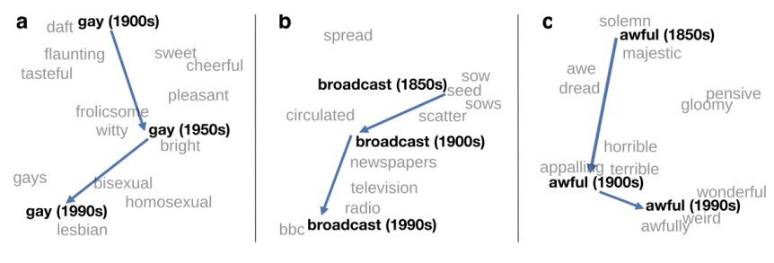

# Looking ahead

#### What we did 

So far we focused on how methods for quantitative text analysis work. 

We only briefly looked at applications of those methods.

--

#### The road ahead

However, we need to have a *deeper* understanding of how QTA helps us answer *substantive research questions*

In the next sessions, we will therefore evaluate how useful QTA methods are (as opposed to understanding how they work)

--

#### Motivation 

While methodological innovations are quite common, articles rarely showcase strong explanatory power of QTA for substantive research questions

E.g. an application challenged a widely established belief or revealed new insights for a specific research area in political science/sociology

---
# Outline for today

1. **Evaluations**

2. **Designing research**
  
  - Research questions and research design
  - How are we going to evaluate research papers in session 10
  - A recommendation on how to present your research ideas in session 11

3. **Discussion of published applications**

4. **Word embeddings**
  - How does it work? 
  -  The Geometry of Culture by Kozlowski et al [(2019)](https://doi.org/10.1177/0003122419877135) as an example

---
# Course schedule

| Session |  Date  | Topic                                                |   Assignment  |     Due date    |
|:-------:|:------:|:-----------------------------------------------------|:-------------:|:---------------:|
|    1    | Feb 02 | Overview and key concepts                            |     \-        |     \-          |
|    2    | Feb 09 | Preprocessing and descriptive statistics             | Formative     | Feb 22 23:59:59 |
|    3    | Feb 16 | Dictionary methods                                   |     \-        |     \-          |
|    4    | Feb 23 | Machine learning for texts: Classification I         | Summative 1   | Mar 08 23:59:59 |
|    5    | Mar 02 | Machine learning for texts: Classification II        |     \-        |     \-          |
|    6    | Mar 09 | Supervised and unsupervised scaling                  | Summative 2   | Mar 15 23:59:59 |
|    7    | Mar 16 | Similarity and clustering                            |     \-        |     \-          |
|    8    | Mar 23 | Topic models                                         | Summative 3   | Apr 12 23:59:59 |
|   \-    |   \-   | *Break*                                              |     \-        |     \-          |
|    9    | Apr 13 | Retrieving data from the web                         |     \-        |     \-          |
|   10    | Apr 20 | *Published applications*                             |     \-        |     \-          |
|   11    | Apr 27 | Project Presentations                                |     \-        |     \-          |

---
class: inverse, center, middle
# Designing research
--------------------

---
# Quality criteria

####While teachers are paid to read student reports, readers outside the university have no such incentive. 

####Writers must find other ways to convince their audience to read their work.

--

 

A good research design begins with a research question:
- for which the answer/s matter
- that builds on an identifiable body of knowledge
- that is feasible to (at least partially) answer

--

Why?  Because good research is *all* of the below:
- *consequential*: tells us something important
- *novel*: tells us something new
- *valid*: tells us something true

---
# The consequentiality criterion

There are lots of practicable yet trivial research questions but good research should be consequential

Explain how your research problem is also your reader's problem by showing the consequence or the costs of not solving it.

--

#### Costs of not solving a conceptual problem

Ignorance about a conceptual problem is a lack of understanding that keeps us from understanding something else even more significant. 

> If we cannot answer how our depictions of romantic love have changed second question, then we cannot answer how our culture shapes the expectations of young people about marriage and families?consequence/more important question

--

#### Costs of not solving a practical problem

The cost of a practical problem is a tangible thing or situation we would like to avoid 

>If we do not know the extent of the losses due to the economic crisis, we cannot plan the budget for the next year.

---
# The novelty criterion

There are a lot of people doing social research

- Someone has already tried to answer a question similar to your 
question.

- Reviewing the research literature demonstrates that the exact 
question has not been satisfactorily answered.

- One goal for research is novelty, but you cannot assess novelty 
without an honest assessment of what has already been done.
Research should make a specific contribution to an identifiable 
literature 

---
# The feasibility criterion

####Research design is about understanding feasibility tradeoffs

  

- If you deploy unlimited budgets or godlike powers, then you are not really engaging with the difficulty of the problem.

--

- A research design should include the best arguments in favor of your research design decisions

--

- Real research must be feasible in order to be completed and generate valid conclusions.

--

- For the purposes of this course, feasibility means in the context of a small-scale research project

---
# Expectations on a final project

####Your research proposal is not going to be the most consequential or the most novel, given the fact that supervisors demand that it be feasible for you to complete as small-scale course project

 

What supervisors typically want to see is that you can explain 
- what you are proposing to do, 
- why it is worth doing, 
- how it works, 
- what we learn from it, 
- and what are its limitations.

If you have done this, you will have no difficulty with...

---
# Dinner party test

####Scene: You and a stranger at a dinner party / pub  

.pull-left[
*Stranger*: "So what do you do?"

 *Stranger* (inevitably): "So what’s it about?"

    *Stranger* (desperately seeks escape and/or stiff drink, vowing never to ask that question again)
]

.pull-right[
 *You* (reluctantly): "I'm working on my student research project"

 *You* (ramble on for 10 minutes secretly thinking): "this stranger can't possibly understand the complexity and nuance of what I'm doing ..."
]

--

>If you cannot give a synoptic, ordinary language explanation in two or three minutes of what you are focusing on and what you hope to achieve, the **chances are very high that in a very fundamental way you do not yet understand your thesis topic**. (Dunleavy 2003: 22)

---
# Tell me about your research

.left-column[
 

]
.right-column[

#### Preparation for dinner-party test 

1. Topic: I am studying ...
2. Question: because I want to find out what/why/how ...,
3. Significance: in order to help my reader understand ...

#### Projecting outcomes of the study

- What kind of answer do expect from your study? 
- How might your results change our view on the social phenomenon that you are studying?

#### Methods

- Which methods might be useful for collecting and analyzing data?
]

---
# Template for a Research Design

1. Background/literature review

2. Research question(s)

3. Data collection strategies

4. Data analysis strategies

5. Potential impact and relevance of the study

6. Limitations and further research

7. References / bibliography

---
# Implicit Questions

#### Implicitly, a research design asks these questions
 

1. What do we know already?

2. What are you going to try to learn?

3. What kind of evidence are you going to collect and how 
will you collect it?

4. How does that evidence enable us to draw conclusions?

5. What might those conclusions be and why do they 
matter?

6. What are the limitations of what you are going to do? What have you done to mitigate these limitations? What more could be done with extra time and/or resources?

7. References / bibliography

---
# Research questions

####[R]esearch questions can provide the key to planning and carrying out a successful research project (Robson and McCartan 2016: 59)

They help to:

- Define your project (summarize its focus)

--

- Set boundaries (demarcate the parameters of your project and so enhance 
feasibility)

--

- Give direction (signal what literature to search [relevance vs 
comprehensiveness], what data to collect, what methods to employ…)

--

- Define success (answerable research questions enable you to show that 
you have done what you set out do to)

---
# Setting-up research questions

We need to consider not only what questions enable us to do, but also where we get them from - how can we set-up/motivate our research question/s
  - ‘Consequentiality’ and ‘novelty’ criteria is key to this
  - Importance of showing that our research matters and that it contributes somehow to our existing understanding of social phenomena

--

.pull-left[
‘Gap-spotting’ in the academic literature a conventional way of motivating research 
  - Substantiate our contribution by reviewing what we (collectively) know already 
  - Multiple modes of ‘gap-spotting’, e.g. confusion spotting, neglect spotting… (Sandberg and 
Alvesson 2011); also methodological gap spotting
]

.pull-right[
 
]

---
# Supplementary sources

Can also signal the importance of our work in other ways. These include framing our research in relation to:

- contemporary social problems/puzzles (e.g. political debates or policy 
conundrums)

- why does this research matter beyond the ivory towers?

- apparent ‘gaps’ between official discourse and social practice

- socio-technical developments and trends

- interdisciplinary (‘spending time in the next village’ – e.g. how have 
commensurate processes been studied in other disciplines?)

- ‘problematisation’ (Sandberg and Alvesson 2011)

- personal experience (‘starting where you are’ [Robson and McCartan 
2016: 49-50])

---
# Identifying research questions

.pull-left[

]
.pull-right[
- Unlike much funded or commissioned research, for independent projects 
(course projects, BA and MA theses) you are expected to come up with research 
questions yourselves
- Identifying and reading around topics of interest (being sure to include cutting 
edge studies) should help with this 
- You might identify the gap yourself but often empirical papers also include 
further research directions in their conclusions. Could you feasibly address any of these?
- Journal editorials/review papers can often serve as a source of inspiration

]

---
# Topic ≠ research question/s

- Once you have a topic, clarifying the purpose/s of your 
research can be crucial to developing research questions

- Beyond contributing to knowledge, typical broad purposes 
include exploration, description and explanation (and possibly 
impact for more applied research)

- Don’t be afraid of coming up with multiple questions – this is normal, and a set of (often nested) questions can indeed be advantageous/more readily answerable (as long as the questions are feasible)

- Use the feasibility criterion to help you prioritize your research 
questions

---
# Example immigration-related questions

### What is the type of answer you expect from doing research?
.pull-left[

1. <mark>How many</mark> people in my dataset of German residents said they thought there should be less immigration?
2. <mark>How</mark> do people living in post-industrial towns in Germany perceive immigration in their local areas?
3. <mark>What fraction</mark> of people in Germany think there should be less immigration?
4. <mark>What kinds</mark> of people in Germany tend to say there should be less immigration?
5. Do people in Germany become more or less favorable towards immigration <mark>if</mark> they work with immigrants?
6. <mark>Why</mark> do some people in Germany say there should be less immigration?
]

.pull-right[
1. A question about particular data
 
 

2. An exploratory question about a population
 
 
3. A quantifiable question about a population

4. A question about a relationship in a broader population

5. A question about causal relationship size

6. A question about causal relationship mechanisms

]

---
# Topically Related Research Questions
### What is the type of answer you expect from doing research?
.pull-left[

1. How many people in my dataset of German residents said they thought there should be less immigration?
2. How do people living in post-industrial towns in Germany perceive immigration in their local areas?
3. What fraction of people in Germany think there should be less immigration?
4. What kinds of people in Germany tend to say there should be less immigration?
5. Do people in Germany become more or less favorable towards immigration if they work with immigrants?
6. Why do some people in Germany say there should be less immigration?
]

.pull-right[
1. Description
 
 

2. Exploration
 
 
3. Population Inference (description)

4. Population Inference (description)

5. Causal Inference (cause-effect) [explanation]

6. Causal Inference (causal mechanisms) [exploration/explanation]

]

---
class: inverse, middle, center
# Discussion of published applications
--------------------------------------

---
# Today's discussion

| Text                                                                                                                                                                                                                                                 | Presenter                |   
|-----------------------------------------------------------------------------------------------------------------------------------------------------------------------------------------------------------------------------------------------------|--------------------------|
| How Censorship in China Allows Government Criticism but Silences Collective Expression [(King et al 2014)](https://doi.org/10.1017/s0003055413000014)  | T.O.           |
| Rhetorics of Radicalism [(Karell and Freedman 2019)](https://doi.org/10.1177/0003122419859519)                                                                                        | A.V., M.M.                   |
| Racialized Discourse in Seattle Rental Ad Texts [(Kennedy et al 2020)](https://doi.org/10.1093/sf/soaa075)                                                      | N.R.                     |
| Whose Ideas Are Worth Spreading? The Representation of Women and Ethnic Groups in TED Talks [(Schwemmer and Jungkunz 2019)](https://doi.org/10.1080/2474736X.2019.1646102)             | V.O.          |
| The Geometry of Culture: Analyzing the Meanings of Class through Word Embeddings [(Kozlowski et al 2019)](https://doi.org/10.1177/0003122419877135)                 | D.B.          |

####Note:

These are good examples of articles that addresses substantial social science questions

However, you may also present a different article if it better fits your research interest

You find the literature on <a href=https://learning.zu.de/goto.php?target=fold_30469&client_id=ilias>ILIAS

---
class: inverse, middle, center
# Word embeddings
-----------------

---
# Word embeddings
- Bag of word approaches only track the frequency of terms,
but ignore context, grammar, word order

--

- One alternative to the bag-of-words approach are word
embeddings (word vectors)

--

- Word embeddings represent words as real-valued vectors in a
multidimensional space (often 100–500 dimensions)

--

- The goal is to obtain a measure of a word’s “meaning” by its
position in that space relative to the position of other words

--

- “You shall know a word by the company it keeps” (John
Rupert Firth, 1957)

--

- Algorithms learn the vector representations of words through
the context in which the words appear in training texts

---
# Word embeddings
- Learning vector representations of words has been an area of
research for long, not just since 2013. See e.g. Bengio et al.
(2003): ”A neural probabilistic language model”

--

- Yet, word2vec (Mikolov, et al. 2013) was able to yield word
embeddings of previously unknown quality

--

- Other frequently used word embeddings are e.g. GloVe (Pennington
et al., 2014)

--

- Embeddings are used for analysis themselves or as inputs in many
machine learning models

--

- Very recent work in word embeddings: Contextual embeddings such
as e.g. *BERT* (Devlin et al., 2018) which yield different vectors for
the same word in different contexts (word2vec and GloVe in
contrast yield a single vector for each word in a corpus)

---
# Word embeddings example

After training a model e.g. on the corpus of Wikipedia, four exemplary
embeddings with 300 dimensions could look like the following

--

.pull-left[
- You can think of each vector as a point in space
- Words that tend to appear together in texts should be close in vector
space
- Stylized visualization in three dimensions:
]
.pull-right[

]

---
# Visualising word vectors
- Word vectors are often visualised in lower dimensions

- Common methods to bring vectors down from e.g. 300 to 2 or 3
dimensions are:
  - PCA (principal component analysis)
  - t-SNE (t-distributed stochastic neighbour embeddings) by van der
Maaten et al. (2008)
  - t-SNE is a tool specifically for visualisation which tries to preserve
clusters from high dimensional space also in lower dimensional plots
in the commonly shown plots

- Yet, its nonlinear mapping from the high to the low dimensional
space will distort linear relationships in the low dimensional space

- In general, it is important to keep in mind that the high dimensional
space still has much richer structures which we cannot see

- Illustration by [Tensorflow](https://projector.tensorflow.org/)

---
# Similarities

I Always use original vectors to compute similarities, not the
visualization ones
I Similarity between word vectors are usually computed with
cosine similarity(x, y) =
x·y
||x|| ||y||
I Cosine similarity is the cosine of the angle between the two
vectors and therefore normalised on the interval [−1, 1]
I A cosine similarity of 1 implies an angle between the two
vectors of 0 degrees, 0 implies 90 degrees, and −1 implies 180
degrees
I If you want to use Euclidian distance instead, normalise all
vectors to the same length as otherwise differences in lengths
can mechanically drive differences in semantic similarity
(particularly relevant to document vectors with different
amount of words but the same shares of words)

---
# Analogies

Among the most widely discussed features of word embeddings is
their ability to capture analogies via their geometry

vector(‘king’) + (vector(‘woman’) - vector(‘man’))  
= vector(‘king’) - vector(‘man’) + vector(‘woman’) ≈ vector(‘queen’)

#### How to find ’queen’ in detail:
1. Compute the new vector x = vector(‘king’) - vector(‘man’) +
vector(‘woman’)
2. Find the vector most similar to x via cosine similarity
(convention to exclude the vectors ‘king‘, ‘man‘, ‘women‘
individually from outcomes)

---
# Analogies

Among the most widely discussed features of word embeddings is
their ability to capture analogies via their geometry

- Vectors capture general semantic information about words
and their relationships to one another

- Analogies work for a surprisingly wide range of examples (see
coding session)

---
# Geometry of culture

---
# Semantic shifts

.footnote[

Source: Hamilton et al. (2016) ACL

https://nlp.stanford.edu/projects/histwords/
]

---
class: inverse, middle, center
# Coding example
----------------
