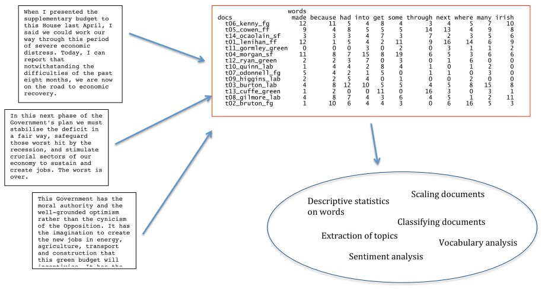

<!-- # see live presentation with xaringan::inf_mr('Session 1/session_1_slides.Rmd') -->

# Outline for today

1. **Course assignments**
    - Formative and summative
2. **Review of fundamentals**
    - Concepts and definitions
    - Bag of words
    - Roots of words
3. **Preprocessing**
    - Recipe
    - Complete example
4. **Descriptive statistics**
    - Term frequency
    - (Inverse) document frequency
    - Term frequency inverse document frequency
    - Lexical diversity
5. **Coding exercise**
    - Rmarkdown
    - Text analysis introduction

---
class: inverse, center, middle
# Assignments
<html>

</html> 

---
# Assignments

## Formative

- The formative assignment does not count toward the final grade. 
- Opportunity to practice the structure and questions of the summative assignments

## Summative

- The _three_ summative assignments weigh 10% respectively and amount to a total of 30% of the final grade.

 

Please send the `.Rmd` file and the compiled `.html` document to david.broska@zu.de before midnight on the due date.

Details on each assignment are given on the [course page](https://github.com/davidbroska/Computational-Political-Science).

---
# Course schedule

| Session |  Date  | Topic                                    |               Assignment               | Due date        |
|:-------:|:------:|:-----------------------------------------|:--------------------------------------:|:---------------:|
|    1    | Feb 02 | Overview and key concepts                |                   \-                   |     \-          |
|    2    | Feb 09 | **Preprocessing and descriptive statistics** | Formative                    | Feb 22 23:59:59 |
|    3    | Feb 16 | Dictionary methods                       |                   \-                   |     \-          |
|    4    | Feb 23 | Machine learning (for texts)             | Summative 1                            | Mar 08 23:59:59 |
|    5    | Mar 02 | Supervised scaling models for texts      |                   \-                   |     \-          |
|    6    | Mar 09 | Unsupervised scaling models for texts    | Summative 2                            | Mar 15 23:59:59 |
|    7    | Mar 16 | Similarity and clustering                |                   \-                   |     \-          |
|    8    | Mar 23 | Topic models                             | Summative 3                            | Apr 12 23:59:59 |
|   \-    |   \-   | *Break*                                  |                   \-                   |     \-          |
|    9    | Apr 13 | Retrieving data from the web             |                   \-                   |     \-          |
|   10    | Apr 20 | Published applications                   |                   \-                   |     \-          |
|   11    | Apr 27 | Project Presentations                    |                   \-                   |     \-          |

---
class: inverse, center, middle
# Review of fundamentals
<html>

</html> 

---
# Overview of text as data methods

&nbsp; Fig. 1 in Grimmer and Stuart (2013) 

---
# Basic concepts (1)

| Concept       | Definition                                       |
|:--------------|:-------------------------------------------------|
| (text) corpus | a large and structured set of texts for analysis |
| document      | each of the texts of the corpus                  |
| types         | for our purposes, a unique word                  |
| tokens        | any word - so token count is total words         |

### Example

>`[A corpus is a set of documents.]`  
`[This is the second document in the corpus.]`

is a corpus with 2 documents, where each document is a sentence. 

The first document has 6 types and 7 tokens.

The second has 7 types and 8 tokens. (We ignore punctuation for now.)

---
# Basic concepts (2)

| Concept    | Definition                                                                                                                           |
|:-----------|:-------------------------------------------------------------------------------------------------------------------------------------|
| keys       | such as dictionary entries, where the user defines a set of equivalence classes that group different word types (e.g. US, USA, U.S.) |                                                    |
| stop words | words that are designated for exclusion from any analysis of a text                                                                  |
| stems      | words with suffixes removed                                                                                                          |
| lemmas     | canonical word form (the base form of a word that has the same meaning even when different suffixes or prefixes are attached)   |

### Example 

|           |     |         |      |     |        |
|-----------|-----|---------|------|-----|--------|
| **word**  | win | winning | wins | won | winner |
| **stem**  | win | win     | win  | won | winner |
| **lemma** | win | win     | win  | win | win    |

---
# QTA Workflow 

### Texts $\rightarrow$ Matrix $\rightarrow$ Analysis

 

---
# Bag of Words

QTA *assumes* that a document can be represented as a collection of words that could have occurred anywhere in the document.

$\rightarrow$ Grammar and ordering or words are ignored.  
$\rightarrow$ Only word frequency is taken into account.

---
# Bag of Words: Justification

Bag-of-words approach disregards grammar and word order and uses word frequencies as features. 

- Context is _often_ uninformative conditional on presence of words:
  - Individual word usage tends to be associated with a particular degree of affect, position, etc. without regard to context of word usage
  
- Single words tend to be the most informative, as co-occurrences of multiple words (n-grams) are rare

- Some approaches focus on occurrence of a word as a binary variable, irrespective of frequency: a binary outcome

- Other approaches use frequencies: Poisson, multinomial, and related distributions

---
# Roots of words

- **Lemmatization** refers to the algorithmic process of converting words to their lemma forms.

- **Stemming** is the process for reducing inflected (or sometimes derived) words to their stem, base or root form. 
  - Different from lemmatization in that stemmers operate on single words *without knowledge of the context*.

**Both** convert the morphological variants into stem or root terms

 
**Why?** Measure the same notion only once! 

$\rightarrow$ We reduce the feature space by collapsing different words into a stem 
  &nbsp;&nbsp;&nbsp;&nbsp; (e.g. "happier" and "happily" convey same meaning as "happy")

---
# Issues with stemming approaches

- The most common is probably the Porter stemmer

- But this set of rules gets many stems wrong, e.g.
    - policy and police considered (wrongly) equivalent
    
- Other corpus-based, statistical, and mixed approaches
designed to overcome these limitations
- It is key to be careful through inspection of morphological variants and their stemmed versions

- Sometimes not appropriate! e.g. Schofield and Minmo (2016) find that "stemmers produce no meaningful improvement in likelihood and coherence (of topic models) and in fact can degrade
topic stability"

---
# Zipf Distribution of Word Frequency

Where are the most informative words on this plot?

--

<b>How might we address the problem of highly weighted non-informative tokens?</b>

---
# Word frequency: Zipf's Law

#### Zipf's law

Given some corpus of natural language utterances, the frequency of any word is inversely proportional to its rank in the frequency table.

#### Basic idea

Word frequency follows a power distribution; "of" and "the" make up 10% of all occurrences and "aardvark" hardly ever occurs.

The simplest case of Zipf’s law is a function of the type $\frac{1}{\text{rank}}$. 

Given a set of Zipfian distributed frequencies, sorted from most
common to least common, the second most common frequency will occur $\frac{1}{2}$ as often as the first. The third most common frequency will occur $\frac{1}{3}$ as often as the first. The nth most common frequency will occur $\frac{1}{n}$ as often as the first. 

Besides: this law also holds for measures such as the population of global cities.

---
# Word frequency: Zipf's Law

Formulaically: if a word occurs $f$ times and has a rank $r$ in a list of frequencies, then for all words $f = \frac{a}{r^ b}$ where $a$ and $b$ are constants and $b$ is close to $1$. So if we $\log$ both sides, 

$$ \begin{align}
\log(f)=& \log(\frac{a}{r^ b}) \\\\
=&\log(a) - \log(r^ b) \\\\
=& \log(a) -  b \times \log(r) \\\\
\end{align} $$

If we plot $\log(f)$ against $\log(r)$ then we should see a straight
line with a slope of approximately $-1$.

???

Verification: The law states that r is raised to the power of 1 so that the rank is inversely proportional to the frequency. r raised to the power of b=1 is just r. So the whole term is (some constant) divided by r

---
# Common English stop words

 
 
 
 
.pull-center[
a, able, about, across, after, all, almost, also, am, among,
an, and, any, are, as, at, be, because, been, but, by, can,
cannot, could, dear, did, do, does, either, else, ever,
every, for, from, get, got, had, has, have, he, her, hers,
him, his, how, however, I, if, in, into, is, it, its, just,
least, let, like, likely, may, me, might, most, must, my,
neither, no, nor, not, of, off, often, on, only, or, other,
our, own, rather, said, say, says, she, should, since, so,
some, than, that, the, their, them, then, there, these,
they, this, tis, to, too, twas, us, wants, was, we, were,
what, when, where, which, while, who, whom, why, will, with,
would, yet, you, your
]
---
# Data sources

#### Where to obtain textual data? Some tips...

- Existing datasets, e.g.
  - [UCD’s EuroParl](http://erdos.ucd.ie/europarl/) project
  - [Hansard Archive](http://www.hansard-archive.parliament.uk/) of parliamentary debates in UK
  - Media archives for newspaper articles, TV transcripts and other texts  at
  [LexisNexis](https://lexisnexis.com/), [ProQuest](https://www.proquest.com/), [Factiva](http://www.factiva.com/), etc.
  - Academic articles (JSTOR Data for Research)
  - Open-ended responses to survey questions
  
- Collect your own data:
  - From social media (Twitter, FB) and blogs
  - Scraping other websites
  
- Digitize your own text data using optical character
recognition (OCR) software
  - Options: Tesseract (open-source), Abbyy FineReader

---
class: inverse, center, middle
# Preprocessing

<html>

</html> 

---
# A potential recipe for preprocessing

1. Remove capitalization and punctuation

2. Segment into words, characters, morphemes

3. Discard order ("Bag of Words" Assumption)

4. Discard stop words

5. Create equivalence class: stem, lemmatize, or synonym

6. Discard less useful features

7. Other reduction, specialization

---
# A complete example

### "Political power grows out of the barrel of a gun"- Mao

 
**Compound Words/Collocations**: [political], [power], [grows], [out], [of] [the], [<mark>barrel of a gun</mark>] 

$\rightarrow$ An analyst may want to combine words into a single term that can be analyzed.

--
 

**Stopword Removal**: [political], [power], [grows], [out], [<s>of</s>] [<s>the</s>], [barrel of a gun] 

$\rightarrow$ Removing terms that are not related to what the author is studying from the text.

--
 

**Stemming:** [polit<s>ical</s>], [power], [grow<s>s</s>], [out], [barrel of a gun]  

$\rightarrow$ Takes the ends off conjugated verbs or plural nouns, leaving just the ”stem.”

---
# A complete example

Imagine we have a second document in addition to the Mao quote, "**the political science students study politics**", which tokenizes as follows.

**Document #1**: [polit], [power], [grow], [out], [barrel of a gun] 
**Document #2**: [polit], [scien], [student], [studi], [polit]

Finally, we can turn tokens and documents into a "document-term matrix." 

$$
\begin{bmatrix}
  & \text{Doc 1} & \text{Doc 2} \\
\text{power} & 1 & 0     \\
\text{grow}  & 1 & 0     \\
\text{out}   & 1 & 0     \\
\text{barrel of a gun} & 1 & 0 \\
\text{student} & 0 & 1 \\
\text{studi}   & 0 & 1 \\
\text{polit}   & 1 & 2 \\
\text{scien}   & 0 & 1 \\
\end{bmatrix}
$$

---
class: inverse, middle, center
# Descriptive statistics

<html>

</html> 

---
# Weighting strategies

####term frequency

Frequency is clearly useful; if sugar appears a lot near apricot,
that’s useful information.
But overly frequent words like “the”, “it”, or “they” are not very informative about content. 

We need a function that resolves this frequency paradox! ( $\rightarrow$ tf-idf)

#### document frequency 

Depending on the research question one could weight words more that appear in few documents or vice versa

#### tf-idf 

a combination of term frequency and inverse document frequency, common method for feature weighting

---
# Term frequency (tf)

Idea: A term $t$ is more important if it occurs more frequently in a document $d$

#### Term frequency (raw count)

$$\text{tf}_{i,j} = n_{i,j}$$
where $n_{i,j}$ is the number of occurrences of term $t_i$ in document $d_j$

#### Relative term frequency

$$\text{tf}_{i,j} = \frac{n_{i,j}}{\sum_k n_{k,j}}$$

where $n_{i,j}$ is the number of occurrences of term $t_i$ in document $d_j$, $k$ is the total number of terms in document $d_j$

Note: tf-idf uses the relative term frequency

---
# Inverse document frequency (idf)

Idea: A term is more discriminative if it occurs only in fewer documents.

$$\text{idf}_i=\log(\frac{N}{\text{df}_i})$$

$N$ is the total number of documents in the collection

$\text{df}_i$ is the number of documents in the collection that contain the word $i$

Words like ”the” or ”and” have a very low idf.

???

Note that idf is document independent while tf is document dependent!

---
# Strategies for feature weighting: tf-idf

#### Relative term frequency

$$\text{tf}_{i,j} = \frac{n_{i,j}}{\sum_k n_{k,j}}$$

where $n_{i,j}$ is the number of occurrences of term $t_i$ in document $d_j$, $k$ is the total number of terms in document $d_j$

#### Inverse document frequency

$$\text{idf}_i=\log(\frac{N}{\text{df}_i})$$

$N$ is the total number of documents in the collection. $\text{df}_i$ is the number of documents in the collection that contain the word $i$

####Term frequency inverse document frequency

$$\text{tf-idf}_i=\text{tf}_{i,j} \times \text{idf}_i$$

---
# Computing tf-idf: Example

We have 100 political party manifestos, each with 1000
words. 

The first document contains 16 instances of the word “environment”.

40 of the manifestos contain the word “environment”.

- The term frequency is 16/1000 = 0.016

- The inverse document frequency is 100/40 = 2.5, or ln(2.5) = 0.916

-  The tf-idf will then be 0.016 $\times$ 0.916 = 0.0147

- If the word "environment" had only appeared in 15 of the 100 manifestos, then its tf-idf would be 0.0304 (three times higher).

- A high weight in tf-idf is reached by a high term frequency (in the given document) and a low document frequency of the term in the whole collection of documents; **hence the weights hence tend to filter out common terms**

---
# Other quantities for describing texts

#### Length 

in characters, words, lines, sentences, paragraphs,
pages, sections, chapters, etc.

####Readability statistics

Use a combination of syllables and sentence length to indicate “readability” in terms of complexity

####Vocabulary diversity

(At its simplest) involves measuring a type-to-token ratio (TTR) where unique words are types and the total words are tokens

---
# Vocabulary diversity and corpus length

In natural language text, the rate at which new types appear is very high at first, but diminishes with added tokens

 
---
# Lexical diversity: Type to token

#### Type to token ratio (TTR)*

$$\frac{\text{total types}}{\text{total tokens}}$$

#### Guiraud

$$\frac{\text{total types}}{\sqrt{\text{total tokens}}}$$
#### D (Malvern et al 2004)

Randomly sample a fixed number of tokens and count those

#### MTLD

"the mean length of sequential word strings in a text that maintain a given TTR value" (McCarthy and Jarvis 2010), e.g. fixes the TTR at 0.72 and counts the length of the text required to achieve it

.footnote[*Reminder: Loosely speaking, unique words are types and tokens are words]

---
# Descriptive table about texts

.left-column[
Whenever you write a report: 

Provide the reader with a *description* of the data on which your conclusions are based!
]

.right-column[

]
---
# Readability indices

#### Flesch Reading Ease Index
 

$$206.835 − 1.015 \left( \frac{\text{total words}}{\text{total sentences}} \right)− 84.6 \left( \frac{\text{total syllables}}{\text{total words}}\right)$$

Interpretation: 0-30: university level; 60-70: understandable by 13-15 year olds; and 90-100 easily understood by an 11-year old student

 

#### Flesch-Kincaid Readability Index
 

$$0.39 \left(\frac{\text{total words}}{\text{total sentences}}\right) + 11.8 \left(\frac{\text{total syllables}}{\text{total words}}\right)− 15.59$$

Interpretation: Rescales to the US educational grade levels (1-12)

---
class: inverse, middle, center
# Coding exercise

<html>

</html>