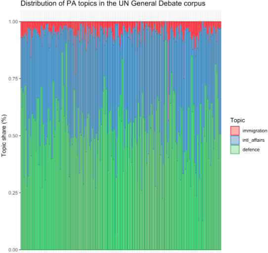
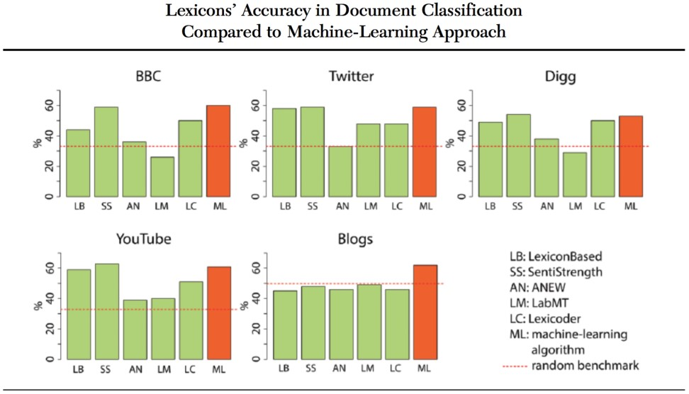
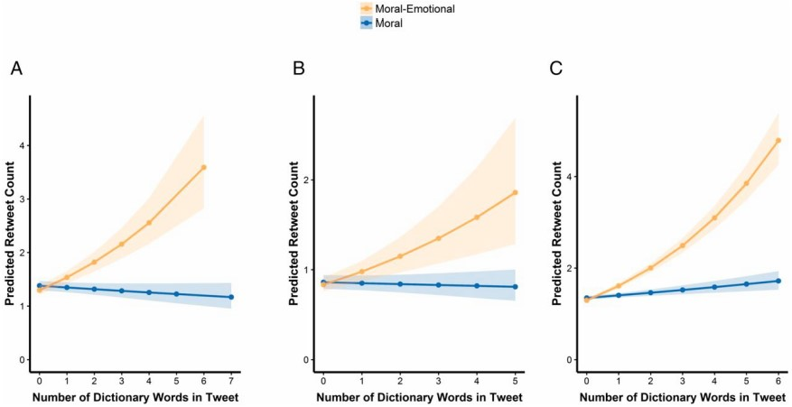
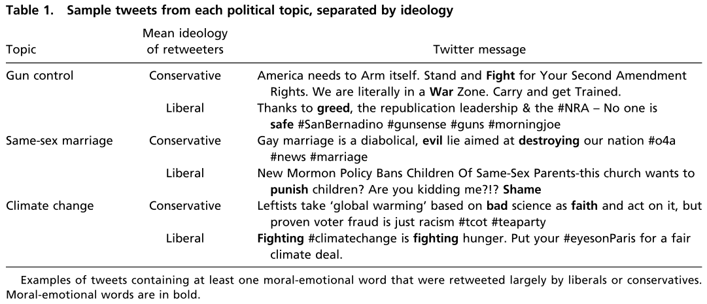
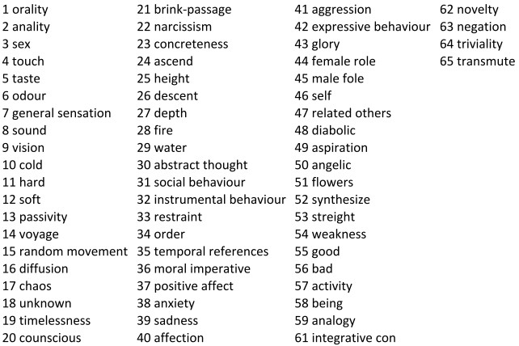
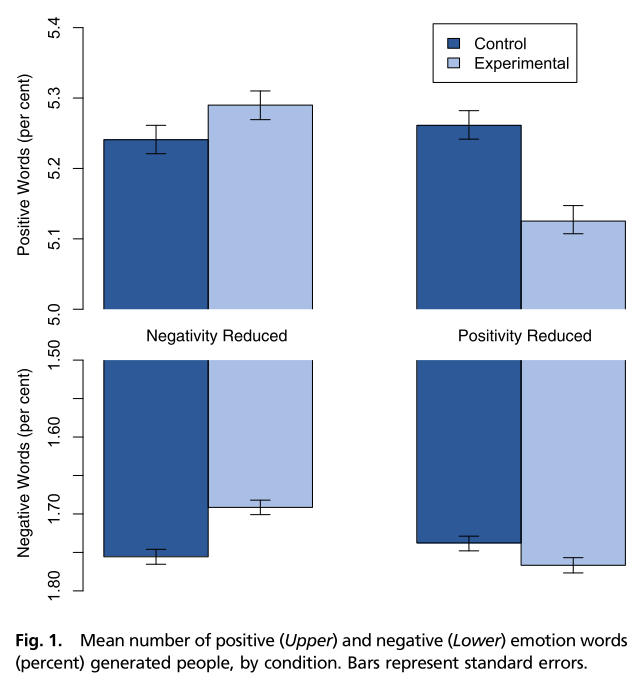
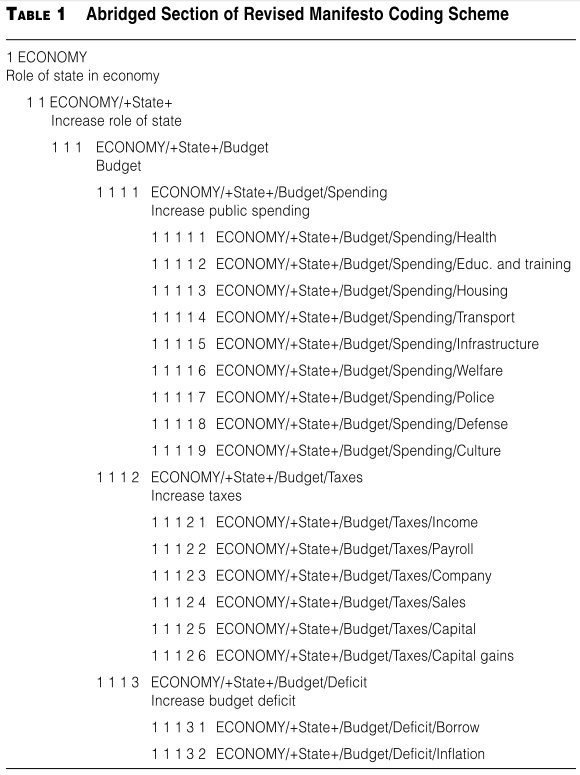
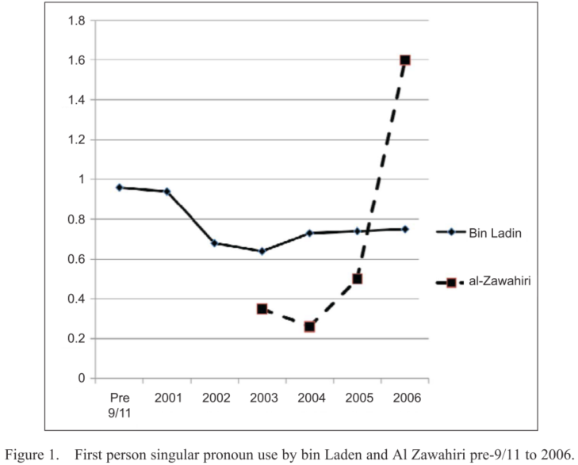
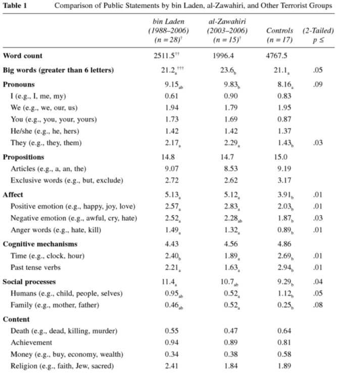

<!-- # see live presentation with xaringan::inf_mr('Session 1/session_1_slides.Rmd') -->

<!-- # see live presentation with xaringan::inf_mr('Session 1/session_1_slides.Rmd') -->


# Course schedule

| Session |  Date  | Topic                                    |               Assignment               | Due date        |
|:-------:|:------:|:-----------------------------------------|:--------------------------------------:|:---------------:|
|    1    | Feb 02 | Overview and key concepts                |                   \-                   |     \-          |
|    2    | Feb 09 | Preprocessing and descriptive statistics | Formative                              | Feb 22 23:59:59 |
|    3    | Feb 16 | **Dictionary methods**                   |                   \-                   |     \-          |
|    4    | Feb 23 | Machine learning (for texts)             | Summative 1                            | Mar 08 23:59:59 |
|    5    | Mar 02 | Supervised scaling models for texts      |                   \-                   |     \-          |
|    6    | Mar 09 | Unsupervised scaling models for texts    | Summative 2                            | Mar 15 23:59:59 |
|    7    | Mar 16 | Similarity and clustering                |                   \-                   |     \-          |
|    8    | Mar 23 | Topic models                             | Summative 3                            | Apr 12 23:59:59 |
|   \-    |   \-   | *Break*                                  |                   \-                   |     \-          |
|    9    | Apr 13 | Retrieving data from the web             |                   \-                   |     \-          |
|   10    | Apr 20 | Published applications                   |                   \-                   |     \-          |
|   11    | Apr 27 | Project Presentations                    |                   \-                   |     \-          |

---
# Outline for today

1. **Introduction to dictionary methods**
  - Rationale
  - Dictionaries as classifiers
  - Caveats
2. **Well-known dictionaries**
  - General Inquirer
  - Moral Foundations Dictionary
  - Regressive Imagery Dictionary
  - Linguistic Inquiry & Word Count
3. **Applications**
  - Emotional contagion
  - Policy positions
  - Terrorist speech
4. **How to build a dictionary?**
  - Quality criteria
  - Steps
5. **Coding exercise**

---
class: inverse, center, middle
# Introduction to dictionary methods
<html><div style='float:left'></div><hr color='#EB811B' size=1px width=800px></html>


---
# Rationale for dictionaries

<br>

###Rather than count words that occur, pre-define words associated with specific meanings and count only those

<br>

Two components:

1. **key** is the label for the equivalence class for the concept or canonical term

2. **values** are (multiple) terms or patterns that are declared *equivalent occurrences* of the key class
  - Frequently involves stemming/lemmatization of inflected words to capture all relevant terms or patterns
  
  
???

Dictionaries limit scope of analysis

---
# Dictionary vs thesaurus

```{r}
library(quanteda)
corpus <- c("We aren't schizophrenic but I am",
            "I bought myself a car")
# first person pronouns
fp <- dictionary(list(singular=c("I","me","my","mine","myself"), 
                      plural  =c("we","us","our","ourselves")))
dfm(corpus, dictionary = fp)
dfm(corpus, thesaurus  = fp)
```


---
# Feature weighting

```{r, include=F}
options(digits=2)
```


```{r}
( dfmat <- dfm(corpus) )                            # create dfm with counts

( dfmat_w <- dfm_weight(dfmat, scheme = "prop") )   # compute proportion

( dfmat_wd <- dfm_lookup(dfmat_w, dictionary = fp) ) # add up relevant cells
```


???

Why? Normalize by document length if documents differ in length

---
# Dictionaries as classifiers


&nbsp; Fig. 1 in Grimmer and Stuart (2013)


---
# Dictionaries as classifiers

#### Classifying documents into known categories

Lists of words that correspond to each category:
- Emotions: sad, happy, angry, anxious... 
- Cognitive processes: Insight, causation, discrepancy, tentative... 
- Hate speech: Sexism, homophobia, xenophobia, racism...
- Sentiment: Positive or negative

#### Count number of times they appear in each document

- Normalize by document length if necessary
- Validate, validate, validate
  - Check sensitivity of results to exclusion of specific words
  - Code a few documents manually and see if dictionary prediction aligns with human coding of document

---
# Mixed vs single membership

.pull-left[
#### **Mixed membership**

A document can belong to more than category

E.g. a speech held at the UN General Debate is about immigration, defense, and other topics. 

#### **Single membership**

A document belongs to one category

#### Using dictionaries as single membership classifier requires **simplification**!

E.g. a document is about defense if the majority of the associated words occur more often than those of the other topics. 

]


.pull-right[


[Puschmann (2019)](https://www.mzes.uni-mannheim.de/socialsciencedatalab/article/advancing-text-mining/)
]

???

What about unobserved topics, i.e. topics not included in the dictionary?


---
# Disadvantage: context specific

Classification accuracy of dictionary methods **depends on the context**

<br>

&emsp;&emsp; González-Bailón and Paltoglou (2015)


???

In some cases, dictionaries perform worse than a random classifier

Performance of machine learning methods does not vary as much as the performance of dictionary methods


---
# Disadvantage: context specific

<br>
Loughran and McDonald used the Harvard-IV-4 TagNeg (H4N) file to classify sentiment for a corpus of 50,115 firm-year 10-K filings from 1994-2008

They found two problems with the dictionary approach:

#### 1. Polysemes - words that have multiple meanings

 Almost three-fourths of the "negative" words of H4N were typically not negative in a financial context 

For example: cost, tax, capital, liability, and vice

#### 2. Incompleteness - dictionary lacked important negative financial words

For example: litigation, restated, misstatement, and unanticipated


---
class: inverse, middle, center
# Well-known dictionaries
<html><div style='float:left'></div><hr color='#EB811B' size=1px width=800px></html> 

---
# General Inquirer

- Originally developed by Stone et al (1966)

- Latest version contains 182 categories - the "Harvard IV-4" dictionary, the “Lasswell” dictionary, and five categories based on the social cognition work of Semin and Fiedler

#### Examples

- "self references", containing mostly pronouns
  - self = I, me, my, mine, myself
  - selves = we, us, our, ours, ourselves
  
- "negatives", the largest category with 2291 entries
  - abandon, fanatical, distract

Also uses simple word sense disambiguation, for example to distinguishes between race as a contest, race as moving rapidly, race as a group of people of common descent, and race in the idiom “rat race” 

Output example: http://www.wjh.harvard.edu/~inquirer/Spreadsheet.html


---
# Moral foundations dictionary (MFD)

Definition: Moral foundations are dimensions of human moral reasoning

#### Moral foundations dictionary by Graham and Haidt:

Measures the proportions of virtue and vice words for each
*foundation*:

  1. *Care/Harm* relates to the ability to feel (and dislike) the pain of others and underlies virtues of kindness, gentleness, and nurturance
  
  2. *Fairness/Cheating* relates to ideas of justice, rights, and autonomy
  
  3. *Loyalty/Betrayal* underlies virtues of patriotism and self-sacrifice for the group
  
  4. *Authority/Subversion* underlies virtues of leadership and followership, including deference to legitimate authority and respect for traditions
  
  5. *Sanctity/Degradation* underlies religious notions of striving to live in an elevated, less carnal, more noble way: the body is a temple which can be desecrated by immoral activities 
  
Link: https://www.moralfoundations.org


---
# MFD example

What is the role of moral emotions in the spread of morally tinged posts on Twitter? 




#### Findings of Brady et al (2017)

- Posts with the highest amount of moral-emotional language are retweeted most.
- Moral emotional language increases the diffusion within liberal and conservative clusters and less so across those ideological boundaries


???

The authors use two dictionaries to identify moral and emotional words: if a certain word occurs in both dictionaries it is a moral-emotional word.

The authors use a large sample of tweets related to polarizing political topics: gun control, same-sex marriage, and climate change.

---
# MFD example

Brady et al (2017) use two dictionaries to identify moral and emotional words respectively: 

if a certain word occurs in both dictionaries it is treated as a moral-emotional word

<br>


---
# Regressive Imagery Dictionary (RID)

- RID is designed to measure primordial vs. conceptual thinking
  - *Conceptual* thought is abstract, logical, reality oriented, and aimed at problem solving
  - *Primordial* thought is associative, concrete, and takes little account of reality - the type of thinking found in fantasy, reverie, and dreams

- Consists of about 3,200 words and roots, assigned to 29 categories of primary process cognition, 7 categories of secondary process cognition, and 7 categories of emotions

- Categories were derived from the theoretical and empirical literature on regressive thought by Martindale (1975, 1990)


???

Analyze thinking processes

---
# Regressive Imagery Dictionary (RID)

Full listing of categories



More on categories: http://www.kovcomp.co.uk/wordstat/RID.html


---
# Linguistic Inquiry & Word Count (LIWC) 

LIWC reads a given text and counts the percentage of words that reflect different emotions, thinking styles, social concerns, and parts of speech. 

- Hierarchical dictionary which consists of about 4,500 words and word stems, each defining one _or more_ word categories or subdictionaries. For example:

  - The word *cried* is part of five word categories: sadness, negative emotion, overall affect, verb, and past tense verb
  - So observing *cried* causes each of these five subdictionary scale scores to be incremented

- Created by James Pennebaker et al - see http://www.liwc.net

- Subject to a small fee: https://liwcsoftware.onfastspring.com

- LIWC is pronounced as Luke

---
class: inverse, middle, center
# Examples
<html><div style='float:left'></div><hr color='#EB811B' size=1px width=800px></html>

---
# Emotional contagion

.pull-left[
Using the LIWC dictionary, Kramer et al (2014) show that emotional states are transferred to others by exposure to content of Facebook friends

- N=689,003 Facebook users

- Treatment 1: Postive content more visible on news feed
- Treatment 2: Negative content more visible on news feed

- Control: No news feed intervention


Controversial study: concerns about ethics!
]
.pull-right[

]

---
# Policy positions

.pull-left[
- Laver and Garry (2000) created a **hierarchical** set of categories to distinguish policy domains and policy positions
- Five domains at the top level of hierarchy
  - economy
  - political system
  - social system
  - external relations
  - a general domain
- Looked for word occurrences within "word strings with an average length of ten words" 
- Built the dictionary on a set of specific UK manifestos
]
.pull-right[

]

---
# Terrorist speech

Analysis of Al Qaeda discourse in videotapes, interviews, and letters by Hancock et al (2010)




First-person pronouns (I, me, my, mine) included in LIWC:
- Osama bin Laden’s use remained constant over time
- Ayman al-Zawahri increased usage over time

Suggests: Zawahiri was feeling threatened, indicating a rift in his relationship with bin Laden

---
# Terrorist speech

Using the LIWC dictionary to extract grammatical pronouns and words related to cognitive mechanisms, Hancock et al (2010) find that **high status** organization members use

- fewer words writing to lower status
- fewer first person singular pronouns than lower status members
- "you" significantly more often
- far fewer cognitive mechanism words (indicating cause, discrepancy and inclusion)


|                      |      High-low |   Same status |       Low-high |
|----------------------|--------------:|--------------:|---------------:|
| Word count           | 63.85 (10.07) | 88.70 (19.62) | 187.95 (25.70) |
| 'I'                  |         0 (0) |   0.55 (0.29) |   0.38  (0.23) |
| 'You'                |   2.20 (0.48) |  1.32 (0.28)  |   0.38  (0.16) |
| Cognitive mechanisms |  11.56 (0.73) |  14.36 (0.96) |  14.18  (0.97) |


.footnote[
Table: Mean and standard errors of language features for high-status to low-status messages, same status messages, low-status to high status messages
]


---
# Terrorist speech


.pull-left[


Table 1 in Pennebaker and Chung (2007) based on the LIWC dictionary
]

.pull-right[
"Striking difference between other extremist groups and the
two Al-Qaeda authors"
- More focus more on other individuals: “the group is defining
itself to a large degree by the existence of an oppositional
group" (third-person plural pronouns)
- More emotional statements: "far more emotional in their use
of both positive and negative emotion words"
- More anger and hostility words (relative to anxiety or sadness
words).
]

---
class: inverse, center, middle
# How to build a dictionary
<html><div style='float:left'></div><hr color='#EB811B' size=1px width=800px></html> 

---
# Dictionary: quality criteria 

####The ideal content analysis dictionary associates all and only the relevant words to each category in a perfectly valid scheme.

Three key issues:

- **Validity**: Is the dictionary’s category scheme valid?

- **Recall**: Does this dictionary identify all my content?

- **Precision**: Does it identify only my content?

<br>
Say we want to classify texts into positive and negative
classes:

- What if we included the word *terribly*? For instance, *terribly happy*
- What if we included only the word *distraught*?
- What if we included every word used in the corpus?

---
# Dictionary construction


#### Steps

1. Identify "extreme texts" with "known" positions. Examples:

  - Tweets by populist vs mainstream parties (for populism dictionary)
  - Opposition leader and Prime Minister in a no-confidence debate (for opposition vs government dictionary)
  - Facebook comments to news about natural catastrophes vs football victories (for sentiment dictionary)
  - Subreddits for white nationalist groups vs regular politics (for racist rhetoric)

2. Search for differentially occurring words using word frequencies

3. Examine these words in context to check their precision and recall

4. Use regular expressions to see whether stemming or using wildcards is required

---
class: inverse, center, middle
# Coding exercise
<html><div style='float:left'></div><hr color='#EB811B' size=1px width=800px></html>


---
# References

<small>

Brady, William J., Julian A. Wills, John T. Jost, Joshua A. Tucker, and Jay J. Van Bavel. 2017. “Emotion Shapes the Diffusion of Moralized Content in Social Networks.” Proceedings of the National Academy of Sciences 114 (28): 7313–18. https://doi.org/10.1073/pnas.1618923114.

GONZÁLEZ-BAILÓN, SANDRA, and GEORGIOS PALTOGLOU. 2015. “Signals of Public Opinion in Online Communication: A Comparison of Methods and Data Sources.” The Annals of the American Academy of Political and Social Science 659: 95–107.

Hancock, Jeffrey T., David I. Beaver, Cindy K. Chung, Joey Frazee, James W. Pennebaker, Art Graesser, and Zhiqiang Cai. 2010. “Social Language Processing: A Framework for Analyzing the Communication of Terrorists and Authoritarian Regimes.” Behavioral Sciences of Terrorism and Political Aggression 2 (2): 108–32. https://doi.org/10.1080/19434471003597415.

Kramer, Adam D. I., Jamie E. Guillory, and Jeffrey T. Hancock. 2014. “Experimental Evidence of Massive-Scale Emotional Contagion through Social Networks.” Proceedings of the National Academy of Sciences 111 (24): 8788–90. https://doi.org/10.1073/pnas.1320040111.

Pennebaker, James W., and Cindy K. Chung. 2007. “Computerized Text Analysis of Al-Qaeda Transcripts.” In A Content Analysis Reader, edited by Klaus Krippendorff and M. Bock. CA: SAGE.

</small>

