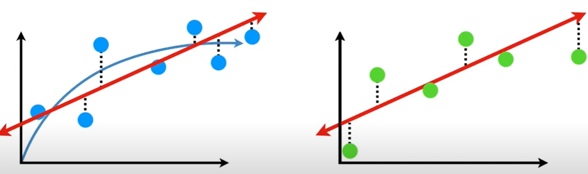

# Outline for today

1. **Evaluating classifier performance**
  - Precision, Recall, F1
  - Accuracy

2. **Regularization**
  - Ridge regression 
  - Lasso regression

3. **Coding exercise**
  - Which letters are most predictive of female and male names?

---
# Course schedule

| Session |  Date  | Topic                                                |   Assignment  |     Due date    |
|:-------:|:------:|:-----------------------------------------------------|:-------------:|:---------------:|
|    1    | Feb 02 | Overview and key concepts                            |     \-        |     \-          |
|    2    | Feb 09 | Preprocessing and descriptive statistics             | Formative     | Feb 22 23:59:59 |
|    3    | Feb 16 | Dictionary methods                                   |     \-        |     \-          |
|    4    | Feb 23 | Machine learning for texts: Classification I         | Summative 1   | Mar 08 23:59:59 |
|    5    | Mar 02 | *Machine learning for texts: Classification II*      |     \-        |     \-          |
|    6    | Mar 09 | Supervised and unsupervised scaling                  | Summative 2   | Mar 22 23:59:59 |
|    7    | Mar 16 | Similarity and clustering                            |     \-        |     \-          |
|    8    | Mar 23 | Topic models                                         | Summative 3   | Apr 12 23:59:59 |
|   \-    |   \-   | *Break*                                              |     \-        |     \-          |
|    9    | Apr 13 | Retrieving data from the web                         |     \-        |     \-          |
|   10    | Apr 20 | Published applications                               |     \-        |     \-          |
|   11    | Apr 27 | Project Presentations                                |     \-        |     \-          |

---
class: inverse, center, middle

# Evaluating classifier performance

<html>

</html> 

---
# Supervised machine learning 

&nbsp; Fig. 1 in Grimmer and Stuart (2013)

---
# Supervised machine learning

### The goal is classify documents into pre existing categories.

For example, authors of documents, sentiment of tweets, ideological position of parties based on manifestos, tone of movie reviews...

### What we need

- Hand-coded dataset (labeled), to be split into:
    
    - *Training set*: used to train the classifier
    - *Validation/Test set*: used to validate the classifier
  
- Method to *extrapolate* from hand coding to unlabeled documents (classifier):
    
    - Naive Bayes, regularized regression, SVM, CNN, ensemble
methods, etc.

- *Performance metric* to choose best classifier and avoid overfitting:
    
    - Confusion matrix, accuracy, precision, recall...

- Approach to *validate* classifier: cross-validation

---
# Principles of supervised learning

.pull-left[
### Generalization

A classifier or a regression algorithm learns to correctly predict output from given inputs

Crucially, it predicts correctly not only in previously seen samples but also in previously unseen samples.
]

.pull-right[

### Overfitting

A classifier or a regression algorithm learns to correctly predict output from given inputs in previously seen samples. 

However, it fails to do so in previously unseen samples. This causes poor prediction/generalization.
]

 
####The goal is to maximize the frontier of precise identification of true condition with accurate recall

---
# Confusion matrix

**Precision**: Does the classifier identify only my content?
  &nbsp; &nbsp; &nbsp; &nbsp;  &nbsp; &nbsp; &nbsp; &nbsp;&nbsp; % of documents that are predicted positive that are indeed positive
  
--

**Recall**: &nbsp;&nbsp; &nbsp;  Does the classifier identify all my content?
  &nbsp; &nbsp; &nbsp; &nbsp;  &nbsp; &nbsp; &nbsp; &nbsp;&nbsp; % of positive documents that are predicted positive

--

**Accuracy**: How correctly is the classifier’s identifications?
  &nbsp; &nbsp; &nbsp; &nbsp;  &nbsp; &nbsp; &nbsp; &nbsp;&nbsp; % of documents that are correctly predicted

---
# Measuring performance example

####Assume

- We have a corpus where 80 documents are really positive (as opposed to negative, as in sentiment)
- Our method declares that 60 are positive
- Of the 60 declared positive, 45 are actually positive

####Exercise

1. Please draw a confusion matrix with the given numbers and compute precision and recall
2. Compute accuracy for the following two scenarios
     
  a) 10 true negatives  
  b) 100 true negatives
  
How do you interpret the result? How does accuracy relate to precision and recall?

---
# Measuring performance example

####Let's fill in the blanks with the given numbers on the classified documents

.pull-left[

60 are predicted positve whereas 45 are truely positive leaving 15 false positives

]

--

.pull-right[

Since we have 80 truly positive documents there are 35 false negatives

]

--

.pull-left[

####Precision 

$$\frac{ \text{TP} }{ \text{TP} + FP}=\frac{45}{45+15}=\frac{3}{4}=75\%$$
]

--

.pull-right[
#### Recall

$$\frac{ \text{TP} }{ \text{TP} + FN}=\frac{45}{45+35}=\frac{9}{16}=56.3\%$$
]
--
.pull-right[
<small>
Note: Recall also known as "Sensitivity"
</small>
]

---
# Measuring performance example

.pull-left[
#### Accuracy with **10** true negatives

$$
\begin{align}
\text{Accuracy }=&\frac{ \text{TP} + \text{TN} }{ \text{TP} + \text{TN} + \text{FP} + \text{FN}}\\
=&\frac{45+10}{105}=52\%
\end{align}
$$

]
--

.pull-right[

#### Accuracy with **100** true negatives

$$
\begin{align}
\text{Accuracy }=&\frac{ \text{sum of diagonal}  }{\text{sum of all cells}}\\
=&\frac{45+100}{195}=74\%
\end{align}
$$

]

--

While precision and recall remain constant accuracy increases as the true negatives increase

--

A model can achieve high classification accuracy but it might be useless in solving the problem!

---
# Measuring performance

#### Combined metric for precision and recall

$$
\begin{align}
F1 &= 2 \times \frac{ \text{Precision} \times \text{Recall}}{ \text{Precision} + \text{Recall}}\\
&= \frac{0.75 \times 0.52}{0.75+ 0.52}\\&=0.64 
\end{align}
$$ 

F1 is a good measure when the goal is to seek a balance between Precision and Recall

  

#### Additional remarks

- Precision and recall can be reported separately for each category

- Precision and recall (or F1) should be reported alongside accuracy. [Why?](https://youtu.be/j-EB6RqqjGI)

-  There is generally a trade-off between precision and recall. [Why?](https://towardsdatascience.com/tradeoffs-how-to-aim-for-the-sweet-spot-c20b40d5e6b6)

---
# Bias-variance trade-off

####What is the relationship between weight and height of mice?

- At first, heavier mice tend to be larger but the increase levels off. 
- As weight increases further, however, the mice are not larger but only obese.

&rarr; The *true* relationship is best described by a curve with decreasing slope.

If we were to use a machine learning approach to predict height by weight on unseen data, we would create a training set (blue) and a test set (green).

---
# Bias-variance trade-off

####The inability for a machine learning method to capture the true relationship is called bias.

Broadly speaking, it is possible to apply a simple or a complex model on the training data 

--

.pull-left[
#### Training a simple model

Since the relationship is actually curvy, a straight line is not an accurate representation of the true relationship. 

&rarr; The simple model has high bias.
]

.pull-right[
#### Training a complex model

In contrast, the squiggly line can replicated the arc in the data. 

 
&rarr; The complex model has very little bias.

]

--

<small>
Example by [Starmer (2018)](https://youtu.be/EuBBz3bI-aA)
</small>

---
# Bias-variance trade-off

While the simpler model fits the training data *worse* than than complex model, it produces a *better* fit to the test data.

--

While the complex model fits the training data *better* than the simpler model, it produces a *worse* fit to the test data.

#### The amount by which the predictions change if the model is applied to a different training data set is called **variance**.

---
# Bias-variance trade-off

- Generally we want to apply method to new data, e.g. predict class of unseen documents
- However, the classifier is trained to maximize in-sample performance
- Danger: **overfitting**

.pull-left[

]

.pull-right[
- Model is too complex, describes noise rather than signal (Bias-Variance trade-off)
- Focus on features that perform well in labeled data but may
not generalize (e.g. “inflation” in 1980s)
- In-sample performance better than out-of-sample performance
]

Solutions
- Randomly split dataset into training and test set
- Cross validation

---
# Cross validation

Using the same data for training and testing would give us no clue about how well the method works for data it was not trained on, e.g. when we use all data for training

--

A *better* idea is to use &frac45; of the data for training and &frac15; for testing. But how do we know that the first &frac45; is the best way to divide up the data?

--

An *even better* idea is to let the computer evaluate the performance on all K combinations training and test sets ("folds") 

Then, we choose the method specification with the best cross-validated performance

---
class: inverse, center, middle
# Regularization

<html>

</html>

---
# Regularized regression

Assume we have: 

- $i = 1,2,..., N$ documents
- Each document $i$ is in class $y_i=0$ or $y_i=1$
- $j = 1,2,..., J$ unique features
- $x_{ij}$ as the count of feature $j$ in document $i$

We could try building a linear regression model as a classifier, using the values of $\beta_0, \beta_1, ..., \beta_J$ that minimize 

$$\text{SSR}=\sum_{i=1}^N \left( y_i - \beta_0 - \sum_{j=1}^J \beta_j x_{ij} \right)^2$$
where SSR denotes the sum of squared residuals

--

#### But can we?

- If $J > N$, OLS does not have a unique solution
- Even with $N>J$, OLS has low bias/high variance &rarr; overfitting

---
# Regularized regression

What can we do? Add a penalty for model complexity so that we minimize either obtain

#### Ridge regression

$$\sum_{i=1}^N \left( y_i - \beta_0 - \sum_{j=1}^J \beta_j x_{ij} \right)^2 + \lambda \sum_{j=1}^J \beta_j^2$$
or

#### Lasso regression

$$\sum_{i=1}^N \left( y_i - \beta_0 - \sum_{j=1}^J \beta_j x_{ij} \right)^2+ \lambda \sum_{j=1}^J |\beta_j|$$
where $\lambda$ is the **penalty parameter** (to be estimated)

---
# Constrained Optimization

Why is it that the lasso, unlike ridge regression, results in coefficient estimates that are exactly equal to zero?

One can show that the lasso and ridge regression coefficient estimates solve the problems below (may now look familiar if you recall Lagrange multipliers from calculus)

$$\underset{\beta}{\text{minimize}} = \sum_{i=1}^n \left( y_i - \beta_0 - \sum_{j=1}^p \beta_j x_{ij} \right)^2 \text{ subject to } \sum_{j=1}^p |\beta_j| < s$$

 and 

$$\underset{\beta}{\text{minimize}} = \sum_{i=1}^n \left( y_i - \beta_0 - \sum_{j=1}^p \beta_j x_{ij} \right)^2 \text{ subject to } \sum_{j=1}^p \beta_j^2 < s$$

 respectively. 

---
# Visualizing regularization

Assume the task is to minimize SSR of a regression line that predicts height by weight

In typical regression settings, we would choose the slope where SSR is smallest at the lowest point of the parabola

In machine learning, however, we would introduce bias to get lower variance! 

We do this by adding the ridge or lasso regression penalty...

--

<small>
Figures by [Starmer (2020)](https://youtu.be/Xm2C_gTAl8c)
</small>

---
# Visualizing regularization

When we add the *squared* penalty parameter in **Ridge** regression the parabolas move towards zero but the lowest point *is never* zero 

--

When we add the *absolute value* penalty parameter in **Lasso** regression the parabolas move towards zero and the lowest point *can be* zero

---
# Visualizing Lasso vs. Ridge Regression

- We penalize large coefficients more as the size of increases
- Ridge regression shrinks some parameters close to zero but
never quite gets there.
- Lasso shrinks some parameters to exactly zero.

#### In both models we find the best value of $\lambda$ through cross-validation 

---
# Regularized regression

####Why the penalty (shrinkage)? 

- Reduces the variance (avoid overfitting)
- Identifies the model if $J > N$
- Some coefficients become zero (feature selection)

--

####The penalty can take different forms: 

- Ridge regression: $\lambda \sum_{j=1}^{J} \beta_j^2$ with $\lambda >0$; and when $\lambda =0$ becomes OLS
- Lasso $\lambda \sum_{j=1}^{J} |\beta_j|$ where some coefficients become zero
- Elastic Net: $\lambda_1 \sum_{j=1}^J \beta_j^2+ \lambda_2 \sum_{j=1}^J |\beta_j|$ (best of both worlds?)

--

####How do they perform?

Since Lasso regression can exclude useless variable from equations it tends to be better than Ridge regression at reducing variance for models with many useless variables. 

Ridge regression tends to do a little better than Lasso regression when most variables are useful.

---
class: middle, inverse, center
# Coding exercise
-----------------
