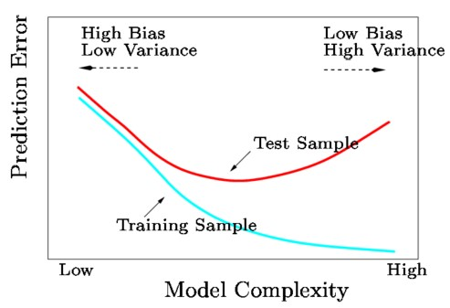
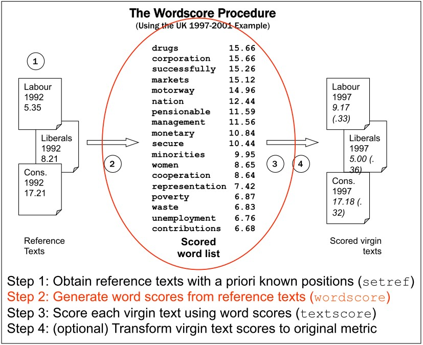

# Outline for today

1. **Evaluating classifier performance**
  - Precision, Recall, F1
  - Accuracy

2. **Coding exercise**
  - Classifying movie reviews
  - Which letters are most predictive of female and male names?

3. **Wordscores model**
  - How it relates to Bayes theorem
  - How it is implemented

4. **Wordscores coding example**


---
class: inverse, center, middle

# Evaluating classifier performance

<html><div style='float:left'></div><hr color='#EB811B' size=1px width=800px></html> 

---
# Supervised machine learning 


&nbsp; Fig. 1 in Grimmer and Stuart (2013)


---
# Supervised machine learning

### The goal is classify documents into pre existing categories.

For example, authors of documents, sentiment of tweets, ideological position of parties based on manifestos, tone of movie reviews...

### What we need

- Hand-coded dataset (labeled), to be split into:
    
    - *Training set*: used to train the classifier
    - *Validation/Test set*: used to validate the classifier
  
- Method to *extrapolate* from hand coding to unlabeled documents (classifier):
    
    - Naive Bayes, regularized regression, SVM, CNN, ensemble
methods, etc.

- *Performance metric* to choose best classifier and avoid overfitting:
    
    - Confusion matrix, accuracy, precision, recall...

- Approach to *validate* classifier: cross-validation

---
# Principles of supervised learning

.pull-left[
### Generalization

A classifier or a regression algorithm learns to correctly predict output from given inputs

Crucially, it predicts correctly not only in previously seen samples but also in previously unseen samples.
]

.pull-right[

### Overfitting

A classifier or a regression algorithm learns to correctly predict output from given inputs in previously seen samples. 

However, it fails to do so in previously unseen samples. This causes poor prediction/generalization.
]

<br>
####The goal is to maximize the frontier of precise identification of true condition with accurate recall

---
# Confusion matrix


**Precision**: Does the classifier identify only my content?
<br> &nbsp; &nbsp; &nbsp; &nbsp;  &nbsp; &nbsp; &nbsp; &nbsp;&nbsp; % of documents that are predicted positive that are indeed positive
  
--

**Recall**: &nbsp;&nbsp; &nbsp;  Does the classifier identify all my content?
<br> &nbsp; &nbsp; &nbsp; &nbsp;  &nbsp; &nbsp; &nbsp; &nbsp;&nbsp; % of positive documents that are predicted positive

--

**Accuracy**: How correctly is the classifier’s identifications?
<br> &nbsp; &nbsp; &nbsp; &nbsp;  &nbsp; &nbsp; &nbsp; &nbsp;&nbsp; % of documents that are correctly predicted


---
# Measuring performance example

####Assume

- We have a corpus where 80 documents are really positive (as opposed to negative, as in sentiment)
- Our method declares that 60 are positive
- Of the 60 declared positive, 45 are actually positive

####Exercise

1. Please draw a confusion matrix with the given numbers and compute precision and recall
2. Compute accuracy for the following two scenarios
     
  a) 10 true negatives <br>
  b) 100 true negatives
  
How do you interpret the result? How does accuracy relate to precision and recall?

---
# Measuring performance example

####Let's fill in the blanks with the given numbers on the classified documents

.pull-left[

60 are predicted positve whereas 45 are truely positive leaving 15 false positives


]

--

.pull-right[

Since we have 80 truely positive documents there are 35 false negatives


]

--

.pull-left[

####Precision 

$$\frac{ \text{TP} }{ \text{TP} + FP}=\frac{45}{45+15}=\frac{3}{4}=75\%$$
]

--

.pull-right[
#### Recall

$$\frac{ \text{TP} }{ \text{TP} + FN}=\frac{45}{45+35}=\frac{9}{16}=56.3\%$$
]

---
# Measuring performance example

.pull-left[
#### Accuracy with **10** true negatives


$$
\begin{align}
\text{Accuracy }=&\frac{ \text{TP} + \text{TN} }{ \text{TP} + \text{TN} + \text{FP} + \text{FN}}\\
=&\frac{45+10}{105}=52\%
\end{align}
$$

]
--

.pull-right[

#### Accuracy with **100** true negatives


$$
\begin{align}
\text{Accuracy }=&\frac{ \text{sum of diagonal}  }{\text{sum of all cells}}\\
=&\frac{45+100}{195}=74\%
\end{align}
$$

]

--

While precision and recall remain constant accuracy increases as the true negatives increase

--

A model can achieve high classification accuracy but it might be useless in solving the problem!


---
# Measuring performance

#### Combined metric for precision and recall

$$
\begin{align}
F1 &= 2 \times \frac{ \text{Precision} \times \text{Recall}}{ \text{Precision} + \text{Recall}}\\
&= \frac{0.75 \times 0.52}{0.75+ 0.52}\\&=0.64 
\end{align}
$$ 

F1 is a good measure when the goal is to seek a balance between Precision and Recall

<br> 

#### Additional remarks

- Precision and recall can be reported separately for each category

- Precision and recall (or F1) should be reported alongside accuracy. Why?

-  There is generally a trade-off between precision and recall. Why?


---
# Trade-off

- Generally we want to apply method to new data, e.g. predict class of unseen documents
- However, the classifier is trained to maximize in-sample performance
- Danger: **overfitting**

.pull-left[



]

.pull-right[
- Model is too complex, describes noise rather than signal (Bias-Variance trade-off)
- Focus on features that perform well in labeled data but may
not generalize (e.g. “inflation” in 1980s)
- In-sample performance better than out-of-sample performance
]

Solutions
- Randomly split dataset into training and test set
- Cross validation

---
# Cross validation

#### Intuition

- Create K training and test sets ("folds") within training set

- For k in K, run the classifier and estimate performance in test set within fold

- Choose best classifier based on cross-validated performance


---
class: inverse, center, middle
# Coding exercise

<html><div style='float:left'></div><hr color='#EB811B' size=1px width=800px></html>


---
class: inverse, center, middle

# Wordscores

<html><div style='float:left'></div><hr color='#EB811B' size=1px width=800px></html> 

---
# From classification to scaling

Machine learning focuses on identifying classes (*classification*), while social science is typically interested in locating things on latent traits (*scaling*), for example:

- Policy positions on economic vs social dimension
- Inter- and intra-party differences
- Soft news vs hard news
- ...and any other continuous scale


But the two methods overlap and can be adapted - will demonstrate later using the Naive Bayes classifier

In fact, the class predictions for a collection of words from Naive Bayes can be adapted to scaling


---
# Wordscores 

Analogous to a "training set" and a "test set" in classification, the Wordscores method by Laver, Benoit, and Garry (2003) uses two sets of texts:

#### Reference texts

- texts about which we know something (a scalar dimensional score)

#### Virgin texts

- texts about which we know nothing (but whose dimensional score we'd like to know)

<br>
#### Basic procedure

1. Analyze reference texts to obtain a single "score" for every word 
2. Use word scores to score virgin texts


---
# Wordscores procedure (I)


---
# Wordscores procedure (II)


---
# Wordscores procedure (III)


---
# Wordscores procedure (IV)


---
# Wordscore implementation

```{r, include=F}
library(quanteda)
library(quanteda.textmodels)
```


```{r}
# 4 texts with known and 3 texts with unknown category
txt <- c(k1 = "$ Win $", 
         k2 = "$ Prize $", 
         k3 = "Earn $ Easily", 
         k4 = "Paypal 100 $",
         u1 = "$",
         u2 = "$ $",
         u3 = "Paypal 100 $ $")
x <- dfm(txt) 
y <- c(1, 1, 1, -1, NA, NA, NA)
```


.pull-left[

training dfm from references texts

```{r, echo=F}
kab_x <- knitr::kable(quanteda::convert(x[1:4,], "data.frame"), align = "c", 
                    col.names = c("",colnames(x))) 

kableExtra::column_spec(kab_x, 2:ncol(x[1:4,]), width = "0.5in")
```

]

.pull-right[

training vector with known positions

```{r, echo=F}
kab_y <- knitr::kable(y[1:4], align = "c", col.names = "y")

kableExtra::column_spec(kab_y, 1, width = "0.5in")
```

]

---
# Wordscores

#### Compute probability of a reading document given a word

Start with a set of $D$ reference texts, represented by an $D \times W$ document-feature matrix $C_{dw}$ , where $d$ indexes the document and $w$ indexes the $W$ total word types.

We normalize the document-feature matrix within each
document by converting $C_{ij}$ into a relative document-feature
matrix (within document), by dividing $C_{ij}$ by its word total
marginals

####Probability of word given the document

```{r,eval=F}
( PwGd <- dfm_weight(x[1:4,],scheme="prop") )
```

```{r,echo=F}
PwGd <- as.matrix( dfm_weight(x[1:4,],scheme="prop"))
round( PwGd, 2)
```

---
# P( k<sub>1</sub> | &#36; )

.pull-left[


Uniform priors: P(k<sub>1</sub>)=...=P(k<sub>4</sub>)= &frac14;

####If we only read "&#36;" the probability of reading the document k<sub>1</sub> is  &frac13;.


]

.pull-right[

Probability of word given the document:

```{r, echo=F}

kab_PwGd <- knitr::kable(round(as.matrix(PwGd),2), align = c("l", rep("c", ncol(PwGd)-1)), 
                    col.names = colnames(PwGd))

kab_PwGd_c  <- kableExtra::column_spec(kab_PwGd, 1,width_max = "0.15in")
kab_PwGd_cr <- kableExtra::row_spec(kab_PwGd_c, 0:nrow(PwGd), font_size = 17.5)
kab_PwGd_cr 

```
<br>

$$
\begin{align}
&P(k_1|$)\\
&=\frac{P(k_1)P($|k_1)}{P(k_1)P($|k_1)+\text{...}+P(k_2)P($|k_4)}\\
&=\frac{P($|k_1)}{P($|k_1)+\text{...}+P($|k_4)}\\
&=\frac{ \frac{2}{3} }{\frac{2}{3} + \frac{2}{3} + \frac{1}{3} + \frac{1}{3}}=\frac{1}{3}
\end{align}
$$

]

---
# P( document | word )

####Now let's compute all probabilities of reading a document given a word

```{r, eval=F}
PwGd # recall our matrix containing all P(word | document)
```

```{r, echo=F}
round(PwGd,2) # recall our matrix containing all P(word | document)
```

.pull-left[
```{r,eval=F}
# transpose PwGd matrix
( tPwGd <- t(PwGd) ) 
```

```{r, echo=F}
tPwGd <- t(PwGd)
round( tPwGd ,2)
```
]

.pull-right[
```{r,eval=F}
# P(document | word)
( PdGw <- tPwGd / rowSums(tPwGd) )
```
```{r,echo=F}
PdGw <-tPwGd/rowSums(tPwGd) #P(document|word)
round( tPwGd / rowSums( tPwGd ) ,2)
```
]


---
# Scoring words

Compute a $J$-length "score" vector $S$ for each word $j$ as the average of each document $i$’s scores $a_i$, weighted by each word's $P_{ij}$: 

$$S_j=\sum_i^I a_i P_{ij}$$


```{r,eval=F}
# transpose matrix so we can multiply words of the document with the document score
t(PdGw) * y[1:4]
```
```{r, echo = F}
# transpose matrix so we can multiply words of the document with the document score
round( t(PdGw) * y[1:4] ,2)
```

```{r, eval=F}
# then, sum up the result column-wise
colSums( t(PdGw) * y[1:4] )
```
```{r,echo=F}
# then, sum up the result column-wise
round( colSums( t(PdGw) * y[1:4]) ,2)
```

---
# Scoring words

We obtain the scored words *also* by using matrix multiplication. In matrix algebra, $$\underset{1 \times J}{S} = \underset{1 \times I}{a} \cdot \underset{I \times J}{P}$$

.pull-left[


```{r,eval=F}
PdGw # P(document | word)
```

```{r,echo=F}
round( tPwGd ,2) # P(document | word)
```
]

.pull-right[

```{r}
y[1:4] # documents scale
```

]


```{r, eval = F}
 # matrix multiplication with P(document|words) and scores
( ws <- PdGw %*% y[1:4] )
```
```{r, echo = F}
# matrix multiplication with P(document | words) and scores 
ws <- PdGw %*% y[1:4]
round( ws , 2)[,1]
```


---
# Scoring texts

####The goal is to obtain a single score for any new text, relative to the reference texts

We do this by taking the mean of the scores of its words, weighted by their term frequency

- Note that new words outside of the set $J$ may appear in the $K$ virgin documents — these are simply ignored (because we have no information on their scores)
- Note also that nothing prohibits reference documents from also being scored as virgin documents

```{r, eval=F}
# matrix multiplication with P(word | document) and obtained wordscores 
dfm_weight(x, scheme="prop") %*% ws
```
```{r,echo=F}
as.matrix(round( dfm_weight(x ,scheme="prop") %*% ws,2))[,1]
```


#### Does this result make sense in the context of the spam example? 
<br>
```{r, echo=F}
df <- t(data.frame(txt))
rownames(df) <- NULL
colnames(df) <- c("k1 (s)", "k2 (s)","k3 (s)", "k4 (¬s)", "u1","u2","u3")
df_kab <- knitr::kable(df, align = "c")
kableExtra::column_spec(df_kab, 1:7, width_min = "0.8in") 
```

---
# Using textmodel_wordscores()

#### For convenience we can use the quanteda function to obtain the above results

```{r}
ws_mod <- textmodel_wordscores(x,y) 
```


#### Wordscores

```{r, eval=F}
summary(ws_mod)
```
```{r,echo=F}
summary(ws_mod)[[1]]
round( summary(ws_mod)[[3]], 2)     # print wordscores
```

#### Scaled documents

```{r, eval=F}
predict(ws_mod)
```
```{r,echo=F}
round(predict(ws_mod),2)
```


---
class: inverse, center, middle
# Wordscore coding exercise

<html><div style='float:left'></div><hr color='#EB811B' size=1px width=800px></html>
