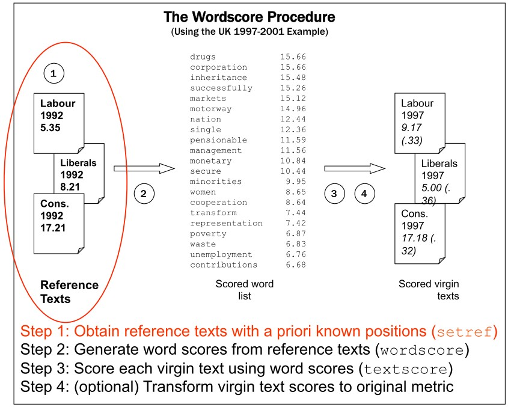
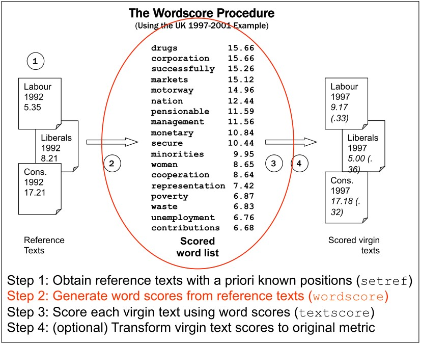
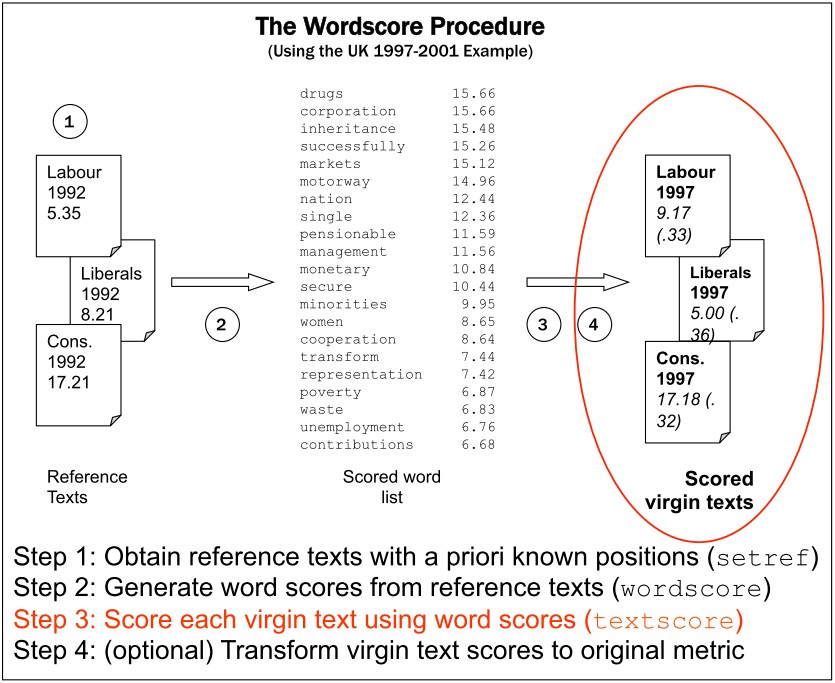
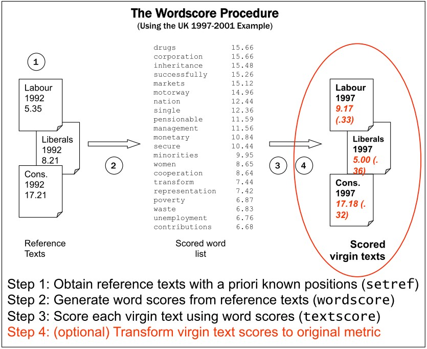
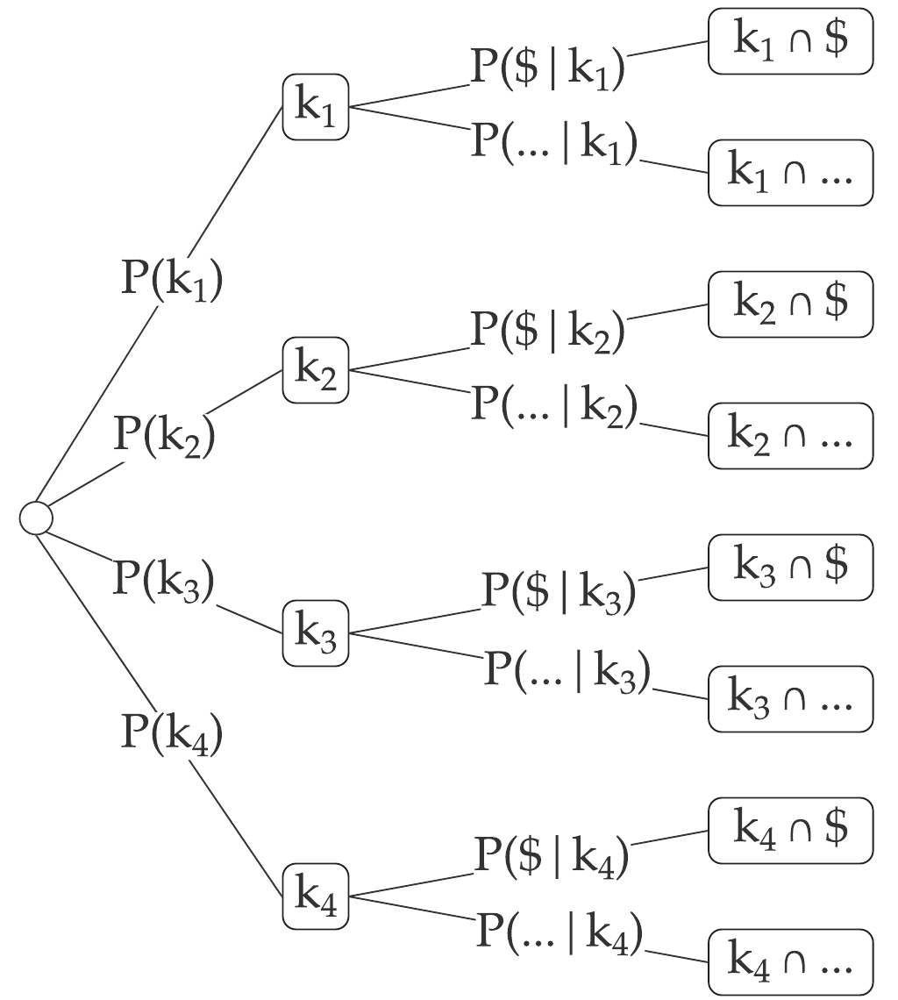

# Outline for today

1. **A word about designing research...**
  
  - Research questions and research design
  - How are we going to evaluate research papers in session 10
  - A recommendation on how to present your research ideas in session 11

2. **Wordscores model**
  - How it relates to Bayes theorem
  - How it is implemented

3. **Regularization** (revisit slides of session 5)
  - Ridge regression 
  - Lasso regression

3. **Coding exercise** (revisit exercise of session 5)
  - Which letters are most predictive of female and male names?


---
# Course schedule

| Session |  Date  | Topic                                                |   Assignment  |     Due date    |
|:-------:|:------:|:-----------------------------------------------------|:-------------:|:---------------:|
|    1    | Feb 02 | Overview and key concepts                            |     \-        |     \-          |
|    2    | Feb 09 | Preprocessing and descriptive statistics             | Formative     | Feb 22 23:59:59 |
|    3    | Feb 16 | Dictionary methods                                   |     \-        |     \-          |
|    4    | Feb 23 | Machine learning for texts: Classification I         | Summative 1   | Mar 08 23:59:59 |
|    5    | Mar 02 | Machine learning for texts: Classification II        |     \-        |     \-          |
|    6    | Mar 09 | *Supervised and unsupervised scaling*                | Summative 2   | Mar 15 23:59:59 |
|    7    | Mar 16 | Similarity and clustering                            |     \-        |     \-          |
|    8    | Mar 23 | Topic models                                         | Summative 3   | Apr 12 23:59:59 |
|   \-    |   \-   | *Break*                                              |     \-        |     \-          |
|    9    | Apr 13 | Retrieving data from the web                         |     \-        |     \-          |
|   10    | Apr 20 | Published applications                               |     \-        |     \-          |
|   11    | Apr 27 | Project Presentations                                |     \-        |     \-          |

---
class: inverse, center, middle

# A word about designing research...

<html><div style='float:left'></div><hr color='#EB811B' size=1px width=800px></html> 


---
# Quality criteria

####While teachers are paid to read student reports, readers outside the university have no such incentive. 

####Writers must find other ways to convince their audience to read their work.

--

<br>

A good research design begins with a research question:
- for which the answer/s matter
- that builds on an identifiable body of knowledge
- that is feasible to (at least partially) answer

Why?  Because good research is *all* of the below:
- consequential: tells us something important
- novel: tells us something new
- valid: tells us something true


---
# The consequentiality criterion

There are lots of practicable yet trivial research questions but good research should be consequential

Explain how your research problem is also your reader's problem by showing the consequence or the costs of not solving it.

--

#### Costs of not solving a conceptual problem

Ignorance about a conceptual problem is a lack of understanding that keeps us from understanding something else even more significant. 

- If we cannot answer how our depictions of romantic love have changed <sub>second question</sub>, then we cannot answer how our culture shapes the expectations of young people about marriage and families?<sub>consequence/larger, more important question</sub>

--

#### Costs of not solving a practical problem

The cost of a practical problem is a tangible thing or situation we would like to avoid 

- If we do not know the extent of the losses due to the economic crisis, we cannot plan the budget for the next year.

---
# The novelty criterion

There are a lot of people doing social research

- Someone has already tried to answer a question similar to your 
question.

- Reviewing the research literature demonstrates that the exact 
question has not been satisfactorily answered.

- One goal for research is novelty, but you cannot assess novelty 
without an honest assessment of what has already been done.
Research should make a specific contribution to an identifiable 
literature (this should primarily be the scholarly literature but may 
also include ‘grey literature’ [see Robson and McCartan 2016: 50-
56])

---
# The feasibility criterion

###Research design is about understanding feasibility tradeoffs

<br> 

- If you deploy unlimited budgets or godlike powers, then you are not really engaging with the difficulty of the problem.

- A research design should include the best arguments in favor of your research design decisions 

- Real research must be feasible in order to be completed and generate valid conclusions.

- For the purposes of this course, feasibility means in the context of your degree program.

---
# Expectations on graduate research

####Your research proposal is not going to be the most consequential or the most novel, given the fact that supervisors demand that it be feasible for you to complete in your current degree.

<br>

What supervisors typically want to see is that you can explain 
- what you are proposing to do, 
- why it is worth doing, 
- how it will work, 
- what we will learn from it, 
- and what are its limitations.

If you have done this, you will have no difficulty with...

---
# Dinner party test

####Scene: You and a stranger at a dinner party / pub <br>

.pull-left[
*Stranger*: "So what do you do?"


<br>*Stranger* (inevitably): "So what’s it about?"

<br><br><br><br>*Stranger* (desperately seeks escape and/or stiff drink, vowing never to ask that question again)
]

.pull-right[
<br>*You* (reluctantly): "I'm working on my student research project"

<br>*You* (ramble on for 10 minutes secretly thinking): "this stranger can't possibly understand the complexity and nuance of what I'm doing ..."
]

--

>If you cannot give a synoptic, ordinary language explanation in two or three minutes of what you are focusing on and what you hope to achieve, the **chances are very high that in a very fundamental way you do not yet understand your thesis topic**. (Dunleavy 2003: 22)

---
# Template for a Research Design


1. Background/literature review

2. Research question(s)

3. Data collection strategies

4. Data analysis strategies

5. Potential impact and relevance of the study

6. Limitations and further research

7. References / bibliography

<br>

####This is an important template that we keep in mind as we go through the reading exercises!


---
# Implicit Questions

#### Implicitly, a research design asks these questions
<br>

1. What do we know already?

2. What are you going to try to learn?

3. What kind of evidence are you going to collect and how 
will you collect it?

4. How does that evidence enable us to draw conclusions?

5. What might those conclusions be and why do they 
matter?

6. What are the limitations of what you are going to do? What have you done to mitigate these limitations? What more could be done with extra time and/or resources?

7. References / bibliography


---
# Research questions

####[R]esearch questions can provide the key to planning and carrying out a successful research project (Robson and McCartan 2016: 59)


They help to:

Define your project (summarize its focus)

--

- Set boundaries (demarcate the parameters of your project and so enhance 
feasibility)

--

- Give direction (signal what literature to search [relevance vs 
comprehensiveness], what data to collect, what methods to employ…)

--

- Define success (answerable research questions enable you to show that 
you have done what you set out do to)


---
# Setting-up research questions

We need to consider not only what questions enable us to do, but also where we get them from - how can we set-up/motivate our research question/s
  - ‘Consequentiality’ and ‘novelty’ criteria is key to this
  - Importance of showing that our research matters and that it contributes somehow to our existing understanding of social phenomena

--

.pull-left[
‘Gap-spotting’ in the academic literature a conventional way of motivating research 
  - Substantiate our contribution by reviewing what we (collectively) know already 
  - Multiple modes of ‘gap-spotting’, e.g. confusion spotting, neglect spotting… (Sandberg and 
Alvesson 2011); also methodological gap spotting
]

.pull-right[
 
]


---
# Supplementary sources

Can also signal the importance of our work in other ways. These include framing our research in relation to:

- contemporary social problems/puzzles (e.g. political debates or policy 
conundrums)

- why does this research matter beyond the ivory towers?

- apparent ‘gaps’ between official discourse and social practice

- socio-technical developments and trends

- interdisciplinary (‘spending time in the next village’ – e.g. how have 
commensurate processes been studied in other disciplines?)

- ‘problematisation’ (Sandberg and Alvesson 2011)

- personal experience (‘starting where you are’ [Robson and McCartan 
2016: 49-50])


---
# Identifying research questions

.pull-left[

]
.pull-right[
- Unlike much funded or commissioned research, for independent projects 
(BA and MA theses) you are expected to come up with research 
questions yourselves
- Identifying and reading around topics of interest (being sure to include cutting 
edge studies) should help with this 
- You might identify the gap yourself but often empirical papers also include 
further research directions in their conclusions. Could you feasibly address any of these?
- Journal editorials/review papers can often serve as a source of inspiration

]


---
# Topic ≠ research question/s

- Once you have a topic, clarifying the purpose/s of your 
research can be crucial to developing research questions

- Beyond contributing to knowledge, typical broad purposes 
include exploration, description and explanation (and possibly 
impact for more applied research)

- Don’t be afraid of coming up with multiple questions – this is normal, and a set of (often nested) questions can indeed be advantageous/more readily answerable (as long as the questions are feasible)

- Use the feasibility criterion to help you prioritize your research 
questions

--


#### Ultimately, you should be able to fill in these blanks:

1. Topic: I am studying ...
2. Question: because I want to find out what/why/how ...,
3. Significance: in order to help my reader understand ...


---
# Example immigration-related questions


### What is the type of answer you expect from doing research?
.pull-left[

1. <mark>How many</mark> people in my dataset of German residents said they thought there should be less immigration?
2. <mark>How</mark> do people living in post-industrial towns in Germany perceive immigration in their local areas?
3. <mark>What fraction</mark> of people in Germany think there should be less immigration?
4. <mark>What kinds</mark> of people in Germany tend to say there should be less immigration?
5. Do people in Germany become more or less favorable towards immigration <mark>if</mark> they work with immigrants?
6. <mark>Why</mark> do some people in Germany say there should be less immigration?
]

.pull-right[
1. A question about particular data
<br>
<br>

2. An exploratory question about a population
<br>
<br>
3. A quantifiable question about a population

4. A question about a relationship in a broader population

5. A question about causal relationship size

6. A question about causal relationship mechanisms

]


---
# Topically Related Research Questions
### What is the type of answer you expect from doing research?
.pull-left[

1. How many people in my dataset of German residents said they thought there should be less immigration?
2. How do people living in post-industrial towns in Germany perceive immigration in their local areas?
3. What fraction of people in Germany think there should be less immigration?
4. What kinds of people in Germany tend to say there should be less immigration?
5. Do people in Germany become more or less favorable towards immigration if they work with immigrants?
6. Why do some people in Germany say there should be less immigration?
]

.pull-right[
1. Description
<br>
<br>

2. Exploration
<br>
<br>
3. Population Inference (description)

4. Population Inference (description)

5. Causal Inference (cause-effect) [explanation]

6. Causal Inference (causal mechanisms) [exploration/explanation]

]


---
# Tell me about your research

.left-column[
<br>


]
.right-column[
In individual meetings we will discuss your Zeppelin project while the others are encouraged to work on the reading assignments


#### Preparation for dinner-party test 

1. Topic: I am studying ...
2. Question: because I want to find out what/why/how ...,
3. Significance: in order to help my reader understand ...

#### Projecting outcomes of the study

- What kind of answer do expect from your study? 
- How might your results change our view on the social phenomenon that you are studying?


#### Methods

- Which methods might be useful for collecting and analyzing data?

]


---
class: inverse, center, middle

# Wordscores
------------

---
# Supervised and unsupervised learning 


&nbsp; Fig. 1 in Grimmer and Stuart (2013)


---
# From classification to scaling

Machine learning focuses on identifying classes (*classification*), while social science is typically interested in locating things on latent traits (*scaling*), for example:

- Policy positions on economic vs social dimension
- Inter- and intra-party differences
- Soft news vs hard news
- ...and any other continuous scale


But the two methods overlap and can be adapted - will demonstrate later using the Naive Bayes classifier

In fact, the class predictions for a collection of words from Naive Bayes can be adapted to scaling


---
# Wordscores 

Analogous to a "training set" and a "test set" in classification, the Wordscores method by Laver, Benoit, and Garry (2003) uses two sets of texts:

#### Reference texts

- texts about which we know something (a scalar dimensional score)

#### Virgin texts

- texts about which we know nothing (but whose dimensional score we'd like to know)

<br>
#### Basic procedure

1. Analyze reference texts to obtain a single "score" for every word 
2. Use word scores to score virgin texts


---
# Wordscores procedure (I)



---
# Wordscores procedure (II)


---
# Wordscores procedure (III)


---
# Wordscores procedure (IV)




---
# Wordscore implementation

```{r, include=F}
library(quanteda)
library(quanteda.textmodels)
```


```{r}
# 4 texts with known and 3 texts with unknown category
txt <- c(k1 = "$ Win $", 
         k2 = "$ Prize $", 
         k3 = "Earn $ Easily", 
         k4 = "Paypal 100 $",
         u1 = "$",
         u2 = "$ $",
         u3 = "Paypal 100 $ $")
x <- dfm(txt) 
y <- c(1, 1, 1, -1, NA, NA, NA)
```


.pull-left[

training dfm from references texts

```{r, echo=F}
kab_x <- knitr::kable(quanteda::convert(x[1:4,], "data.frame"), align = "c", 
                    col.names = c("",colnames(x))) 

kableExtra::column_spec(kab_x, 2:ncol(x[1:4,]), width = "0.5in")
```

]

.pull-right[

training vector with known positions

```{r, echo=F}
kab_y <- knitr::kable(y[1:4], align = "c", col.names = "y")

kableExtra::column_spec(kab_y, 1, width = "0.5in")
```

]

---
# Wordscores

#### Compute probability of a reading document given a word

Start with a set of $D$ reference texts, represented by an $D \times W$ document-feature matrix $C_{dw}$ , where $d$ indexes the document and $w$ indexes the $W$ total word types.

We normalize the document-feature matrix within each
document by converting $C_{ij}$ into a relative document-feature
matrix (within document), by dividing $C_{ij}$ by its word total
marginals

####Probability of word given the document

```{r,eval=F}
( PwGd <- dfm_weight(x[1:4,],scheme="prop") )
```

```{r,echo=F}
PwGd <- as.matrix( dfm_weight(x[1:4,],scheme="prop"))
round( PwGd, 2)
```

---
# P( k<sub>1</sub> | &#36; )

.pull-left[




Uniform priors: P(k<sub>1</sub>)=...=P(k<sub>4</sub>)= &frac14;

####If we only read "&#36;" the probability of reading the document k<sub>1</sub> is  &frac13;.


]

.pull-right[

Probability of word given the document:

```{r, echo=F}

kab_PwGd <- knitr::kable(round(as.matrix(PwGd),2), align = c("l", rep("c", ncol(PwGd)-1)), 
                    col.names = colnames(PwGd))

kab_PwGd_c  <- kableExtra::column_spec(kab_PwGd, 1,width_max = "0.15in")
kab_PwGd_cr <- kableExtra::row_spec(kab_PwGd_c, 0:nrow(PwGd), font_size = 17.5)
kab_PwGd_cr 

```
<br>

$$
\begin{align}
&P(k_1|$)\\
&=\frac{P(k_1)P($|k_1)}{P(k_1)P($|k_1)+\text{...}+P(k_2)P($|k_4)}\\
&=\frac{P($|k_1)}{P($|k_1)+\text{...}+P($|k_4)}\\
&=\frac{ \frac{2}{3} }{\frac{2}{3} + \frac{2}{3} + \frac{1}{3} + \frac{1}{3}}=\frac{1}{3}
\end{align}
$$

]

---
# P( document | word )

####Now let's compute all probabilities of reading a document given a word

```{r, eval=F}
PwGd # recall our matrix containing all P(word | document)
```

```{r, echo=F}
round(PwGd,2) # recall our matrix containing all P(word | document)
```

.pull-left[
```{r,eval=F}
# transpose PwGd matrix
( tPwGd <- t(PwGd) ) 
```

```{r, echo=F}
tPwGd <- t(PwGd)
round( tPwGd ,2)
```
]

.pull-right[
```{r,eval=F}
# P(document | word)
( PdGw <- tPwGd / rowSums(tPwGd) )
```
```{r,echo=F}
PdGw <-tPwGd/rowSums(tPwGd) #P(document|word)
round( tPwGd / rowSums( tPwGd ) ,2)
```
]


---
# Scoring words

Compute a $J$-length "score" vector $S$ for each word $j$ as the average of each document $i$’s scores $a_i$, weighted by each word's $P_{ij}$ so that 
$S_j=\sum_i^I a_i P_{ij}$
```{r}
y[1:4] # the "a" vector with the positions of the document
```


```{r,eval=F}
t(PdGw) * y[1:4] # transpose matrix so we can multiply PdGw with the doc positions
```
```{r, echo = F}
# transpose matrix so we can multiply words of the document with the document score
round( t(PdGw) * y[1:4] ,2)
```

```{r, eval=F}
( ws <- colSums( t(PdGw) * y[1:4] )) # then, sum up the result column-wise
```
```{r,echo=F}
# then, sum up the result column-wise
ws <- colSums( t(PdGw) * y[1:4] )
round( ws, 2)
```

---
# Scoring words

We obtain the scored words *also* by using matrix multiplication. In matrix algebra, $$\underset{1 \times J}{S} = \underset{1 \times I}{a} \cdot \underset{I \times J}{P}$$

.pull-left[


```{r,eval=F}
PdGw # P(document | word)
```

```{r,echo=F}
round( tPwGd ,2) # P(document | word)
```
]

.pull-right[

```{r}
y[1:4] # documents scale
```

]


```{r, eval = F}
 # matrix multiplication with P(document|words) and scores
( ws <- PdGw %*% y[1:4] )
```
```{r, echo = F}
# matrix multiplication with P(document | words) and scores 
ws <- PdGw %*% y[1:4]
round( ws , 2)[,1]
```


---
# Scoring texts

####The goal is to obtain a single score for any new text, relative to the reference texts

We do this by taking the mean of the scores of its words, weighted by their term frequency

.pull-left[
```{r, eval = F}
PwGd <- dfm_weight(x, scheme="prop")
t(PwGd) # transpose matrix 
```
```{r, echo = F}
PwGd <- as.matrix(dfm_weight(x, scheme="prop") )
round(t(PwGd),2) # transpose matrix
```


]


.pull-right[

```{r,eval=F}
# row-wise PwGd * score
t(PwGd) * ws[,1]
```
```{r,echo=F}
# row-wise PwGd * score
round((t(PwGd) * ws[,1])[,1:6],2)
```

]

```{r, eval = F}
colSums( t(PwGd) * ws[,1] )
```
```{r, echo=F}
round(colSums( t(PwGd) * ws[,1] ), 2)
```
---
# Scoring texts

We obtain the scored words *also* by using matrix multiplication.

```{r, eval=F}
# matrix multiplication with P(word | document) and obtained wordscores 
PwGd %*% ws
```
```{r,echo=F}
as.matrix(round( dfm_weight(x ,scheme="prop") %*% ws,2))[,1]
```


#### Does this result make sense in the context of the spam example? 
<br>

```{r, echo=F}
df <- t(data.frame(txt))
rownames(df) <- NULL
colnames(df) <- c("k1 (s)", "k2 (s)","k3 (s)", "k4 (¬s)", "u1","u2","u3")
df_kab <- knitr::kable(df, align = "c")
kableExtra::column_spec(df_kab, 1:7, width_min = "0.8in") 
```

--

#### Final remarks
- Note that new words outside of the set $J$ may appear in the $K$ virgin documents — these are simply ignored (because we have no information on their scores)
- Note also that nothing prohibits reference documents from also being scored as virgin documents

---
# Scoring texts


---
# Using textmodel_wordscores()

#### For convenience we can use the quanteda function to obtain the above results

```{r}
ws_mod <- textmodel_wordscores(x,y) 
```


#### Wordscores

```{r, eval=F}
summary(ws_mod)
```
```{r,echo=F}
summary(ws_mod)[[1]]
round( summary(ws_mod)[[3]], 2)     # print wordscores
```

#### Scaled documents

```{r, eval=F}
predict(ws_mod)
```
```{r,echo=F}
round(predict(ws_mod),2)
```


---
class: inverse, center, middle
# Wordscore coding exercise

<html><div style='float:left'></div><hr color='#EB811B' size=1px width=800px></html>


