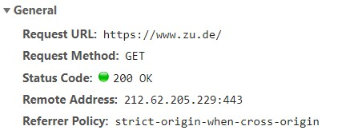

# Looking ahead

#### What we did 

So far we focused on how methods for quantitative text analysis work. 

We only briefly looked at applications of those methods.

--

#### The road ahead

However, we need to have a *deeper* understanding of how QTA helps us answer *substantive research questions*

In the next sessions, we will therefore evaluate how useful QTA methods are (as opposed to understanding how they work)

--

#### Motivation 

While methodological innovations are quite common, articles rarely showcase strong explanatory power of QTA for substantive research questions

E.g. an application challenged a widely established belief or revealed new insights for a specific research area in political science/sociology


---
# Session 10 


| Text                                                                                                                                                                                                                                                 | Presenter                |   
|-----------------------------------------------------------------------------------------------------------------------------------------------------------------------------------------------------------------------------------------------------|--------------------------|
| How Censorship in China Allows Government Criticism but Silences Collective Expression [(King et al 2014)](https://doi.org/10.1017/s0003055413000014)  | T.O.           |
| Rhetorics of Radicalism [(Karell and Freedman 2019)](https://doi.org/10.1177/0003122419859519)                                                                                        | A.V.,<br>M.M.                   |
| Racialized Discourse in Seattle Rental Ad Texts [(Kennedy et al 2020)](https://doi.org/10.1093/sf/soaa075)                                                      | N.R.                     |
| Whose Ideas Are Worth Spreading? The Representation of Women and Ethnic Groups in TED Talks [(Schwemmer and Jungkunz 2019)](https://doi.org/10.1080/2474736X.2019.1646102)             | V.O.          |
| The Geometry of Culture: Analyzing the Meanings of Class through Word Embeddings [(Kozlowski et al 2019)](https://doi.org/10.1177/0003122419877135)                 | D.B.          |

####Note:

<p style="margin-left:2.5%">
These are good examples of articles that addresses substantial social science questions
</p>

<p style="margin-left:2.5%">
However, you may also present a different article if it better fits your research interest
</p>

<p style="margin-left:2.5%">
You find the literature on <a href=https://learning.zu.de/goto.php?target=fold_30469&client_id=ilias>ILIAS
</p>


---
# Outline for today (session 9)

1. **How to retrieve data from the web?**

2. **Features of the internet**
  
3. **HTML and CSS**

4. **XPath and CSS Selectors**

5. **APIs**

6. **Bias in social media data**

7. **Coding example**
  - Scraping the course [website](https://github.com/davidbroska/Computational-Political-Science) on GitHub with CSS selectors
  - How to use the Twitter API and classify (dis)approval tweets
  
8. **Coding exercise**
  - Scrape an [online bookshop](http://books.toscrape.com/catalogue/page-1.html?)

---
# Course schedule

| Session |  Date  | Topic                                                |   Assignment  |     Due date    |
|:-------:|:------:|:-----------------------------------------------------|:-------------:|:---------------:|
|    1    | Feb 02 | Overview and key concepts                            |     \-        |     \-          |
|    2    | Feb 09 | Preprocessing and descriptive statistics             | Formative     | Feb 22 23:59:59 |
|    3    | Feb 16 | Dictionary methods                                   |     \-        |     \-          |
|    4    | Feb 23 | Machine learning for texts: Classification I         | Summative 1   | Mar 08 23:59:59 |
|    5    | Mar 02 | Machine learning for texts: Classification II        |     \-        |     \-          |
|    6    | Mar 09 | Supervised and unsupervised scaling                  | Summative 2   | Mar 22 23:59:59 |
|    7    | Mar 16 | Similarity and clustering                            |     \-        |     \-          |
|    8    | Mar 23 | Topic models                                         | Summative 3   | Apr 12 23:59:59 |
|   \-    |   \-   | *Break*                                              |     \-        |     \-          |
|    9    | Apr 13 | *Retrieving data from the web*                       |     \-        |     \-          |
|   10    | Apr 20 | Published applications                               |     \-        |     \-          |
|   11    | Apr 27 | Project Presentations                                |     \-        |     \-          |


---
# What is webscraping?

.pull-left[
An increasing amount of data is available on the web

- Speeches, biographical information ...

- Social media data, press releases ...
- Geographic information, conflict data... 

]

.pull-right[


]

<br>

However, these data are often provided in an *unstructured format*

#### Web scraping is the process of automatically extracting content from the web and transforming it into a structured dataset

---
# How to get data from the internet with R

#### 1. Screen scraping 

Extract data from source code of website with HTML parser and/or regular expressions

- `rvest` package in R for screen scraping

<br>
--

#### 2. Web APIs

A set of structured http requests that return JSON or XML data

- `httr` package to construct API requests

- Packages specific to each API 


---
class: inverse, middle, center
# Key features of the internet
------------------------------

---
# Client-server model


#### 1. User computer tablet, phone, etc. make request to server. Depending on what you want to get, the request might be

- HTTP(S): Hypertext Transfer Protocol
- SMTP: Simple Mail Transfer Protocol
- FTP: File Transfer Protocol

#### 2. Server returns response

---
# HTTP request and response

<br>


<small>
<p style="margin-left:72%"> 
Figure from <a href="https://stackoverflow.com/questions/4109689/how-does-a-client-browser-generate-a-request-to-be-sent-to-a-server">StackOverflow</a>
</p>
</small>

---
# Example: zu.de

Press `Ctrl+Shift+I` in your Google Chrome browser to see the source code of a website


####We can use the `rvest` package to parse data from the website's source code!


---
# Example: zu.de

#### General header 


.pull-left[
#### Request header

]
.pull-right[
#### Response header

]

<small>
Please refer to [this guide](https://mkyong.com/computer-tips/how-to-view-http-headers-in-google-chrome/) on viewing HTTP headers
</small>

---
class: inverse, middle, center
# HTML and CSS
--------------


---
# HTML and beyond

#### Hypertext Markup Language (HTML)

<p style="margin-left:2.5%">
HTML displays mostly static content
</p>

<p style="margin-left:2.5%">
Many contents of dynamic webpages cannot be found in HTML, e.g. Google Maps
</p>
  

&rArr; Understanding what is static and dynamic in a webpage is a crucial first step

--

#### Cascading Style Sheets (CSS)

<p style="margin-left:2.5%">
Style sheet language which describes formatting of HTML components
</p>

<p style="margin-left:2.5%">
CSS is useful for webscraping because there are CSS-based selectors for HTML elements
</p>

--

#### Javascript (JS)

<p style="margin-left:2.5%">
Adds functionalities to websites, e.g. change content/structure after website has been loaded
</p>

<p style="margin-left:2.5%">
Javascript on websites usually makes webscraping more difficult
</p>


---
# A simple HTML file

```{r include = F}
library(rvest)
```

Let's create a simple HTML page

```{html}
<!DOCTYPE html>
<html>
  <head>
  </head>
  <body>
    <h3>My First Heading</h1>
    <p>My first paragraph.</p>
  </body>
</html>
```

It will look like this: 

<html>
  <head>
  </head>
  <body>
    <h3>My first heading</h1>
    <p>My first paragraph.</p>
  </body>
</html>


---
# Slightly more features

```{html}
<!DOCTYPE html>
<html>
  <head>
  </head>
  <body>
    <h1>Heading of the first division</h1>
    <p>A first paragraph.</p>
    <p>A second paragraph with some <b>formatted</b> text.</p>
    <p>A third paragraph with a <a href="http://www.zu.de">hyperlink</a>.</p>
  </body>
</html>
```

It will look like this:

<html>
  <head>
  </head>
  <body>
    <h1>Heading of the first division</h1>
    <p>A first paragraph.</p>
    <p>A second paragraph with some <b>formatted</b> text.</p>
    <p>A third paragraph with a <a href="http://www.zu.de">hyperlink</a>.</p>
  </body>
</html>

---
# With some content divisions

```{html}
<!DOCTYPE html>
<html>
  <head>
  </head>
  <body>
    <div>
      <h3>Heading of the first division</h3>
      <p>A first paragraph.</p>
      <p>A second paragraph with some <b>formatted</b> text.</p>
      <p>A third paragraph with a <a href="http://www.zu.de">hyperlink</a>.</p>
    </div>
    <div>
      <h3>Heading of the second division</h3>
      <p>Another paragraph with some text.</p>
    </div>
  </body>
</html>
```


---
# Adding some simple CSS

```{html}
<!DOCTYPE html>
<html>
  <head>
    <style>
      .text-about-web-scraping {color: blue;}
      .division-two h3 {color: green;}
    </style>
  </head>
  <body>
    <div>
      <h3>Heading of the first division</h3>
      <p>A first paragraph.</p>
      <p>A second paragraph with some <b>formatted</b> text.</p>
      <p>A third paragraph with a <a href="http://www.zu.de">hyperlink</a>.</p>
    </div>
    <div class="division-two">
      <h3>Heading of the second division</h3>
      <p class="text-about-web-scraping">Webscraping is a tricky thing...</p>
    </div>
  </body>
</html>
```

---
# Et voilà ...

#### This is how our HTML page looks like with formatting tags and CSS styles: 
<br>

<div style="margin-left:20%;">
<html>
  <head>
    <style>
      .text-about-web-scraping {color: blue;}
      .division-two h3 {color: green;}
    </style>
  </head>
  <body>
    <div>
      <h3>Heading of the first division</h3>
      <p>A first paragraph.</p>
      <p>A second paragraph with some <b>formatted</b> text.</p>
      <p>A third paragraph with a <a href="http://www.zu.de">hyperlink</a>.</p>
    </div>
    <div class="division-two">
      <h3>Heading of the second division</h3>
      <p class="text-about-web-scraping">Webscraping is a tricky thing to do...</p>
    </div>
  </body>
</html>
</div>


---
class: inverse, middle, center
# Identifying elements with CSS and XPath
-------

---
# Identifying elements via CSS selector

#### Selecting by tag-name

Exemplary html code: `<h3>Some text</h3>`

Selector: `h3`

<br>

#### Selecting by class

Exemplary html code: `<div class = 'itemdisplay'>Some text</div>`

Selector: `.itemdisplay`

<br>

#### Selecting by id

Exemplary html code: `<div id = 'maintitle'>Some text</div>`

Selector: `#maintitle`


---
# Identifying elements via CSS selector

#### Selecting by tag-name

Exemplary html code: `<h3>Some text</h3>`

Selector: `h3`

<br>

#### Selecting by class


Exemplary html code: `<div class = 'itemdisplay'>Some text</div>`

Selector: `.itemdisplay`

<br>

#### Selecting by id

Exemplary html code: `<div id = 'maintitle'>Some text</div>`

Selector: `#maintitle`


---
# XPath basic syntax 


`/` selects from the root node, e.g. `/html/body/div[2]/p[1]`

`//` selects specific nodes from the document, e.g. `//div[2]/p[1]`

`//div/*` Selects all nodes which are immediate children of a div node

`//div/p[last()]` selects the last paragraph nodes which are children of all div nodes

`//div[@*]` selects all division nodes which have any attribute

`//div[@class]` selects all division nodes which have a class attribute

`//div[@class='division-two']` selects all division nodes which have a class attribute with name "division-two"

`//*[@class='division-two']` selects any node with a class attribute with name "division-two"

.footnote[
See [w3schools.com](https://www.w3schools.com/xml/xpath_syntax.asp) for reference and full details
]


---
# XPath vs CSS selector


| Selector type                                                                              | CSS Selector                          | XPath                                 |
|:-------------------------------------------------------------------------------------------|:--------------------------------------|:--------------------------------------|
| By tag                                                                                     | `"h1"`, `"p"`                         | `"//h1"`, `"//p"`                     |
| By class                                                                                   | `".division-two"`                     | `"//*[@class='division-two']"`        |
| By id                                                                                      | `"exemplary-id"`                      | `"//*[@id='exemplary-id']"`           |
| By tag with class (or id)                                                                  | `"div.division-two"`                  | `"//div[@class='division-two']`       |
| Tag structure <br> (p as a child of div)                                                   | `"div > p"`                           | `"//div/p"`                           |
| Tag strucure <br> (p which is a second child of the div node with class name division-two) | `"div.division-two>p:nth-of-type(2)"` | `"//div[@class='division-two']/p[2]"` |

--

See this [guide](https://ghostinspector.com/docs/css-xpath-conversion/) and this [converter app](https://css-selector-to-xpath.appspot.com/) for XPath and CSS

---
# Using rvest


.pull-left[
Recall our simple HTML with some CSS:

<br>

<html>
  <head>
    <style>
      .text-about-web-scraping {color: blue;}
      .division-two h3 {color: green;}
    </style>
  </head>
  <body>
    <div>
      <h3>Heading of the first division</h3>
      <p>A first paragraph.</p>
      <p>A second paragraph with some <b>formatted</b> text.</p>
      <p>A third paragraph with a <a href="http://www.zu.de">hyperlink</a>.</p>
    </div>
    <div class="division-two">
      <h3>Heading of the second division</h3>
      <p class="text-about-web-scraping">Webscraping is a tricky thing to do...</p>
    </div>
  </body>
</html>
]

--

.pull-right[
Let's first make R recognize the HTML code 

```{r, include = F}
library(rvest)
```


```{r}
page <- read_html('<!DOCTYPE html>
<html>
  <head>
    <style>
    .text-about-web-scraping{color:blue;}
    .division-two h3{color: green;}
    </style>
  </head>
  <body>
    <div>
      <h3>Heading of the first division</h3>
      <p>A first paragraph.</p>
      <p>A second paragraph with some <b>formatted</b> text.</p>
      <p>A third paragraph with a <a href="http://www.zu.de">hyperlink</a>.</p>
    </div>
    <div class="division-two">
      <h3>Heading of the second division</h3>
      <p class="text-about-web-scraping">Webscraping is a tricky thing to do...</p>
    </div>
  </body>
</html>')
```
]

---
# Parsing HTML with rvest

```{r}
page                               # let's look at the parsed HTML file
```

--

.pull-left[
#### Using CSS selectors

```{r, eval = F}
page %>% html_nodes(css= 'h3') %>% 
  html_text()
```

```{r, echo = F}
page %>% html_nodes(css= 'h3') %>% 
  html_text() %>% paste(collapse = "\n") %>% cat()
```
]

.pull-right[
#### Using XPath

```{r, eval = F}
page %>% html_nodes(xpath= '//h3') %>% 
  html_text() 
```
```{r, echo = F}
page %>% html_nodes(xpath= '//h3') %>% 
  html_text() %>% paste(collapse = "\n") %>% cat()
```
]

.pull-left[
```{r eval=F}
page %>% html_node(css= 'a') %>% 
  html_attr('href') 
```
```{r,echo=F}
page %>% html_node(css= 'a') %>% 
  html_attr('href') %>% cat()
```
]


.pull-right[
```{r, eval=F}
page %>% html_nodes(xpath= '//a') %>% 
  html_attr('href')
```
```{r, echo=F}
page %>% html_nodes(xpath= '//a') %>% 
  html_attr('href') %>% cat()
```
]


---
class: inverse, middle, center
# Scraping with RSelenium
-------------------------

---
# Why RSelenium?


Many websites cannot be scraped as easily as a simple HTML
--
.pull-left[
#### Authentication 

Sometimes you have to be logged in to access the content of a website

Thus, we need a way to fill the authentication form!
]
.pull-right[

]
--
.pull-left[
#### Dynamic contents
Some websites do not load all content at once but only if you scroll down, e.g. on social media
]
.pull-right[

]
---
# Selenium

[Selenium](https://www.seleniumhq.org/) is a  technology for browser automation.
[RSelenium](https://www.rdocumentation.org/packages/RSelenium/versions/1.7.7) is a R binding for Selenium

#### Idea

Launch a browser session and all communication will be routed through that browser session

We scrape websites loaded in that browser session

--
.pull-left[
#### How it works

1. The webscraper opens a browser window, 
2. navigates to apartments listings 

3. downloads all apartment-listings on that page 

4. and navigates to the next page to repeat the process

]
.pull-right[
<br>


]

.pull-right[
<small>
Example from [towardsdatascience.com](https://towardsdatascience.com/a-data-science-approach-to-stockholms-apartment-prices-part-1-dcee0212596d)
</small>
]


---
# Selenium drivers

####There are two general strategies to run Selenium drivers

####1. Normal browsers

  - Chrome
  
  - Firefox
  
  - etc.

<br>

####2. Headless browser (will not display website)
  - Allows to set up the browser in a situation where you do not have a visual device (i.e. Crawler on the cloud) or do not need an open browser window 
  
  - Common headless browser: phantomJS
  
  - [Selenium in Python](https://pypi.org/project/selenium/) allows to also run Chrome or Firefox in headless mode


---
# Key functions of RSelenium I

Load RSelenium package
```{r, eval = F}
library("RSelenium")
```

Create browser instance
```{r, eval = F}
rD <- rsDriver(browser=c("firefox"))
driver <- rD$client
```

Navigate to website
```{r, eval = F}
driver$navigate("https://www.zu.de")
```

Find element on website

```{r, eval=F}
some_element <- driver$findElement(using = "xpath", value = "...")
```

---
# Key functions of RSelenium II

Click on element
```{r,eval=F}
some_element$clickElement()
```

Type text into box/element
```{r,eval=F}
search_box <- driver$findElement(using = "xpath", value = "...")
search_box$sendKeysToElement(list("some text"))
```

Press enter key

```{r,eval=F}
search_box$sendKeysToElement(list(key = "enter"))
```


---
class: inverse, middle, center
# APIs
------

---
# APIs

.pull-left[
- API: Application Programming Interface

- Provides access to data!

- In web APIs, a set of structured HTTP requests can return data in a lightweight format e.g. JSON or XML

- The API user sends a request to the API (e.g. with a software
such as R) and the API returns data from the API provider’s
database

- We will use the `rtweet` package to to access the Twitter API from R
]
.pull-right[

]
--
.pull-right[
<small>
<p style="margin-left:50%">
Figure from <a href="https://www.seamgen.com/blog/why-apis-are-important-for-business/">seamgen.com</a>
</p>
</small>
]


---
# Why APIs?

#### Advantages

- Cleaner data collection: Avoid malformed HTML, no legal
issues, clear data structures, more trust in data collection...

- Standardized data access procedures: Transparency, replicability

- Robustness: Benefits from "wisdom of the crowds"


--
<br>

#### Disadvantages

- Not always available

- Dependency on API providers

- Rate limits

---
# Packages that wrap existing APIs

#### rtweet

- Excellent, well-maintained [R package](https://rtweet.info/) that wraps the Twitter API
- Twitter search API is limited to recent tweets, so you cannot go back more than a few days
- rtweet provides functions to retrieve tweets as well as user profiles and social graphs (friends, followers)


#### tubeR

- Medium quality [R package](https://cran.r-project.org/web/packages/tuber/vignettes/tuber-ex.html) that wraps Googles Youtube API
- It allows you to fetch video statistics, comments, and statistics on comments


#### Other packages

- `wbstats` for easy access to World Bank data

- `WikipediR`, `wikipediatrend`, or `WikidataR` for data on Wikipedia

- A more extensive list is in this [CRAN view](https://cran.r-project.org/web/views/WebTechnologies.html) 


---
# Twitter APIs

#### Two different methods to collect Twitter data

1. REST API
  - Queries for specific information about users and tweets
  - Search recent tweets
  - Examples: User profile, list of followers and friends, tweets
generated by a given user ("timeline"), users lists, etc.

2. Streaming API
  - Connect to the "stream" of tweets as they are being published
  - Three streaming APIs:
      - Sample stream: 1% random sample of tweets
      - Filter stream: tweets filtered by keywords (when volume reaches 1% of all tweets, it will also return a random sample)
      - Geo stream: tweets filtered by location

---
# Twitter APIs

-  Tweets can only be downloaded in real time, historical data is generally much harder to obtain (exceptions: last seven days or user timelines, where ∼ 3,200 most recent tweets are available)

- Very recent special access for researchers allows to obtain more historical data


---
class: inverse, middle, center
# Bias in social media data
---------------------------


---
# Biases in sampling

#### Morstatter et al (2013) "Is the Sample Good Enough? Comparing Data from Twitter’s Streaming API with Twitter’s Firehose"

- 1% random sample from Streaming API is not truly random

- Less popular hashtags, users, topics... less likely to be sampled

- But for keyword-based samples, bias is not as important 

--
<br>

#### González-Bailón et al (2014) "Assessing the bias in samples of large online networks"

- Small samples collected by filtering with a subset of relevant hashtags can be biased

- Central, most active users are more likely to be sampled

- Data collected via search (REST) API more biased than those collected with Streaming API


---
# Biases in social media data

####Population bias

<p style="margin-left:2.5%">
Sociodemographic characteristics are correlated with presence on social media
</p>


#### Self-selection within samples

<p style="margin-left:5%">
Partisans are more likely to post about politics (Barberá & Rivero 2014)
</p>

#### Proprietary algorithms for public data

<p style="margin-left:2.5%">
Twitter API does not always return 100% of publicly available tweets (Morstatter et al 2014)
</p>

#### Human behavior and online platform design

<p style="margin-left:2.5%">
e.g. Google Flu (Lazer et al 2014)
</p>


<br>
<br>
&rArr; For an overview of sources of bias see Ruths and Pfeffer (2015) and Lazer et al (2017)

---
# Biases in social media data


<small>
  <p style="margin-left:12%">
  Ruths and Pfeffer (2015) "Social media for large studies of behavior"
  </p>
</small>

---
class: inverse, middle, center
# Computer exercises
--------------------


